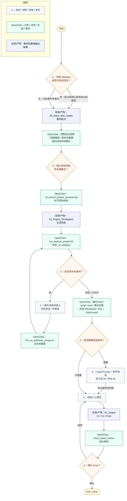

# 自动化脚本、重复筛选与检查清单

> 子文档定位：本文件承载执行细则；执行总纲只保留术语、总口径、决策表和索引。若与执行总纲冲突，以执行总纲和脚本契约检查为准。

## 十六、每次拍摄后的执行顺序

### 状态机速览



### 数据流转总表

| 阶段 | 素材位置 | 工具 / 系统 | OpenClaw 责任 | 人工责任 |
| --- | --- | --- | --- | --- |
| 云端创意初稿 | Obsidian `08_内容项目/项目ID/01_idea_card.md`、`02_project_brief.md`、`04_script.md` | 腾讯云 OpenClaw、Obsidian | 把想法变项目包和 task，不要求提前知道 Mac 本地素材全路径 | 决定是否要做，必要时把 Obsidian 项目ID / 初稿路径写入批次说明 |
| 新素材进入 | `00_Inbox_Mac_Intake/YYYYMMDD_事件名_待整理/` | Finder、AirDrop、图像捕捉、读卡器 | 先读批次说明，再读取 brief/script，结合素材元数据判断目标项目 | 复制素材，补最小事实和无法自动判断的信息 |
| 项目收口 | `01_Project_Workspace/主题集合/项目目录/` | `13_ensure_project_structure.py`、`run_analyze_project.sh` | 建结构、生成 manifest、识别 Raw / 低清 / Live Photo / 360 / 录屏 / 外部包 | 确认项目名、主题集合、明显误分 |
| 增量补充 | `01_Project_Workspace/主题集合/项目目录/待增加/` | `10_run_additions_merge.sh` | 扫描增量、抽帧/预览、生成并执行合并计划 | 把补充素材放进正确项目的 `待增加`，处理 blocked 项 |
| 处理加工 | `App_WorkCache/`、项目内容目录 | Wink、DJI Studio、Insta360 Studio、HyperFrames | 记录处理需求，重跑分析，校验输出是否回填 | 修复、增强、全景重构、选择可用输出 |
| 素材匹配与创作编排 | Obsidian 项目包、`_ai_analysis/`、项目素材 | Mac OpenClaw Runner、Codex | 融合腾讯云初稿、本地素材清单、关键帧和脚本，生成素材匹配、分镜、EDL、native import pack、字幕包 | 决定叙事、审美、节奏、剪辑方向；必要时让腾讯云修订脚本 |
| HyperFrames 包装 | `90_Draft_Project/HyperFrames/`、`91_Output/HyperFrames/` | HyperFrames | 可读取脚本/分镜，生成标题卡、信息卡、图文动画、透明叠加素材 | 确认包装风格，把导出媒体放进剪映 |
| 剪映制作 | `03_Jianying_Active_Drafts/`、`90_Draft_Project/剪映工程/` | 剪映 Mac | 提供人工二创辅助包和导入说明 | 导入、拖时间线、调音乐字幕封面、官方备份 |
| 成片复核 | `91_Output/V1/V2/Final/` | `local_output_review` | 输出质检报告、问题证据、状态建议 | 决定返修、Final、发布 |
| 精选入库 | `80_To_iCloudPhotos_精选入库/` | iCloud 照片 | 检查精选目录和入库清单 | 选择长期精选并手动导入 iCloud 照片 |
| 发布后归档 | `92_Aliyun_SyncReady/`、外接硬盘、`02_Asset_Library/Project_Archive_Index/` | 阿里云盘、外接硬盘、OpenClaw | 检查同步记录、生成归档索引、提示 Mac 瘦身 | 确认发布稳定，移出全量源素材，只保留检索索引 |

每次拍完，固定走下面这套流程：

```text
1. 所有素材进入 Mac
2. 在 00_Inbox_Mac_Intake 下按事件 / 主题 / 拍摄批次建目录，例如 YYYYMMDD_毕业典礼_待整理
3. 在事件批次内放入素材；可以平铺，也可以保留 AirDrop、SD 卡、网盘下载、zip 解压后自带的原始文件夹，不强制按来源建标准子目录
4. 写或补齐 00_批次说明.md：人只写云端项目引用、本地素材批次、目标项目和特别注意；OpenClaw 负责读取并融合
5. 没有云端 task 但已有 Obsidian 项目ID时，运行 `31_link_batch_to_content_project.py` 生成 `_ai_analysis/content_os_link.yaml`
6. 根据事件批次说明创建或找到对应正式项目目录：主题集合/YYYYMM_主题_叙事关键词
7. Codex / 脚本扫描素材并识别 Live Photo、360 原始组、录屏、外部交付包、普通照片 / 视频等技术来源
8. 项目级技术源素材进入 00_RawVault_不可直用；已归场景但待处理素材进入 L3/Raw_待处理
9. 普通可用素材和已确认保留的 Live Photo 同名原始组进入对应 L3
10. DJI 全景默认用 DJI Studio 重构；只有进入 Premiere / DaVinci 专业剪辑时才用 DJI Reframe 插件
11. Insta 全景用 Insta360 Studio 重构
12. 照片副本用 Wink Mac 版修复
13. 视频副本用 Wink Mac 版增强 / 防抖 / 降噪
14. 修复图、增强视频、重构视频回填 L3 根部
15. 运行 99_System_OpenClaw/scripts/run_analyze_project.sh 生成 _ai_analysis，并先完成 Raw / 低清 / 低质判别校验
16. 如果存在二筛增量素材，先放入 `待增加`，运行 10 一键合并回正式项目；只有需要预览时才加 `--plan`
16. 根据 prompt / summary 判断素材价值、Wink 需求、剪辑用途和 80 入库价值
17. 把 AI 分析结论回填 readme.md、素材整理记录、工程说明或项目总览
18. 如果需要动态包装，HyperFrames 源工程进入 90_Draft_Project/HyperFrames，导出素材进入 91_Output/HyperFrames 或回填 L3
19. 剪映 Mac 端调用 L3 根部素材、native_import_pack 和 HyperFrames 导出素材进行人工精剪
20. 真实剪映草稿留在本机活动草稿区；关键版本用剪映官方备份 / 打包工程放入 90_Draft_Project/剪映工程/official_backups
21. 输出 V1 / V2 / Final 到 91_Output
22. 对候选成片执行 local_output_review，本地质检只能推进到 output_reviewed
23. 人工确认最终版本后，项目才进入 final_ready
24. 长期值得展示的内容复制到 80_To_iCloudPhotos_精选入库
25. 从 80 文件夹导入 iCloud 照片；Live Photo 入库时 HEIC + MOV + XMP 同名组必须一起复制、一起导入
26. 更新 aliyun_sync_manifest.md 和 92_Aliyun_SyncReady 检查清单
27. 阿里云盘单向上传整理后项目镜像
28. 写入 `02_Asset_Library/Project_Archive_Index/YYYYMMDD_项目名.archive.md`
29. 项目发布稳定 1 个月后进入外接硬盘冷归档
30. 冷归档和阿里云盘镜像确认后，Mac 项目区只保留轻量索引、必要 Final 和可复用资产卡片，不长期保留全量源素材
```

### AI 分析脚本闭环

脚本目录固定为：

```text
99_System_OpenClaw/scripts/
```

日常说“OpenClaw 脚本”，主要指这些入口：

| 目的 | 脚本 / 命令 |
| --- | --- |
| 补齐项目结构 | `python3 99_System_OpenClaw/scripts/13_ensure_project_structure.py "项目目录"` |
| 分析正式项目 | `./99_System_OpenClaw/scripts/run_analyze_project.sh "项目目录"` |
| 只扫描素材清单 | `python3 99_System_OpenClaw/scripts/01_scan_media_manifest.py "项目目录"` |
| 合并补充素材 | `./99_System_OpenClaw/scripts/10_run_additions_merge.sh "项目目录"` |
| 预览补充素材合并计划 | `./99_System_OpenClaw/scripts/10_run_additions_merge.sh "项目目录" --plan` |
| 重命名单个素材 | `python3 99_System_OpenClaw/scripts/11_rename_media_file.py "项目目录" "项目内相对路径"` |
| 执行腾讯云派发任务 | `python3 99_System_OpenClaw/mac_openclaw_runner.py run-task task_YYYYMMDD_NNN` |
| 检查本地 / Obsidian 文档同步 | `python3 99_System_OpenClaw/scripts/30_check_obsidian_doc_sync.py` |

对单个项目运行：

```bash
./99_System_OpenClaw/scripts/run_analyze_project.sh "项目文件夹路径"
```

如果需要同时提取音频，为后续转写准备：

```bash
./99_System_OpenClaw/scripts/run_analyze_project.sh "项目文件夹路径" --audio
```

脚本输出到项目内部：

```text
_ai_analysis/
├── media_manifest.json
├── media_decision_warnings.md
├── keyframes/
├── audio/
├── prompts/
├── summaries/
├── user_intent_notes.md
├── visual_similarity_groups.md
├── additions_merge_plan.md
├── additions_merge_plan.json
└── project_overview.md
```

素材内容信息的正式保存位置：

```text
_ai_analysis/media_manifest.json
= 文件级清单：相对路径、类型、尺寸、时长、拍摄时间、生命周期状态、Live Photo / Raw / 80 等判别

_ai_analysis/keyframes/
= 视频关键帧证据，用于 LLM / 人工判断画面人物、场景、动作和可剪辑价值

_ai_analysis/summaries/
= 分批内容概述、场景判断、人物呈现、素材用途建议

_ai_analysis/project_overview.md
= 项目级总览：叙事结构、主要场景、人物呈现、可复用价值、后续处理建议

_ai_analysis/prompts/
= 本项目实际使用或待使用的 prompt，不是最终结论，但保留判断依据

_ai_analysis/user_intent_notes.md
= 用户/创作者明确说过的素材意图，例如某张图用于表达设备不便捷性、创作幕后、准备成本或人物分心；生成 prompt 时必须优先注入

素材整理记录.md
= 已执行的移动、改名、合并、发放、复用登记等操作日志

readme.md
= 项目给人看的简明入口说明
```

`项目根/App_WorkCache` 只保存加工副本和临时输出，不保存素材内容判断的唯一事实；内容事实以 `_ai_analysis`、`素材整理记录.md` 和 `readme.md` 为准。

闭环关系是：

```text
99_System_OpenClaw/docs/00_本地素材与剪映HyperFrames流转总纲.md 规定目录、命名、筛选、精选、同步
↓
99_System_OpenClaw/scripts/ 按大纲扫描 L3 / Raw / 80 / Output
↓
07_validate_media_decisions.py 校验 Raw 原因、低清证据和模糊命名
↓
_ai_analysis 生成清单、关键帧、prompt、summary
↓
AI 生成分析、归类、提示和校验；人工决定发布、删除和最终精选
↓
结论回填 readme.md、素材整理记录、90_Draft_Project/工程说明.md、aliyun_sync_manifest.md
↓
每日检查清单再次验证项目是否符合大纲
```

`_ai_analysis` 是分析资产，不是 iCloud 照片精选库，也不是剪映工程。它可以随项目同步做长期参考，但外包交付时默认不需要提供，除非对方也参与素材筛选或内容策划。

AI 职责边界固定为：

```text
AI 可以做：
内容概述
场景判断
命名建议
Raw 判别提醒
重复组联系表
Wink 需求建议
iCloud 入库建议

AI 不直接做：
最终删除
公开发布确认
人物是否好看确认
是否代表本人意愿
是否最终进入 iCloud 照片
```

一句话：AI 负责分析、归类、提示、校验；人工负责发布、删除、最终精选。

### 二次筛选待增加素材规则

`待增加` 是第二遍筛选后发现的增量素材入口，不是正式项目目录，也不是项目镜像结构。

### 00_批次说明.md 与腾讯云初稿融合

`00_批次说明.md` 的写入责任：

```text
人负责：
事件、地点、人物、时间范围、目标项目、特别注意、明显不能自动判断的背景

腾讯云 OpenClaw 负责：
idea card、project brief、脚本初稿、发布方向、账号策略

Mac OpenClaw 负责：
读取批次说明、素材文件、Obsidian 初稿路径、task、项目 _ai_analysis 后融合判断
```

“腾讯云初稿已经在 Obsidian 里”的判定：

| 判定项 | 路径 |
| --- | --- |
| 选题卡 | `08_内容项目/项目ID/01_idea_card.md` |
| 项目 brief | `08_内容项目/项目ID/02_project_brief.md` |
| 脚本初稿 | `08_内容项目/项目ID/04_script.md` |
| 云端派发任务 | `98_Agent任务队列/01_cloud_to_mac_ready/task_*.yaml` |
| 轻量绑定任务 | `_OpenClawQueue/cloud_to_mac/run_*.json` |

这些路径由 Obsidian Content OS 规则确定：`自媒体入口.md` 定义项目包与任务队列，`06_技术栈与自动化/腾讯云OpenClaw与MAC_OpenClaw本地素材协同流转规范.md` 定义本地素材流转，`06_技术栈与自动化/260626-OpenClaw Bot标签能力归档与创作拍摄执行规范.md` 定义腾讯云创作/拍摄执行入口。

推荐字段：

```markdown
# YYYYMMDD_事件名_待整理

## 云端项目引用

Obsidian 项目ID：

腾讯云初稿路径：
- 01_idea_card:
- 02_project_brief:
- 04_script:
- task:

## 本地素材批次

事件：
地点：
人物：
时间范围：
素材来源：
本地素材批次：
目标项目：
这批素材可能服务的内容：
必须保留 / 特别注意：
不确定的地方：
临时初稿摘录：
```

如果初稿已经进入 Obsidian，优先写项目ID和路径；如果只是聊天记录或临时文本，才把关键段落粘贴到“临时初稿摘录”。批次说明不是最终归类结论，最终归类以后续 manifest、关键帧、brief、script 和人工确认共同决定。

读取顺序：

```text
00_批次说明.md
-> 08_内容项目/{project_id}/02_project_brief.md
-> 08_内容项目/{project_id}/04_script.md
-> 当前批次素材元数据、关键帧、manifest
-> 素材匹配报告 / Storyboard / EDL / native import pack
```

四种入口：

| 入口 | 命令 | 结果 |
| --- | --- | --- |
| 云端已派 task | `python3 99_System_OpenClaw/mac_openclaw_runner.py run-task task_YYYYMMDD_NNN` | 直接按 task 生成结果 |
| 没有 task，但批次说明有 Obsidian 项目ID | `python3 99_System_OpenClaw/scripts/31_link_batch_to_content_project.py "00_Inbox_Mac_Intake/YYYYMMDD_事件名_待整理"` | 生成 `_ai_analysis/content_os_link.yaml`，给后续分析和匹配读取 |
| 旧任务层需要进入本地素材处理 | `python3 99_System_OpenClaw/scripts/33_enqueue_openclaw_queue_job.py task_YYYYMMDD_NNN --process` | 从 `98_Agent任务队列` 生成本机 `_OpenClawQueue` JSON，并立即交给执行层 |
| 云端 ready 队列自动开工 | `python3 99_System_OpenClaw/scripts/33_enqueue_openclaw_queue_job.py --all-ready --process` 或 `--watch --process --interval 10` | 云端任务单同步到 `98_Agent任务队列` 后自动桥接；缺少 Inbox 批次壳时自动创建 |
| 腾讯云只下发轻量 run 绑定 | `python3 99_System_OpenClaw/scripts/32_process_openclaw_queue.py --once` 或 `--watch --interval 10` | 生成 `_openclaw/link.json`、`status.json` 和 `_OpenClawQueue/mac_to_cloud/*.result.json` |

正式跨设备同步走 Obsidian vault 里的 `98_Agent任务队列`，Mac 再桥接到本机 `_OpenClawQueue`。不要同步整个 `00_Inbox_Mac_Intake`，原始照片和视频仍然留在 Mac 本地。

边界固定为：

```text
98_Agent任务队列 = 任务层 / 协议层 / 文档层
_OpenClawQueue = 执行层 / 素材层 / 控制层
```

如果 task 带 `inputs.content_os_link_path`，Mac Runner 必须校验这个 link 是 `brief_ready`、project_id 一致、没有缺失项目包文件；校验通过后才生成素材匹配、Storyboard、EDL 和 local_assets。

Mac 回写才是腾讯云可继续使用的“本地事实”：

```text
08_内容项目/{project_id}/03_material_match_report.md
08_内容项目/{project_id}/05_storyboard.md
08_内容项目/{project_id}/06_edit_decision_list.json
08_内容项目/{project_id}/08_local_assets.md
98_Agent任务队列/02_mac_to_cloud_results/result_*.yaml
_OpenClawQueue/mac_to_cloud/run_*.result.json
```

腾讯云后续只能基于这些回写结果改 `04_script.md` 和 `09_publish_pack.md`，不能直接推断 Mac 目录。

状态定义：

| 状态 | 含义 |
| --- | --- |
| `pending_cloud_brief` | 有素材，但还没有云端项目包或项目包缺关键文件 |
| `brief_ready` | 云端项目包已有，批次已能链接到 brief/script |
| `materials_analyzed` | 本地素材已分析 |
| `materials_matched` | 素材已和 brief/script 匹配 |
| `storyboard_ready` | 分镜 / EDL 已出 |

补充素材按下面分流：

| 情况 | 放置位置 | 处理方式 |
| --- | --- | --- |
| 还不知道属于哪个项目 | `00_Inbox_Mac_Intake/YYYYMMDD_事件名_待整理/` | 写 `00_批次说明.md`，先让 OpenClaw 判断事件和目标项目 |
| 已经知道属于某个项目 | `01_Project_Workspace/主题集合/项目目录/待增加/` | 运行 `./99_System_OpenClaw/scripts/10_run_additions_merge.sh "01_Project_Workspace/主题集合/项目目录"` |
| 只想给已在项目里的素材改名 | 原内容目录 | 走 `11_rename_media_file.py`，不经过 `待增加` |
| 修复 / 增强 / 全景重构输出 | `项目根/App_WorkCache/` 或处理软件输出目录 | 人确认可用后回填项目内容目录、`91_Output` 或 `80_To_iCloudPhotos_精选入库` |

它可以是大杂烩：

```text
可以混放照片、视频、录屏、Live Photo 半组、后补素材、未命名素材
可以暂时保留相机原文件名
可以不预先人工归入 L3
```

但它不能直接进入剪辑、iCloud 照片或阿里云盘正式同步判断。所有 `待增加` 素材必须先经过脚本二次分类、命名和 Raw 判别；只有显式 `--plan` 或脚本阻断项才需要人工确认。

抽象流程：

```text
待增加
↓
10_run_additions_merge.sh 调用 08 扫描增量素材
↓
读取文件名、格式、时长、分辨率、GPS、创建时间
↓
读取显式文件名/元数据，并为泛名素材生成视频关键帧、图片预览图、Live Photo 组级证据和 LLM 判读 prompt
↓
输出 additions_merge_plan.md / additions_merge_plan.json / additions_llm_review_prompt.md
↓
默认检查是否存在 blocked 阻断项；如显式 `--plan`，则停在人工确认
↓
10_run_additions_merge.sh 调用 09 执行已确认计划
↓
素材移动到正式项目 L3 / Raw_待处理 / 80 / 其他目标位置
↓
正式项目重新运行 run_analyze_project.sh
↓
回填 readme.md、素材整理记录、工程说明和同步记录
```

`待增加` 的处理原则：

```text
1. 待增加固定放在正式项目内：项目/待增加
2. 日常只把目标项目目录传给 10，由脚本自动定位 项目/待增加
3. 10 默认执行合并、重跑分析并清空待增加目录
4. 只有显式加 `--plan` 时，10 才只生成计划、不移动文件
5. 08 只生成计划，不移动文件
6. 09 只执行已确认计划，不直接猜测合并
7. 08/09/10/12 都必须校验待增加目录等于 项目/待增加，避免误用上一级同名目录
8. 待增加不参与剪辑、不进入 iCloud 照片、不进入阿里云盘镜像
9. 原始相机名不等于必须进 Raw；泛名素材要先生成关键帧/预览图/联系表，再由 LLM 或人工结合项目 prompt 判读后改成人话命名并归入对应 L3
10. Live Photo 增量素材必须保持 HEIC / MOV / XMP 同名不同后缀，不能拆名合并
11. 文件名和元数据不够判断时，视频必须抽关键帧、图片必须生成预览图、Live Photo 必须按组继承证据；脚本不按颜色或内置视觉启发式直接判断田径跑道、跑道自拍、成绩表/名单等宏观语义
12. 合并后正式项目必须重新跑完整 AI 分析与判别校验
```

### 单独重命名规则

当素材已经在正式项目内，只需要把文件名改得更准确时，不再走 `待增加` 合并流程，也不手工拆 Live Photo。单独重命名必须先拆解素材内容，生成关键帧/联系表和 rename plan；宏观语义命名由 LLM 或人工结合项目 prompt 判读后通过 `--override-stem` 写入，脚本不硬造名字。

```text
正式项目内单个素材
↓
11_rename_media_file.py 抽帧 / 生成图片预览 / 读取同组 Live Photo 或原始关联组
↓
LLM / 人工按关键帧、预览图、文件路径、项目 prompt 和现有命名给出推荐基名
↓
如果命中 Live Photo 同名组，默认 HEIC / MOV / XMP 整组同名改；如果命中 OSV / LRF / INSV 原始关联组，整组保持同 stem 改名
↓
输出 _ai_analysis/rename_keyframes 和 _ai_analysis/rename_plans
↓
追加素材整理记录
↓
重新运行 run_analyze_project.sh，更新 manifest / keyframes / prompts / summaries
```

单独重命名的原则：

```text
1. 只改文件名，不改变 L3 分类位置
2. 脚本只生成命名证据和安全改名计划；推荐基名来自 LLM/人工的宏观判读
3. 识别依据必须写入 rename_plan.json
4. Live Photo 和 OSV / LRF / INSV 原始关联组默认整组改名；只有明确要拆开当前文件时才使用 --single
5. 目标文件名已存在时必须停止，不能覆盖
6. 低置信度自动命名必须停止，除非明确使用 --allow-low-confidence
7. 改名后必须记录到 素材整理记录.md
8. 改名后默认重跑项目 AI 分析与判别校验
```

### 重复组合照筛选规则

合照、自拍合影、领奖合影、连续人像这类素材，不能按单张照片平铺管理，必须先成组，再定角色。

这里的目标不是把项目素材库压到最少，也不是让 AI 替用户挑高光；而是把照片并回清楚的主题目录，方便后续人工查看、合照发放和剪辑取用。

```text
重复组
↓
按场景/人物关系归类
↓
照片全部并入对应 L3 主题目录
↓
需要修复、待确认、不可直用的照片进入 Raw_待处理
↓
后续合照发放通过 93 合照发放目录按姓名复制副本
```

命名规则：

```text
场景短名_G组号_补充序号_状态.后缀

红墙团队领奖合影_G01_补充01_未修.jpg
红墙团队领奖合影_G01_补充02_未修.jpg
```

普通 JPG 合照不使用 `_原片` 后缀，避免和 Live Photo 原始组、相机 Raw 或 DJI/Insta 技术源文件混淆。需要强调来源时可写 `_JPG副本未修`、`_HEIC未修` 或 `_源文件`。

项目归档层和精选发布层分开命名：

```text
L3 根部：
补充01 / 补充02 / 补充03
= 项目归档与人工复核

80_To_iCloudPhotos_精选入库：
代表01 / 情绪01 / 封面候选01
= 最终精选与展示入库

93_GroupPhoto_Distribution_合照发放：
按姓名复制副本
= 发给具体人的按需分发区；不由主工作流自动创建
```

保留规则：

```text
L3 根部 = 项目可用照片区，可查看、可剪辑、可继续筛选，不代表 AI 已做高光筛选
Raw_待处理 = 需要修复、待确认、不可直接使用的场景级照片
80_To_iCloudPhotos_精选入库 = 只接收 iCloudReady 精选成品
93_GroupPhoto_Distribution_合照发放 = 按需生成，只放按姓名复制出的发放副本，不作为原始素材库
```

删除规则：

```text
项目素材库：以最大信息保留为主，不由 AI 建立删除候选区
合照发放：不靠 AI 判断谁值得保留，按人工确认的姓名清单复制副本
iCloud 照片：高度精选，只放真正值得长期回看的代表照、情绪照、封面图和成片
```

重复照片补充包进入 `待增加` 时，不使用普通分类合并脚本，而使用：

```bash
python3 99_System_OpenClaw/scripts/12_select_repeat_photo_groups.py "正式项目目录" --plan
python3 99_System_OpenClaw/scripts/12_select_repeat_photo_groups.py "正式项目目录" --apply
```

`12_select_repeat_photo_groups.py` 的职责：

```text
1. 扫描 项目/待增加 中的照片补充包
2. 生成联系表，方便按组归入主题目录
3. 生成 repeat_photo_selection_plan.json
4. 按计划移动照片：merge 到 L3 主题目录，raw 到 Raw
5. 追加 重复组合照筛选记录.md
6. 清空 待增加 并重跑项目分析
```

合照发放不再依赖 AI 判断“备用”，而使用明确姓名清单生成副本：

```bash
python3 99_System_OpenClaw/scripts/14_distribute_group_photos_by_name.py "正式项目目录"
```

`14_distribute_group_photos_by_name.py` 读取 `93_GroupPhoto_Distribution_合照发放/合照发放清单.csv`，把同一张合照复制到 `按姓名/姓名/`，姓名为空或待确认的条目进入 `待确认姓名/`。

`93_GroupPhoto_Distribution_合照发放` 不是分类分流目录，也不是主工作流常驻目录。只有需要把合照按人发给同学、老师或团队成员时，才运行 `14_distribute_group_photos_by_name.py` 生成它；平时项目素材仍留在 L3 主题目录中。

### 多重价值素材复用规则

有些素材既属于某个项目，又能作为长期通用素材使用，例如“校园人设”“颜值类”“口播前垫片”“转场氛围”。这类素材不复制源文件到处放，而采用：

```text
源文件归项目 L3 目录
↓
02_Asset_Library 只登记复用索引
↓
常用调色 / Wink / 裁切成品再单独登记为可剪辑副本
```

登记脚本：

```bash
python3 99_System_OpenClaw/scripts/15_register_reusable_asset.py "正式项目目录" "项目内素材相对路径"
```

`15_register_reusable_asset.py` 会更新：

```text
02_Asset_Library/Reusable_通用素材索引.md
02_Asset_Library/Reusable_分类/*.asset.md
```

资产卡片必须写清源文件位置、复用标签、适合用途、建议截取和公开状态。这样一个素材可以同时具有“项目记录价值”和“通用复用价值”，但磁盘上仍只有一个源文件来源。

边界判断：

```text
仍然依赖项目语境、原始画面、人物关系、现场记录价值
= 留在 主题集合/具体项目/L3 目录

只是希望以后跨项目想起来能复用
= 不搬源文件，只在 02_Asset_Library 登记资产卡片

已经加工成跨项目可直接使用的通用成品、模板、品牌资产、音效、字体
= 可以作为副本放入 02_Asset_Library
```

因此 `02_Asset_Library` 不是 `兰州大学` 的备份目录，也不是 iCloud 照片精选库；它是跨项目检索和复用入口。项目目录负责保存事实原件，资产库负责告诉未来的你“这段素材还能在哪里用”。

### 具体情形：连拍 / 重复照片 / 细微动作差异

例子：一次连拍 30 张，其中 20 张非常重复，10 张动作略有区别，5 张特别出彩；你判断 25 张大概率用不掉，但仍想保存。

处理规则：

```text
5 张特别出彩
-> 项目 L3 源文件保留
-> 复制精选副本到 80_To_iCloudPhotos_精选入库/01_Project_Selected_项目精选
-> 如果可做封面，再复制或导出成品到 80_To_iCloudPhotos_精选入库/02_Cover_Candidates_封面候选
-> 如果超脱项目本身有纪念价值，再复制到 80_To_iCloudPhotos_精选入库/03_Memorial_纪念资产

10 张动作略有区别
-> 放在项目对应 L3 内容目录
-> 用 补充01 / 补充02 / 动作变化01 / 情绪备选01 命名
-> 默认不进 iPhone，不进 80
-> 需要未来查找时，靠 L3 目录和素材整理记录找回

15-20 张近重复但想保存
-> 放入 00_RawVault_不可直用/连拍原始组_保留/组名/
-> 不进 iPhone
-> 不进 02_Asset_Library
-> 项目归档时进入阿里云盘镜像和移动硬盘冷归档
```

推荐命名：

```text
红墙合照连拍_G01_代表01_Wink已修.jpg
红墙合照连拍_G01_情绪01_未修.HEIC
红墙合照连拍_G01_补充01_未修.HEIC
红墙合照连拍_G01_动作变化01_未修.HEIC
```

近重复保留组：

```text
00_RawVault_不可直用/
└── 连拍原始组_保留/
    └── 红墙合照连拍_G01/
        ├── IMG_0001.HEIC
        ├── IMG_0002.HEIC
        └── readme.md
```

`连拍原始组_保留` 不是废片区，也不是精选区；它的意思是“这些素材不适合日常剪辑检索和手机同步，但我仍要保留原始信息”。

### 具体情形：未来可复用素材

未来可复用素材不等于必须进 iPhone，也不等于必须复制到资产库。

处理规则：

```text
项目 L3 源文件
-> 保留在原项目 L3
-> 用 15_register_reusable_asset.py 登记到 02_Asset_Library
-> 如果只是未来想起来能用：只写资产卡片，不复制源文件
-> 如果已经加工成通用成品：把成品副本放入 02_Asset_Library/对应分类
-> 如果手机上经常要调用：再复制一份到 80_To_iCloudPhotos_精选入库/04_Reusable_To_iPhone_手机常用复用素材
```

判断：

```text
未来可能用于其他项目，但不常在手机上用
= 只登记资产卡片

经常要在 iPhone / 剪映移动端 / 小红书 App 里调用
= 进入 80/04_Reusable_To_iPhone_手机常用复用素材

已经做成品牌模板、片头、字幕样式、HyperFrames 组件、音效、封面模板
= 可以进入 02_Asset_Library 成品副本区
```

### 具体情形：超脱项目本身的纪念素材

有些素材虽然来自某个项目，但价值已经超过项目本身，例如毕业照、重要合照、火炬手、重回母校、重要比赛瞬间、关键身份节点、非常珍贵的人物关系。

处理规则：

```text
项目 L3 源文件
-> 保留在原项目 L3，承担事实原件职责
-> 精选副本进入 80_To_iCloudPhotos_精选入库/03_Memorial_纪念资产
-> 导入 iCloud 照片后加入 纪念_主题名 相册
-> 在 02_Asset_Library/Memorial_人生节点 写资产卡片
-> 项目发布稳定后进入移动硬盘冷归档
```

纪念素材不一定有复用价值。它可以不进 `Reusable_通用素材索引.md` 的普通复用分类，但应该进入 `Memorial_人生节点`，方便以后按人生节点找回。

### 主工作流自动建目录

主工作流必须先补齐项目空目录，再做扫描分析。这样新项目或半整理项目不会缺少加工区、输出区和同步检查区。

```bash
python3 99_System_OpenClaw/scripts/13_ensure_project_structure.py "正式项目目录"
```

`run_analyze_project.sh` 在扫描前会自动调用它。它只做结构准备，不移动、不复制、不改名素材。

拼图、调色、美颜等二次加工必须处理副本，不直接挪动 L3 原素材。以拼图为例：

```text
L3 根部原图
↓
复制选中图片到 项目根/App_WorkCache/拼图素材暂存/拼图主题_P01/
↓
拼图软件制作
↓
成品先输出到 项目根/App_WorkCache/拼图输出暂存/
↓
确认可用后，发布版进入 91_Output/Final，长期回看精选再复制到 80_To_iCloudPhotos_精选入库
```

所以 `拼图素材暂存` 是输入副本区，`拼图输出暂存` 是成品缓冲区；原图仍留在 L3 中承担素材库信息保留。

自动创建的项目内正式目录：

```text
80_To_iCloudPhotos_精选入库/
├── 01_Project_Selected_项目精选/
├── 02_Cover_Candidates_封面候选/
├── 03_Memorial_纪念资产/
├── 04_Reusable_To_iPhone_手机常用复用素材/
├── 05_LivePhoto_Groups_同名原始组/
├── 06_Final_Output_发布成片与高光/
├── 99_To_Check_入库前复核/
└── README.md

90_Draft_Project/
├── 剪映工程/
│   ├── native_import_packs/
│   ├── official_backups/
│   ├── _draft_generation/
│   └── README.md
├── HyperFrames/
│   ├── src/
│   ├── render_logs/
│   └── README.md
├── 工程说明.md
└── 使用素材记录.md

91_Output/
├── V1/
├── V2/
├── Final/
└── HyperFrames/

92_Aliyun_SyncReady/
├── 项目同步检查清单.md
└── 外包打包工程_如需/

待增加/
App_WorkCache/
aliyun_sync_manifest.md
```

如需按姓名发放合照，再由脚本生成：

```text
93_GroupPhoto_Distribution_合照发放/
├── 合照发放清单.csv
├── 按姓名/
└── 待确认姓名/
```

项目级 WorkCache 位于具体项目根内；脚本在每个正式项目中补齐：

```text
本地素材根/01_Project_Workspace/主题集合/具体项目/App_WorkCache/
├── Wink_修复输出暂存/
├── 调色输出暂存/
├── 拼图素材暂存/
├── 拼图输出暂存/
├── 发布图临时导出/
├── DJI_Studio_Exports/
├── Insta360_Studio_Exports/
├── HyperFrames_RenderCache/
└── Transcode_转码暂存/
```

执行示例：

```bash
./99_System_OpenClaw/scripts/10_run_additions_merge.sh "目标正式项目目录"
```

只想先看计划时才执行：

```bash
./99_System_OpenClaw/scripts/10_run_additions_merge.sh "目标正式项目目录" --plan
```

---


## 十七、每日检查清单

每天收工前检查：

```text
[ ] 00_Inbox_Mac_Intake 是否只剩按事件批次命名的待整理目录，而不是按来源混放？
[ ] 每个 Inbox 事件批次是否都有 00_批次说明.md？
[ ] 每个项目 L3 根部是否都是可用素材？
[ ] Raw_待处理 是否只放不可直用素材？
[ ] Wink 输出是否已经回填 L3？
[ ] DJI 输出是否已经回填 L3？
[ ] Insta360 输出是否已经回填 L3？
[ ] 80_To_iCloudPhotos_精选入库 是否只放精选，且已归入 01_Project_Selected / 02_Cover / 03_Memorial / 04_Reusable / 05_LivePhoto / 06_Final 子目录？
[ ] 93_GroupPhoto_Distribution_合照发放 是否按姓名生成发放副本？
[ ] Live Photo 原始组是否保持同名 HEIC / MOV / XMP 且未拆散？
[ ] 待增加 是否已经合并或暂缓，且未进入 iCloud 照片 / 阿里云盘镜像？
[ ] _ai_analysis/media_manifest.json 是否已生成并反映当前 L3 / Raw / 80 状态？
[ ] _ai_analysis/media_decision_warnings.md 是否通过，没有低清/低质/Raw 原因误判？
[ ] _ai_analysis/keyframes、prompts、summaries 是否与当前素材同步？
[ ] 若存在待增加目录，是否已经生成 additions_merge_plan 并完成确认或暂缓？
[ ] 99_System_OpenClaw/scripts/README.md 与 00_本地素材与剪映HyperFrames流转总纲.md 的闭环契约是否通过检查？
[ ] iCloud 照片是否没有未整理素材？
[ ] 剪映真实草稿是否只在本机活动草稿区或剪映官方本机目录，没有放在 iCloud / 移动硬盘上直接编辑？
[ ] 剪映工程说明、导入包和官方备份包是否在 90_Draft_Project？
[ ] 剪映导出的 V1 / V2 / Final 是否在 91_Output，封面 / 发布图是否按 WorkCache 或 80 规则放置，没有堆在 03_Jianying_Active_Drafts？
[ ] HyperFrames 源工程是否在 90_Draft_Project/HyperFrames，导出素材是否在 91_Output/HyperFrames 或已回填 L3？
[ ] 发布稳定后是否已经写入 02_Asset_Library/Project_Archive_Index 的归档索引卡？
[ ] 若已冷归档，Mac 是否只保留索引卡、必要 Final 和精选入口，没有继续堆全量 L3 / RawVault / 360 原始组？
[ ] 成片是否在 91_Output？
[ ] 阿里云盘同步任务是否无失败？
[ ] aliyun_sync_manifest.md 是否更新？
```

---


## 十八、项目 README 模板

每个 L2 项目必须有：

```text
readme.md
```

模板如下：

```markdown
# 项目名称：20260514_兰州大学_奔赴与校运会

- 创建日期：2026-05-XX
- 主剪辑师：Down
- 项目状态：收录筛片 / 粗剪中 / 包装待审 / 已完结发布
- 主线叙事：清华全运会火炬手跨越 2000 公里回兰大参加校运会
- 采集来源 / 技术来源：iPhone / iPad / 相机卡 / DJI / Insta360 / 外部交付原包 / 录屏原始文件
- 按需中转盘：iCloud 云盘
- 远程镜像盘：阿里云盘
- 精选展示库：iCloud 照片
- 修复工具：Wink Mac 版
- 剪辑工具：剪映 Mac 版
- AI 动态包装：HyperFrames
- AI 分析脚本：99_System_OpenClaw/scripts/run_analyze_project.sh

## 1. 根目录与项目目录说明

根目录级目录：

- 01_Project_Workspace/主题集合/具体项目：项目素材库，保存该项目的源文件、L3 分类、工程、输出和分析结果；合照发放目录只在需要按姓名交付时生成
- 02_Asset_Library：跨项目通用素材索引、可复用成品副本和品牌资产；不是某个项目的 L3 目录，也不是项目源文件备份

- 00_RawVault_不可直用：原始不可直用素材
- L3 内容目录：由 LLM/人工基于项目全局素材分析后确定，例如单一 400 米项目可以是“赛前候场与检录 / 起跑准备 / 400米比赛过程 / 赛后交流与成绩”；完整旅程项目也可以是“路上奔赴 / 赛前准备 / 比赛过程 / 合照互动 / 身份成果”。这些名字不是脚本固定模板。
- 80_To_iCloudPhotos_精选入库：最终进入 iCloud 照片的内容
- 90_Draft_Project：剪映工程
- 90_Draft_Project/HyperFrames：HyperFrames 源工程、prompt、组件配置和渲染记录
- 91_Output：成片输出
- 91_Output/HyperFrames：HyperFrames 导出的包装素材或候选片段
- 92_Aliyun_SyncReady：远程同步检查与交付准备
- 93_GroupPhoto_Distribution_合照发放：按需生成的合照发放副本区，不是主分类目录
- _ai_analysis：AI 素材分析清单、关键帧、prompt、summary 和项目总览

## 2. DJI 全景说明

- 原始文件位置：00_RawVault_不可直用/DJI360_原始全景_待重构/
- 处理软件：默认 DJI Studio；Premiere / DaVinci 工作流才用 DJI Reframe 插件
- 输出格式：9:16 / 16:9 / snapshot / flat360 master
- 输出位置：对应 L3 根部
- 精选位置：80_To_iCloudPhotos_精选入库

## 3. Insta360 全景说明

- 原始文件位置：00_RawVault_不可直用/Insta360_原始全景_待重构/
- 注意事项：.insv / .lrv / 元数据文件不得拆散
- 处理软件：Insta360 Studio
- 输出格式：9:16 / 16:9 / snapshot
- 输出位置：对应 L3 根部
- 精选位置：80_To_iCloudPhotos_精选入库

## 4. Wink 修复说明

- 源文件不动
- 只修副本
- 输出回填 L3 根部
- 长期展示内容复制到 80_To_iCloudPhotos_精选入库
- 文件名使用 _Wink已修 / _Wink增强 / _Wink降噪 / _Wink防抖

## 5. Live Photo 说明

- 原始组必须同名：`画面_LIVE序号.HEIC` / `画面_LIVE序号.MOV` / `画面_LIVE序号.XMP`
- HEIC + MOV + XMP 必须同文件夹保留，不拆散
- XMP 只作为 IPTC / 标题 / 关键词等元数据辅助，不替代 HEIC + MOV 的原始关联
- Wink 修复图只作为衍生品，不覆盖原始 HEIC
- 回导照片 App 时，同名原始组必须一次性一起导入，并检查是否恢复为 Live Photo

## 6. AI 素材分析记录

- [ ] `99_System_OpenClaw/scripts/run_analyze_project.sh` 已运行
- [ ] `_ai_analysis/media_manifest.json` 已生成
- [ ] `_ai_analysis/keyframes` 已生成
- [ ] `_ai_analysis/prompts` 已生成
- [ ] `_ai_analysis/summaries` 已生成
- [ ] `_ai_analysis/project_overview.md` 已回填
- [ ] AI 分析结论已用于判断：是否进 80、是否需要 Wink、是否值得剪

## 7. iCloud 照片入库记录

- [ ] 封面候选已入库
- [ ] 精修合照已入库
- [ ] 发布成片已入库
- [ ] 高光回看视频已入库
- [ ] Live Photo 原始组已回导并检查
- [ ] Live Photo 关键帧已入库

## 8. 阿里云盘远程镜像记录

- 本地路径：
  /Users/vsiyo/Desktop/照片筛选/01_Project_Workspace/2026年重回兰州大学内容创作/20260514_兰州大学_奔赴与校运会

- 云端路径：
  Creator_Media_RemoteMirror_阿里云盘/项目素材/2026年重回兰州大学内容创作/20260514_兰州大学_奔赴与校运会

- 同步模式：
  单向上传

- [ ] L3 可用素材已同步
- [ ] RawVault 已同步
- [ ] Wink 输出已同步
- [ ] DJI 输出已同步
- [ ] Insta360 输出已同步
- [ ] 90_Draft_Project 已同步
- [ ] 91_Output 已同步
- [ ] 80_To_iCloudPhotos_精选入库已同步
- [ ] _ai_analysis 清单、summary、plan、project_overview 已同步
- [ ] _ai_analysis/keyframes 与 audio 已按空间情况同步或排除
- [ ] Live Photo HEIC/MOV/XMP 原始组已同步

## 9. 剪辑禁忌

- 不直接剪 RawVault 里的原始全景文件
- 不直接把 .insv / .lrv / DJI 原始全景文件丢给外包
- 不把未修图导入 iCloud 照片
- 不拆散 Live Photo 的 HEIC / MOV / XMP 原始组
- 不把 Wink 修复 JPG 和原 MOV 当作原生 Live Photo
- 不把 iCloud 照片当同步盘
- 不在阿里云盘端改名、移动、删除项目文件
- 不把 `项目根/App_WorkCache` 同步成项目备份
- 不把 00_Inbox_Mac_Intake 当长期素材库
- 不把 _ai_analysis 当成剪辑工程或精选库
- 不把 HyperFrames 源工程当成剪映草稿
- 不把 native_import_pack 当成可靠自动粗剪
- 不把剪映真实草稿放在 iCloud 或移动硬盘上直接编辑

## 10. 操作日志

- [2026-05-XX]：iPhone 素材已导入 Mac
- [2026-05-XX]：Live Photo 已按 HEIC/MOV/XMP 同名原始组整理
- [2026-05-XX]：DJI 全景素材已导入 Mac，原始文件进入 RawVault
- [2026-05-XX]：Insta360 素材已导入 Mac，INSV/LRV 文件组成组保留
- [2026-05-XX]：Wink 修复完成，输出回填 L3
- [2026-05-XX]：AI 素材分析已完成，summary 已回填
- [2026-05-XX]：Final 成片导出，进入 91_Output
- [2026-05-XX]：精选内容进入 80_To_iCloudPhotos_精选入库
- [2026-05-XX]：iCloud 照片精选相册完成
- [2026-05-XX]：阿里云盘远程镜像检查完成
```

---


## 十九、最终执行口令

以后所有素材管理都按这一句执行：

> **Mac 本地素材根负责全量收口；iCloud 云盘不承载全量素材库，只做按需中转；iCloud 照片只接收 80 中的 iCloudReady 精选；L3 根部负责项目可用素材；剪映真实草稿留在本机活动区；HyperFrames 只生产 AI 动态包装素材；Wink 负责修复增强；DJI / Insta360 负责全景重构；AI 只做分析和校验不做最终删除；阿里云盘只做整理后项目的单向远程镜像；移动硬盘只做冷归档。**

[1]: https://apps.apple.com/us/app/wink-video-enhancer-editor/id1594288016 "‎Wink: Video Enhancer & Editor App - App Store"
[2]: https://www.dji.com/global/downloads/softwares/dji-studio?utm_source=chatgpt.com "DJI Studio - Download Center - DJI Global or Other Regions"
[3]: https://www.insta360.com/blog/tips/how-insv-vs-lrv-video-files-transfer-workflow.html "How Insta360 Video Files Work (INSV vs LRV) + Fast Transfer to Phone/PC/Mac"
[4]: https://www.aliyundrive.com/?utm_source=chatgpt.com "阿里云盘- 备份无忧整理有序·阿里巴巴集团出品"
[5]: https://support.apple.com/guide/mac-help/store-files-in-icloud-drive-mchle5a61431/mac "Store files in iCloud Drive on Mac - Apple Support"
[6]: https://help.aliyun.com/zh/pds/drive-and-photo-service-ent/user-guide/synchronous-backup "
    云与本地数据同步备份-同步备份-网盘与相册服务-阿里云
  "
[7]: https://support.apple.com/guide/mac-help/check-icloud-drive-file-folder-status-mac-mchlc994344b/mac "Check your iCloud Drive file and folder status on Mac - Apple Support"
[8]: https://support.apple.com/en-us/102179 "How to turn off iCloud Photos - Apple Support"
[9]: https://support.apple.com/guide/photos/export-photos-videos-slideshows-and-memories-pht6e157c5f/mac "Export photos, videos, slideshows, and memories on Mac - Apple Support"
[10]: https://support.apple.com/guide/photos/import-from-storage-devices-phtae4e05c67/mac "Import from storage devices and DVDs in Photos on Mac - Apple Support"
[11]: https://discussions.apple.com/thread/255584737 "Re-correlating .heic and .mov into Live Photo - Apple Support Community"
