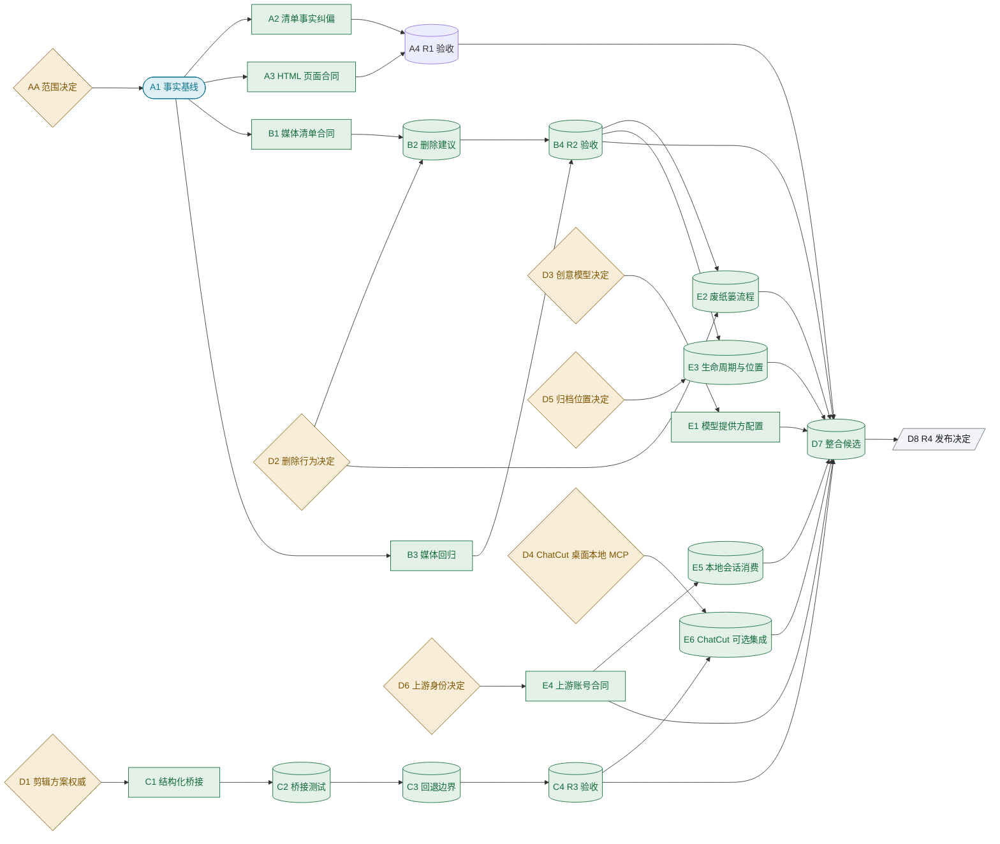

# OpenClaw 开发清单审核整改 SSOT

## 业务结论与范围

### 术语说明

本 SSOT 所说的“开发清单”，是开发清单文件（`openclaw-dev-checklist.html`）；“现有工作台（Studio）”，是仓库内已经运行的照片内容系统工作台（Photo Content OS Studio）；“结构化剪辑方案”，是项目包中的结构化剪辑方案文件（`06_edit_decision_list.json`）；“原型”，是同一交付包中的可点击界面演示。开发清单是待整改输入，当前源码和测试是现状证据，本目录的机器记录负责决定版本、依赖和执行状态。

审核结论不变：原开发清单不能直接作为完整开发权威。用户已在 2026-09-02 接受六项产品决定，消除了结构化剪辑方案、删除行为、创意模型、剪辑服务接入、归档位置和身份来源的不确定性。第四项决定已正式冻结为剪辑服务桌面应用（ChatCut Desktop）的桌面本地模型上下文协议（MCP）可选集成。

本次结构修订补入三类缺口：清单与原型的可执行静态门禁、会移动收件箱（Inbox）批次的临时夹具回归门禁，以及可选上游配对不影响现有工作台（Studio）本地功能的身份合同。它们把“决定已接受”“代码已实施”和“发布已验收”分开，避免 D7 在没有完整证据时直接宣称整合完成。当前清单、媒体、结构化剪辑和整合实施节点均已接受；D8 只等待主分支候选推送、远端回读和清理记录。

本 SSOT 继续采用第二级发布治理（L2 Release SSOT）。四个发布切片可以独立验收和保持未发布；本次修改审核清单、原型和受控测试，不修改媒体、桌面运行数据或外部系统。七条可写实现线均以受控外部 Codex 进程执行，且只使用临时夹具；日志、结构化返回、提示词清理记录和进程台账保留在执行证据目录（`execution/artifacts/`）。

明确排除：不把本地源码或单元测试写成生产完成；不自动或永久删除文件；不把生命周期状态当作物理副本证据；不建立本地第二套账号事实源；不在能力探测前把剪辑服务（ChatCut）显示为在线；不把 Obsidian 快照作为运行权威。

## 输入一致性审查

### 术语说明

“输入一致性审查”用于判断清单中的承诺是否能由现有字段、接口和流程支撑。可以从代码查明的内容作为事实冻结；缺少运行证据的内容只限制验收级别；只有后续重新出现多个有效产品方向时，才创建新的未决问题文件。当前没有待产品负责人拍板的问题。

| 清单承诺或判断 | 当前事实或正式决定 | 结论 | 后续动作 | 阻塞节点 |
|---|---|---|---|---|
| 照片定位信息已经由媒体清单采集 | 图片分支只读取尺寸，定位字段初始化为空；视频分支才读取 QuickTime 位置标签 | 事实错误 | 纠正清单并定义照片 EXIF 来源合同 | A2、B1 |
| 原型中的剪辑角色、轨道层和缺失素材可直接接到现有前端 | D1 已接受：结构化剪辑方案文件（`06_edit_decision_list.json`）是机器执行唯一权威，Studio 文本只作创作说明和只读摘要 | 决定已冻结，实现未完成 | C1 实现结构化读取和失败回退 | C1-C4 |
| 媒体清单足以支持可靠删除 | 当前媒体编号不是内容校验值；D2 已接受用户确认后移入当前系统回收站 | 合同和实现均缺失 | B1-B5 先形成可靠候选与提升脚本夹具门禁，E2 再实现移动、回读和恢复 | B1-B5、E2 |
| 仓库有 45 个测试文件、约 246 个测试 | `tests/` 下有 44 个 `test_*.py`，按语法树统计有 230 个测试函数 | 统计口径错误 | 固定统计命令和目录边界后改清单 | A2 |
| 状态标签可直接代表真实开发准备度 | 多条“可直接接”正文仍要求新增接口或先作决定 | 分类不自洽 | 重新分类并增加“需先拍板”筛选 | A2、A3 |
| 归档状态可以代表云盘和移动硬盘位置已完成 | D5 已接受生命周期和物理位置同时配置，每个位置独立记录清单、内容校验值和回读状态 | 决定已冻结，实现未完成 | B4 后推进 E3 | E3 |
| 一个云端模型选项可以代表全部创意能力 | D3 已接受用户可配置 Codex/OpenAI、Claude/Anthropic、DeepSeek 等提供方；音频转写保持独立合同 | 原承诺过强 | E1 建立提供方配置、密钥引用和能力探测 | E1 |
| 本地应用应建立自己的登录账号 | D6 已接受仅在用户主动配对时复用上游中台账号，不存在时在同一身份系统创建；未配对仍保持本地全功能 | 本地第二账号源被禁止，且不得把配对变成本地使用前提 | E4 建立可选上游合同，E5 消费会话但保留本地全功能 | E4、E5 |
| 原型将 ChatCut 作为主流程时间线引擎 | D4 已冻结为探测成功后才显示的可选桌面本地 MCP 连接 | 原型与决定冲突 | A3 校准原型并由静态测试验证默认隐藏与非主流程边界 | A3、E6 |
| 转写文案把未决定的阿里云和 FunASR 写成既定交付 | 当前实现仅有 `sidecar`、`openai_api`、`pending` | 时态过期 | A2 改为现状与待决定边界，后续另立转写合同 | A2 |
| 页面在移动视口下可直接使用 | 文件缺少文档类型、语言、字符集和视口声明 | 页面合同不完整 | 补齐标准文档头并校验窄屏布局 | A3 |
| 剪辑服务（ChatCut）不存在或可直接显示在线 | 官方资料证明该剪辑服务提供桌面应用、代理插件和桌面本地模型上下文协议（MCP）；D4 已接受桌面本地 MCP 为正式可选接入，仓库尚无适配器 | 接入已冻结，实现未完成 | E6 使用 ChatCut Desktop 桌面本地 MCP 并在展示前实时探测 | E6 |

## 已接受决定

六项决定已由用户/产品负责人在 2026-09-02 接受，版本均为 1：

| 决定节点 | 正式结论 | 直接消费者 |
|---|---|---|
| D1 | 结构化剪辑方案文件（`06_edit_decision_list.json`）是机器执行唯一权威；Studio 文本只保存创作说明和只读摘要 | C1 |
| D2 | 生产生成删除建议；用户选择确认后才移入当前操作系统的回收站，禁止自动或永久删除 | B2、E2 |
| D3 | 创意模型由用户配置，支持 Codex/OpenAI、Claude/Anthropic、DeepSeek 等提供方，密钥由用户管理 | E1 |
| D4 | ChatCut 仅作为可选第三方集成，通过 ChatCut Desktop 桌面本地模型上下文协议（MCP）接入，展示前必须实时探测 | E6 |
| D5 | 生命周期和物理位置同时配置，用户可选择位置，每个位置独立保存清单、内容校验值和回读状态 | E3 |
| D6 | 用户主动配对时优先复用上游中台账号；不存在时在同一身份系统创建。未登录、未配对或系统不支持配对时 Studio 保持本地全功能 | E4、E5 |

当前没有未决人工问题。剪辑服务（ChatCut）的官方产品证据继续保留在调查证据文件（`chatcut-official-evidence.md`）；产品决定只由 D4 机器节点拥有。

## 发布切片与实施路径

### 术语说明

“开发基线”是隔离开发开始时的源码身份；“晋升基线”是候选合入前必须重新核对的远端主分支身份；“发布候选”是尚未发布的不可变结果标识。四个切片互不冒充完成，前三个即使验收，也不能替代第四个产品整合候选。

| 宏观阶段 | 发布切片 | 用户价值 | 独立验收 | 独立失败 | 开发基线 | 晋升基线 | 发布候选 |
|---|---|---|---|---|---|---|---|
| P1 | R1 清单事实纠偏与页面合同 | 清单判断能回到当前代码证据，移动页面可读 | 事实、统计、状态和文档头静态核对通过 | 只保持清单未验收，不影响媒体或服务 | `4737e45525c2cb9359bfb02952d7b690b6799761` | `origin/main@4737e45525c2cb9359bfb02952d7b690b6799761` | `candidate:R1-checklist-contract-v1` |
| P2 | R2 照片元数据、内容校验和删除建议 | 用户可复核文件事实和删除候选，原文件保持不动 | 字段合同、候选实现与负例测试共同通过 | 证据不足即阻断，原始媒体和归档状态不变 | `4737e45525c2cb9359bfb02952d7b690b6799761` | `origin/main@4737e45525c2cb9359bfb02952d7b690b6799761` | `candidate:R2-media-integrity-v1` |
| P3 | R3 结构化剪辑方案桥接 | Studio 可读取经过校验的结构化剪辑方案 | 来源、字段、错误路径和文本回退可验证 | 保持现有文本编辑，不改变项目数据 | `4737e45525c2cb9359bfb02952d7b690b6799761` | `origin/main@4737e45525c2cb9359bfb02952d7b690b6799761` | `candidate:R3-edl-bridge-v1` |
| P4 | R4 模型、删除、身份、归档与可选剪辑整合 | 用户能配置模型、选择删除、指定位置并复用上游账号 | 六项决定、E1-E6 实现与测试、候选身份、远端回读和回退齐全 | 整合保持未发布，R1-R3 不被撤销 | `4737e45525c2cb9359bfb02952d7b690b6799761` | `origin/main@4737e45525c2cb9359bfb02952d7b690b6799761` | `candidate:R4-policy-integration-v3` |

当前有七条逻辑开发线：A2、A3、B1、B3、C1、E1、E4。A2 与 A3 共享同一超文本页面文件，最终落盘必须由单一汇编者串行完成；其余五条没有已知写入冲突。这里的并行宽度是开发拓扑，不代表已经启动七个外部进程。

## 工程执行附录

### 修订记录

| Revision | Deviation level | Reason | Changed versions | Affected nodes | Invalidated acceptance/evidence | Nodes to rerun | Approving authority | Timestamp |
|---|---|---|---|---|---|---|---|---|
| 1 | 初始规划 | 建立清单审核整改 L2 SSOT | plan=1, dag=1, interface=1 | AA-D8 | none | none | 用户与主协调者 | 2026-09-01 |
| 2 | L2 编排修订 | 接受 D1、D2、D3、D5、D6，新增 E1-E6，并以官方资料重写 D4 接入事实 | plan=2, dag=2, interface=2 | B2、B4、C1、C4、D1-D8、E1-E6 | 旧 R4 汇合描述失效；尚无业务验收证据可撤销 | 仅后续新实现节点 | 用户/产品负责人 | 2026-09-02 |
| 3 | L3 方案修订 | 用户正式接受 D4，冻结 ChatCut Desktop 桌面本地模型上下文协议（MCP）可选集成 | plan=3, dag=2, interface=3 | D4、E6、D7、D8 | 未组装的 R4 v2 候选身份被 v3 取代；无已接受业务证据失效 | none | 用户/产品负责人 | 2026-09-02 |
| 4 | L3 方案修订 | 修复冻结命令、补入 Inbox 提升夹具门禁，并将上游身份改为不影响本地功能的可选配对 | plan=4, dag=3, interface=4 | A1-A4、B4-B5、D2、D6、E2、E4、E5 | R1/R2 旧验收命令和 D6 旧会话语义失效；无已接受业务证据失效 | A4、B4、D7、D8 | 主协调者，依据 README 本地优先合同 | 2026-09-02 |
| 5 | L2 实施收敛 | 接受 R1-R3、E1-E6 与 D7；将 R3/R4 替换为实际存在的发现式测试命令 | plan=5, dag=3, interface=4 | A2-A4、B1-B5、C1-C4、E1-E6、D7-D8 | R3/R4 的占位验收命令失效；未声明任何外部或生产验收 | D8 | 用户的完成请求与主协调者 | 2026-09-02 |

### 权威注册表

| Claim/domain | Declared authority path | Authority layer | Lookup method | Change required | Owning node | Validation |
|---|---|---|---|---|---|---|
| 编排、决定状态和依赖 | `.ssot/manifest.json` 及节点、边分片 | decision/orchestration | 机器校验器读取 | 仅由主协调者汇编 | AA、D1-D8 | 程序校验与结构校验 |
| 深度、发布切片和复杂度预算 | `.ssot/planning-compiler.json` | decision/orchestration | 复杂度校验器读取 | 拓扑变化时版本化修改 | AA | 复杂度校验 |
| 当前桌面项目数据合同 | `99_System_OpenClaw/desktop/project_store.py` 与 `server.py` | domain-contract | 源码与针对性测试 | C1、E1、E5、E6 实施时扩展 | C1、E1、E5、E6 | 桌面服务单元测试 |
| 本地优先运行合同 | `README.md:116` | domain-contract | 文件、行号和静态测试 | 上游配对只能增加上游能力，不能收缩本地功能 | D6、E4、E5 | 未配对与不支持配对平台的本地功能测试 |
| 结构化剪辑方案合同 | 剪辑合同文件（`99_System_OpenClaw/scripts/edl_contract.py`）和结构化剪辑方案文件（`06_edit_decision_list.json`） | domain-contract | 结构化读取与校验 | 按 D1 接入 Studio | D1、C1 | 合同测试 |
| 媒体清单与删除候选 | `99_System_OpenClaw/scripts/01_scan_media_manifest.py` 与 `media_common.py` | domain-contract | 源码检查和清单回归 | B1-B4、E2 扩展 | B1-B4、E2 | 媒体清单与废纸篓恢复测试 |
| 上游身份 | 上游中台身份合同和正式接口 | domain-contract | 合同读取、账号与会话回读 | E4、E5 建立消费者 | D6、E4、E5 | 身份、刷新、登出与撤销测试 |
| 剪辑服务（ChatCut）官方能力事实 | 调查证据文件（`chatcut-official-evidence.md`）引用的厂商官方页面 | research/hypothesis | 官方网页调查 | 作为 D4 的来源证据，不拥有产品决定 | D4、E6 | 证据页面与实时能力探测 |
| 剪辑服务（ChatCut）可选接入决定 | `.ssot/nodes/D4.json` | decision/orchestration | 带版本的用户决定记录 | E6 只能按已接受值实现 | D4、E6 | 机器程序校验与针对性连接测试 |
| 本地测试与运行结果 | `99_System_OpenClaw/tests/` 及节点回执 | runtime-evidence | 新鲜运行输出 | 各验收节点生成 | A4、B4、C4、D8 | 源码身份和命令绑定 |
| 实施进度 | `implementation-progress.md` | execution-record | 状态投影 | 每次状态迁移更新 | 主协调者 | 不作为决定权威 |
| 原始开发清单 | `agents-results/2026-09-01/openclaw-media-ui-prototype-and-checklist/openclaw-dev-checklist.html` | research/hypothesis | 审核输入 | R1 修订候选 | A2、A3 | 不可覆盖机器源 |

### 不确定性路由

| Uncertainty | Class | Destination | Owner | Blocking scope | Resolution evidence |
|---|---|---|---|---|---|
| 清单中的当前代码事实 | discoverable-fact | A1 事实基线和后续节点 | 主协调者 | 不阻塞无关实现 | 文件、行号、统计命令 |
| 云盘、移动硬盘、模型接口和上游身份是否真实完成 | evidence-gap | 对应验收节点的未验证项目 | 验收负责人 | 仅阻塞相应外部完成声明 | 外部系统身份与真实回读 |
| 缺少账号、密钥、设备或外部批准 | execution-blocker | 所属实施节点 | 执行负责人 | 仅阻塞需该能力的动作 | 可用凭据或设备回执 |
| 后续运行中的瞬时失败 | incident | 所属实施或验收流程 | 节点负责人 | 当前动作 | 日志、重试和修复记录 |

### 跨领域适用性

| Concern | Decision | Owner | Required gate/evidence |
|---|---|---|---|
| Security, authentication, secrets | required | D3、D6、E1、E4、E5 | 密钥只用受控引用；上游身份负责用户和权限；刷新、登出、撤销可测试 |
| Privacy, compliance, retention | required | D3、D5、E1、E3、E6 | 模型数据发送、位置保留、ChatCut 账号与条款边界明确 |
| Migration, backup, recovery | required | D2、D5、E2、E3 | 废纸篓移动可恢复；每个位置有清单、内容校验值和回读 |
| Reliability, rollback, disaster recovery | required | 各发布验收负责人 | 每个切片可保持未发布；结构化桥接和第三方集成都有回退 |
| Performance and capacity | required | B1、E1、E3 | 大文件流式校验；模型与位置操作有超时和容量边界 |
| Observability and alerting | not-applicable | 主协调者 | 当前目标到本地运行；失败写节点回执，不制造生产告警 |
| Accessibility and internationalization | required | A3 与界面维护者 | 标准语言、视口、键盘焦点和窄屏检查 |
| Cost and external-service limits | required | D3、E1、E6 | 用户可见模型费用、限流和 ChatCut 外部能力边界 |
| Deployment, readback, monitoring window | required | D8 与发布负责人 | 候选、远端主分支回读和必要观察期必须有真实证据 |
| Operational ownership and handoff | required | 主协调者 | 每个节点有唯一负责人、验收权威和交付物 |

### ASCII 拓扑图

```text
AA -> A1 -> A2 ----> A4 ---------------------------------------+
       |      \-> A3 ----/                                     |
       +-----> B1 -> B2 ----------------> B4 ------------------+
       |              ^                   | \                   |
       +-----> B3 ----+-------------------+  +-> E2 -----------+
                      |                   |  +-> E3 -----------+
                     D2 ------------------+   ^                 |
                                             |                 |
                                            D5                 |
D1 -> C1 -> C2 -> C3 -> C4 ------------------------------+-----+
                             \-> E6 ----------------------+     |
                                 ^                              |
                                D4                              |
D3 -> E1 -------------------------------------------------------+
D6 -> E4 -> E5 -------------------------------------------------+
      \---------------------------------------------------------+
                                                               v
                                                              D7 -> D8
```

### Mermaid 拓扑图



### 状态台账

| Task ID | Stage | State | Goal | Owner | Blocking reason | Evidence | Unlocks |
|---|---|---|---|---|---|---|---|
| AA | A | ACCEPTED | 固定审核范围和权威边界 | 主协调者 | none | 用户请求与机器记录 | A1 |
| A1 | A | ACCEPTED | 冻结代码和统计事实 | 主协调者 | none | `source-notes.md`、文件、行号和复查命令 | A2,A3,B1,B3,B5 |
| A2 | A | ACCEPTED | 纠正清单事实、分类和过期转写文案 | 文档维护者 | none | 清单修订与静态门禁通过 | A4 |
| A3 | A | ACCEPTED | 补齐 HTML 页面合同并校准原型 | 文档维护者 | none | 原型修订与静态门禁通过 | A4 |
| A4 | A | ACCEPTED | 验收 R1 | 主协调者 | none | `test_checklist_remediation_static.py` 3 项通过 | D7 |
| B1 | B | ACCEPTED | 定义媒体清单完整性合同 | 媒体工具维护者 | none | `test_media_manifest_contract.py` 5 项通过 | B2 |
| B2 | B | ACCEPTED | 实现生产删除建议与用户选择 | 媒体工具维护者 | none | `test_media_delete_recommendations.py` 7 项通过 | B4 |
| B3 | B | ACCEPTED | 补充媒体清单回归测试 | 测试维护者 | none | 媒体清单合同负例通过 | B4 |
| B5 | B | ACCEPTED | 为 Inbox 提升脚本建立临时夹具门禁 | 测试维护者 | none | `test_promote_inbox_batch_to_project.py` 2 项通过 | B4 |
| B4 | B | ACCEPTED | 验收 R2 | 主协调者 | none | R2 五个发现式测试模块共 19 项通过 | D7,E2,E3 |
| C1 | C | ACCEPTED | 实现结构化剪辑方案桥接 | 桌面服务维护者 | none | `test_ssot_edl_bridge.py` 2 项通过 | C2 |
| C2 | C | ACCEPTED | 验证桥接错误路径 | 测试维护者 | none | 缺失、损坏、版本与来源负例通过 | C3 |
| C3 | C | ACCEPTED | 核对文本编辑回退边界 | 桌面服务维护者 | none | 结构化读取与既有文本编辑边界通过 | C4 |
| C4 | C | ACCEPTED | 验收 R3 | 主协调者 | none | R3 三个发现式测试模块共 28 项通过 | D7,E6 |
| D1 | D | ACCEPTED | 决定结构化剪辑方案权威 | 产品负责人 | none | 2026-09-02 决定 v1 | C1 |
| D2 | D | ACCEPTED | 决定删除行为 | 产品负责人 | none | 2026-09-02 决定 v1 | B2,E2 |
| D3 | D | ACCEPTED | 决定创意模型提供方 | 产品负责人 | none | 2026-09-02 决定 v1 | E1 |
| D4 | D | ACCEPTED | 冻结 ChatCut Desktop 桌面本地 MCP 可选接入 | 产品负责人 | none | 2026-09-02 决定 v1 与官方证据 | E6 |
| D5 | D | ACCEPTED | 决定生命周期与物理位置 | 产品负责人 | none | 2026-09-02 决定 v1 | E3 |
| D6 | D | ACCEPTED | 决定上游身份来源 | 产品负责人 | none | 2026-09-02 决定 v1 | E4 |
| E1 | E | ACCEPTED | 实现创意模型提供方配置 | 桌面服务维护者 | none | `test_model_provider_config.py` 7 项通过 | D7 |
| E2 | E | ACCEPTED | 实现废纸篓移动与恢复 | 媒体工具维护者 | none | `test_media_trash_flow.py` 10 项通过，均为临时夹具 | D7 |
| E3 | E | ACCEPTED | 实现生命周期与位置配置 | 归档工具维护者 | none | `test_archive_location_config.py` 7 项通过，均为临时夹具 | D7 |
| E4 | E | ACCEPTED | 实现上游账号合同 | 上游身份维护者 | none | `test_upstream_identity.py` 9 项通过 | E5,D7 |
| E5 | E | ACCEPTED | 实现本地会话消费 | 桌面服务维护者 | none | `test_upstream_session.py` 8 项通过 | D7 |
| E6 | E | ACCEPTED | 实现 ChatCut Desktop 桌面本地 MCP 可选集成 | 桌面服务维护者 | none | `test_chatcut_mcp.py` 10 项通过，未发起 HTTP 请求 | D7 |
| D7 | D | ACCEPTED | 汇编 R4 整合候选 | 主协调者 | none | 全量 `unittest discover` 304 项、R4 针对性 6 项与 Studio 无项目设置页窄屏验收通过 | D8 |
| D8 | D | READY | 作 R4 最终发布决定 | 产品负责人 | 等待 main 候选推送、远端回读和清理台账 | 候选内容已冻结，尚无远端提交身份 | none |

### 语义节点注册表

| Task ID | Semantic key | Work kind | Domain lane | Execution state | Decision state | Decision version | Readiness mode | Hard dependencies | Soft dependencies | Decision refs | Invalidation keys | Write authority | Acceptance authority |
|---|---|---|---|---|---|---|---|---|---|---|---|---|---|
| AA | decision.scope.audit-remediation | decision-acceptance | scope | ACCEPTED | ACCEPTED | 1 | FORMAL | none | none | none | scope.audit-remediation | isolated-record | 用户请求与主协调者 |
| A1 | fact.audit.checklist-baseline | fact-discovery | fact-baseline | ACCEPTED | NOT_APPLICABLE | none | FORMAL | AA | none | none | facts.checklist-baseline | evidence-only | 主协调者 |
| A2 | contract.checklist.fact-correction | contract-compile | checklist-facts | ACCEPTED | NOT_APPLICABLE | none | FORMAL | A1 | none | decision.scope.audit-remediation@1 | contract.checklist.fact-correction | authoritative-contract | 文档维护者与主协调者 |
| A3 | implementation.checklist.html-contract | implementation | checklist-ui | ACCEPTED | NOT_APPLICABLE | none | FORMAL | A1 | none | decision.scope.audit-remediation@1 | html.checklist.contract | implementation | 文档维护者与主协调者 |
| A4 | acceptance.r1.checklist | validation | r1-acceptance | ACCEPTED | NOT_APPLICABLE | none | FORMAL | A2,A3 | none | decision.scope.audit-remediation@1 | release.r1.acceptance | shared-generated | 主协调者 |
| B1 | contract.media-manifest.integrity | contract-compile | media-integrity | ACCEPTED | NOT_APPLICABLE | none | FORMAL | A1 | none | decision.scope.audit-remediation@1 | contract.media-manifest.integrity | authoritative-contract | 媒体工具维护者与主协调者 |
| B2 | contract.media-delete.recommendation | implementation | media-retention | ACCEPTED | NOT_APPLICABLE | none | FORMAL | B1,D2 | none | decision.scope.audit-remediation@1,decision.delete.behavior@1 | policy.media-delete.behavior | implementation | 媒体工具维护者与产品负责人 |
| B3 | validation.media-manifest.regression | validation | media-tests | ACCEPTED | NOT_APPLICABLE | none | FORMAL | A1 | none | decision.scope.audit-remediation@1 | tests.media-manifest.regression | evidence-only | 测试维护者与主协调者 |
| B5 | validation.inbox-promotion.destructive-move | validation | inbox-promotion-safety | ACCEPTED | NOT_APPLICABLE | none | FORMAL | A1 | none | decision.scope.audit-remediation@1 | tests.inbox-promotion.destructive-move | evidence-only | 媒体工具维护者与主协调者 |
| B4 | acceptance.r2.media-integrity | validation | r2-acceptance | ACCEPTED | NOT_APPLICABLE | none | FORMAL | B2,B3,B5 | none | decision.scope.audit-remediation@1,decision.delete.behavior@1 | release.r2.acceptance | shared-generated | 主协调者 |
| C1 | implementation.edl.structured-bridge | implementation | edl-bridge | ACCEPTED | NOT_APPLICABLE | none | FORMAL | D1 | none | decision.scope.audit-remediation@1,decision.edl.authority@1 | bridge.edl.structured | implementation | 桌面服务维护者与产品负责人 |
| C2 | validation.edl.bridge | validation | edl-tests | ACCEPTED | NOT_APPLICABLE | none | FORMAL | C1 | none | decision.scope.audit-remediation@1,decision.edl.authority@1 | tests.edl.bridge | evidence-only | 测试维护者与桌面服务维护者 |
| C3 | validation.edl.contract | validation | edl-boundary | ACCEPTED | NOT_APPLICABLE | none | FORMAL | C2 | none | decision.scope.audit-remediation@1,decision.edl.authority@1 | contract.edl.validation | evidence-only | 桌面服务维护者与主协调者 |
| C4 | acceptance.r3.edl-bridge | validation | r3-acceptance | ACCEPTED | NOT_APPLICABLE | none | FORMAL | C3 | none | decision.scope.audit-remediation@1,decision.edl.authority@1 | release.r3.acceptance | shared-generated | 主协调者 |
| D1 | decision.edl.authority | decision-acceptance | edl-authority | ACCEPTED | ACCEPTED | 1 | FORMAL | none | none | none | decision.edl.authority | isolated-record | 产品负责人 |
| D2 | decision.delete.behavior | decision-acceptance | delete-policy | ACCEPTED | ACCEPTED | 1 | FORMAL | none | none | none | decision.delete.behavior | isolated-record | 产品负责人 |
| D3 | decision.creative-model.providers | decision-acceptance | creative-model-policy | ACCEPTED | ACCEPTED | 1 | FORMAL | none | none | none | decision.creative-model.providers | isolated-record | 产品负责人 |
| D4 | decision.chatcut.integration | decision-acceptance | editor-integration | ACCEPTED | ACCEPTED | 1 | FORMAL | none | none | none | decision.chatcut.integration | isolated-record | 产品负责人 |
| D5 | decision.archive.lifecycle-location | decision-acceptance | archive-policy | ACCEPTED | ACCEPTED | 1 | FORMAL | none | none | none | decision.archive.lifecycle-location | isolated-record | 产品负责人 |
| D6 | decision.login.identity | decision-acceptance | identity-policy | ACCEPTED | ACCEPTED | 1 | FORMAL | none | none | none | decision.login.identity | isolated-record | 产品负责人 |
| E1 | implementation.creative-model.provider-config | implementation | creative-model-config | ACCEPTED | NOT_APPLICABLE | none | FORMAL | D3 | none | decision.scope.audit-remediation@1,decision.creative-model.providers@1 | creative-model.provider-config | implementation | 桌面服务维护者与产品负责人 |
| E2 | implementation.media-delete.trash-flow | implementation | media-delete-flow | ACCEPTED | NOT_APPLICABLE | none | FORMAL | B4,D2 | none | decision.scope.audit-remediation@1,decision.delete.behavior@1 | media-delete.trash-flow | implementation | 媒体工具维护者与产品负责人 |
| E3 | implementation.archive.lifecycle-location-config | implementation | archive-config | ACCEPTED | NOT_APPLICABLE | none | FORMAL | B4,D5 | none | decision.scope.audit-remediation@1,decision.archive.lifecycle-location@1 | archive.lifecycle-location-config | implementation | 归档工具维护者与产品负责人 |
| E4 | implementation.identity.upstream-account-contract | implementation | upstream-identity | ACCEPTED | NOT_APPLICABLE | none | FORMAL | D6 | none | decision.scope.audit-remediation@1,decision.login.identity@1 | identity.upstream-account-contract | authoritative-contract | 上游身份维护者与产品负责人 |
| E5 | implementation.identity.local-session-consumer | implementation | local-session | ACCEPTED | NOT_APPLICABLE | none | FORMAL | E4 | none | decision.scope.audit-remediation@1,decision.login.identity@1 | identity.local-session-consumer | implementation | 桌面服务维护者与上游身份维护者 |
| E6 | implementation.chatcut.optional-integration | implementation | chatcut-integration | ACCEPTED | NOT_APPLICABLE | none | FORMAL | C4,D4 | none | decision.scope.audit-remediation@1,decision.chatcut.integration@1 | chatcut.optional-integration | implementation | 桌面服务维护者与产品负责人 |
| D7 | convergence.policy.ui-integration | convergence | integration | ACCEPTED | NOT_APPLICABLE | none | FORMAL | A4,B4,C4,E1,E2,E3,E4,E5,E6 | none | decision.scope.audit-remediation@1,decision.edl.authority@1,decision.delete.behavior@1,decision.creative-model.providers@1,decision.chatcut.integration@1,decision.archive.lifecycle-location@1,decision.login.identity@1 | integration.policy-ui | shared-generated | 主协调者 |
| D8 | release.r4.policy-integration | release-decision | r4-release | READY | NOT_APPLICABLE | none | FORMAL | D7 | none | decision.scope.audit-remediation@1 | release.r4.acceptance | shared-generated | 产品负责人 |

### 依赖边表

| From | To | Dependency type | Dependency scope | Required upstream state | Assumption IDs | Invalidation keys | Transferred input | Gate/evidence |
|---|---|---|---|---|---|---|---|---|
| AA | A1 | hard | specific-output | ACCEPTED | none | scope.audit-remediation | 已接受的范围与权威记录 | AA 决定记录 |
| A1 | A2 | hard | specific-output | ACCEPTED | none | facts.checklist-baseline | 审核事实基线 | A1 文件与行号证据 |
| A1 | A3 | hard | specific-output | ACCEPTED | none | facts.checklist-baseline | 审核事实基线 | A1 文件与行号证据 |
| A1 | B1 | hard | specific-output | ACCEPTED | none | facts.checklist-baseline | 媒体字段事实基线 | A1 对扫描脚本的核对 |
| A1 | B3 | hard | specific-output | ACCEPTED | none | facts.checklist-baseline | 已冻结的负例与统计基线 | A1 测试盘点 |
| A1 | B5 | hard | specific-output | ACCEPTED | none | facts.checklist-baseline | Inbox 提升脚本的破坏性移动事实 | A1 当前源码证据 |
| A2 | A4 | hard | specific-output | ACCEPTED | none | contract.checklist.fact-correction | 事实纠偏候选 | A2 静态核对结果 |
| A3 | A4 | hard | specific-output | ACCEPTED | none | html.checklist.contract | 页面合同候选 | A3 HTML 静态核对 |
| A4 | D7 | hard | specific-output | ACCEPTED | none | release.r1.acceptance | R1 验收候选 | A4 发布切片回执 |
| B1 | B2 | hard | specific-output | ACCEPTED | none | contract.media-manifest.integrity | 媒体清单合同 | B1 字段与来源定义 |
| D2 | B2 | hard | specific-output | ACCEPTED | none | decision.delete.behavior | 已接受的删除行为决定 | D2 产品决定记录 |
| B2 | B4 | hard | specific-output | ACCEPTED | none | policy.media-delete.behavior | 删除建议实现候选 | B2 候选与负例测试 |
| B3 | B4 | hard | specific-output | ACCEPTED | none | tests.media-manifest.regression | 媒体回归测试结果 | B3 测试回执 |
| B5 | B4 | hard | specific-output | ACCEPTED | none | tests.inbox-promotion.destructive-move | 临时夹具提升测试结果 | B5 测试回执 |
| B4 | D7 | hard | specific-output | ACCEPTED | none | release.r2.acceptance | R2 验收候选 | B4 发布切片回执 |
| D1 | C1 | hard | specific-output | ACCEPTED | none | decision.edl.authority | 结构化方案权威决定 | D1 产品决定记录 |
| C1 | C2 | hard | specific-output | ACCEPTED | none | bridge.edl.structured | 桌面桥接候选 | C1 接口合同 |
| C2 | C3 | hard | specific-output | ACCEPTED | none | tests.edl.bridge | 桥接错误路径测试结果 | C2 测试回执 |
| C3 | C4 | hard | specific-output | ACCEPTED | none | contract.edl.validation | 边界核对结果 | C3 回退边界记录 |
| C4 | D7 | hard | specific-output | ACCEPTED | none | release.r3.acceptance | R3 验收候选 | C4 发布切片回执 |
| D3 | E1 | hard | specific-output | ACCEPTED | none | decision.creative-model.providers | 创意模型提供方决定 | D3 已接受决定记录 |
| D2 | E2 | hard | specific-output | ACCEPTED | none | decision.delete.behavior | 废纸篓移动决定 | D2 已接受决定记录 |
| B4 | E2 | hard | specific-output | ACCEPTED | none | release.r2.acceptance | 带证据的删除候选 | B4 媒体完整性回执 |
| D5 | E3 | hard | specific-output | ACCEPTED | none | decision.archive.lifecycle-location | 生命周期与位置决定 | D5 已接受决定记录 |
| B4 | E3 | hard | specific-output | ACCEPTED | none | release.r2.acceptance | 媒体清单和内容校验 | B4 媒体完整性回执 |
| D6 | E4 | hard | specific-output | ACCEPTED | none | decision.login.identity | 上游统一身份决定 | D6 已接受决定记录 |
| E4 | E5 | hard | specific-output | ACCEPTED | none | identity.upstream-account-contract | 上游账号与会话合同 | E4 合同测试和回读 |
| D4 | E6 | hard | specific-output | ACCEPTED | none | decision.chatcut.integration | ChatCut 正式决定 | D4 产品决定记录 |
| C4 | E6 | hard | specific-output | ACCEPTED | none | release.r3.acceptance | 结构化剪辑桥接 | C4 R3 验收回执 |
| E1 | D7 | hard | specific-output | ACCEPTED | none | creative-model.provider-config | 创意模型配置实现 | E1 针对性测试回执 |
| E2 | D7 | hard | specific-output | ACCEPTED | none | media-delete.trash-flow | 废纸篓移动与恢复流程 | E2 回读和恢复测试 |
| E3 | D7 | hard | specific-output | ACCEPTED | none | archive.lifecycle-location-config | 生命周期与位置配置 | E3 位置状态隔离测试 |
| E4 | D7 | hard | specific-output | ACCEPTED | none | identity.upstream-account-contract | 上游账号合同 | E4 合同测试和回读 |
| E5 | D7 | hard | specific-output | ACCEPTED | none | identity.local-session-consumer | 本地会话消费实现 | E5 会话生命周期测试 |
| E6 | D7 | hard | specific-output | ACCEPTED | none | chatcut.optional-integration | ChatCut Desktop 桌面本地 MCP 可选集成 | E6 实时探测与连接边界测试 |
| D7 | D8 | hard | specific-output | ACCEPTED | none | integration.policy-ui | 整合候选与决定版本 | D7 汇编回执 |

### 当前就绪前沿

| Frontier | Task ID | Eligibility | Unsatisfied hard dependencies | Active assumptions | Resource decision |
|---|---|---|---|---|---|
| F3 | D8 | formal-ready | none | none | 单一发布汇合：等待候选提交、GitHub `main` 回读和清理台账 |

此前的就绪前沿已经收敛：B2、E1、E2、E3、E4、E5、E6 七个独立实现节点由受控外部 Codex 进程完成，日志、结构化返回、提示词清理状态和进程台账均保留在 `execution/artifacts/`。A2、A3、B1、B3、B5、C1-C4 由主协调者按其原有验收合同汇编。D8 不再启动实现进程，也不把本地测试误写为外部系统或生产完成。

### 叶交付物清单

| Deliverable ID | Parallel batch | Deliverable | Authority write region | Dependencies | Isolation decision | Conflict class | Owning node | Grouping reason |
|---|---|---|---|---|---|---|---|---|
| DL-AA-scope-record | W1 | 范围决定记录 | `.ssot/nodes/AA.json` | none | independent | none | AA | 已接受的最小章程 |
| DL-A1-audit-baseline | W1 | 审核事实基线 | `.ssot/nodes/A1.json` | AA | independent | none | A1 | 已接受的只读事实包 |
| DL-A1-source-notes | W1 | 当前源码行号证据 | `source-notes.md` | AA | independent | none | A1 | 绑定源码身份与复查命令 |
| DL-A2-fact-correction | W2 | 清单事实纠偏候选 | 原始清单候选变更 | A1 | conflict-group | write-write | A2 | 与 A3 共享同一 HTML，汇编时串行 |
| DL-A2-stale-transcription-copy | W2 | 过期转写文案纠偏 | 原始清单候选变更 | A1 | conflict-group | write-write | A2 | 不把未决定能力写为既定交付 |
| DL-A3-html-contract | W2 | 页面合同候选 | 原始清单候选变更 | A1 | conflict-group | write-write | A3 | 与 A2 共享同一 HTML，汇编时串行 |
| DL-A3-prototype-chatcut-boundary | W2 | 原型 ChatCut 可选边界 | 原型候选变更 | A1 | independent | none | A3 | 默认隐藏，探测后才显示 |
| DL-A4-r1-acceptance | W3 | R1 验收回执 | R1 验收记录 | A2,A3 | independent | none | A4 | 只汇编已接受候选 |
| DL-B1-media-manifest-contract | W4 | 媒体清单字段合同 | 媒体合同与实现范围 | A1 | independent | none | B1 | 不触碰原始媒体 |
| DL-B3-manifest-regression | W4 | 媒体负例与回归结果 | 测试范围 | A1 | independent | none | B3 | 与 B1 合同对齐后验收 |
| DL-B2-delete-recommendation | W5 | 生产删除建议与用户选择 | 媒体工具实现 | B1,D2 | independent | none | B2 | 不移动文件 |
| DL-B5-inbox-promotion-fixture-test | W4 | Inbox 提升临时夹具门禁 | 测试范围 | A1 | independent | none | B5 | 只在临时目录覆盖移动、记录与来源批次清空 |
| DL-B4-r2-acceptance | W6 | R2 验收回执 | R2 验收记录 | B2,B3,B5 | independent | none | B4 | 原文件保持不动 |
| DL-C1-edl-bridge | W7 | 结构化剪辑方案桥接 | 桌面服务实现 | D1 | independent | none | C1 | D1 已接受 |
| DL-C2-edl-bridge-tests | W8 | 桥接错误路径测试 | 桌面服务测试 | C1 | independent | none | C2 | 绑定 C1 候选身份 |
| DL-C3-edl-boundary | W9 | 文本回退边界记录 | 桌面合同记录 | C2 | independent | none | C3 | 防止重复权威 |
| DL-C4-r3-acceptance | W10 | R3 验收回执 | R3 验收记录 | C3 | independent | none | C4 | 只接受本地证据 |
| DL-D1-edl-authority-decision | W11 | 剪辑方案权威决定 | `.ssot/nodes/D1.json` | none | independent | none | D1 | 已接受，零 Codex 进程 |
| DL-D2-delete-policy-decision | W11 | 删除行为决定 | `.ssot/nodes/D2.json` | none | independent | none | D2 | 已接受，零 Codex 进程 |
| DL-D3-creative-model-policy-decision | W11 | 创意模型决定 | `.ssot/nodes/D3.json` | none | independent | none | D3 | 已接受，零 Codex 进程 |
| DL-D4-chatcut-decision | W11 | ChatCut 接入决定 | `.ssot/nodes/D4.json` | none | independent | none | D4 | 已接受，零 Codex 进程 |
| DL-D5-archive-location-decision | W11 | 生命周期与位置决定 | `.ssot/nodes/D5.json` | none | independent | none | D5 | 已接受，零 Codex 进程 |
| DL-D6-login-identity-decision | W11 | 上游身份决定 | `.ssot/nodes/D6.json` | none | independent | none | D6 | 已接受，零 Codex 进程 |
| DL-E1-creative-model-provider-config | W12 | 创意模型提供方配置 | 桌面模型配置实现 | D3 | independent | none | E1 | 受控密钥引用 |
| DL-E4-upstream-account-contract | W12 | 上游账号合同 | 上游身份合同 | D6 | independent | none | E4 | 不建立本地账号源 |
| DL-E5-local-session-consumer | W13 | 本地会话消费 | 桌面会话实现 | E4 | independent | none | E5 | 只消费上游会话 |
| DL-E2-user-confirmed-trash-flow | W14 | 用户确认的废纸篓流程 | 媒体删除实现 | B4,D2 | independent | none | E2 | 可恢复，禁止永久删除 |
| DL-E3-archive-lifecycle-location-config | W14 | 生命周期与位置配置 | 归档配置实现 | B4,D5 | independent | none | E3 | 每个位置独立回读 |
| DL-E6-chatcut-optional-integration | W15 | ChatCut 可选集成边界 | 桌面第三方适配 | C4,D4 | independent | none | E6 | 只用正式路径并先探测 |
| DL-D7-integration-plan | W16 | R4 整合候选 | 共享生成记录 | A4,B4,C4,E1-E6 | independent | none | D7 | 薄汇编，不新增决定 |
| DL-D8-r4-release-decision | W17 | R4 发布决定 | 发布回执 | D7 | independent | none | D8 | 人工发布闸门 |

### 并行宽度

| Parallel batch | Leaf deliverables | Independent deliverables | Conflict-grouped deliverables | Logical lane target | Available worker slots | Wave count |
|---|---:|---:|---:|---:|---:|---:|
| F2 已执行前沿 | 7 | 7 | 0 | 7 | 4 | 2 |
| W14-W15 实际并行执行 | 4 | 4 | 0 | 4 | 4 | 1 |
| F3 当前发布前沿 | 1 | 1 | 0 | 1 | 1 | 1 |
| 全计划 | 28 | 26 | 2 | 28 | 4 | 17 |

事件驱动依赖图仍是调度权威。七个实现节点保留独立所有权；其中 W14-W15 的 E2、E3、E5、E6 以四个不同监督器进程并行启动，启动屏障记录在 `execution/artifacts/wave-e2-e3-e5-e6-launch.json`。当前只剩 D8 的串行发布汇合。

### 阅读用波次（非调度权威）

| Wave | Release ID | Node IDs | Resource decision |
|---|---|---|---|
| W1 | R1 | AA,A1 | 已接受范围与事实基线 |
| W2 | R1 | A2,A3 | 共享 HTML，由单一汇编者串行落盘 |
| W3 | R1 | A4 | R1 薄验收 |
| W4 | R2 | B1,B3,B5 | 合同、媒体测试和 Inbox 提升夹具可独立准备 |
| W5 | R2 | B2 | 只生成候选和用户选择，不移动文件 |
| W6 | R2 | B4 | R2 薄验收 |
| W7-W10 | R3 | C1,C2,C3,C4 | 每步消费前一步的已接受结果 |
| W11 | R4 | D1,D2,D3,D4,D5,D6 | 六项决定均已接受 |
| W12 | R4 | E1,E4 | 已完成的模型配置与上游身份合同 |
| W13 | R4 | E5 | 已完成的本地会话消费 |
| W14 | R4 | E2,E3 | 已完成并行的废纸篓和位置配置 |
| W15 | R4 | E6 | 已完成的 ChatCut 可选集成 |
| W16 | R4 | D7 | 已完成的单一共享汇编 |
| W17 | R4 | D8 | 当前唯一的发布决定 |

### 复杂度预算

| Budget | Limit | Actual | Exception authority |
|---|---|---|---|
| 总节点数 | 28 | 28 | none |
| 每个发布切片的实现节点上限 | 6 | 6 | none |
| Codex 执行节点 | 7 | 7 | none |
| 生成视图 | 1 | 1 | none |

### 验收命令和证据边界

R1 的可执行静态门禁是 `99_System_OpenClaw/.venv-content-os/bin/python -m unittest discover -s 99_System_OpenClaw/tests -p 'test_checklist_remediation_static.py'`，它直接核对页面文档头、整改链接、过期转写文案、原型中的 ChatCut 可选边界和 Studio 的设置/用户确认删除入口。R2 的冻结发现式命令覆盖 `test_media_manifest_contract.py`、`test_media_delete_recommendations.py`、`test_p2_photo_remaining.py`、`test_project_structure_v2.py` 与 `test_promote_inbox_batch_to_project.py`。R3 的冻结发现式命令覆盖 `test_p0_edl_contract.py`、`test_p2_desktop_server.py` 与 `test_ssot_edl_bridge.py`。

不得使用 `python3 -m unittest 99_System_OpenClaw.tests...` 冻结发布命令：测试目录中的同级 `_support` 导入只在发现式运行时满足。任何未来新增测试都必须采用项目虚拟环境与 `unittest discover -s 99_System_OpenClaw/tests -p '<模块名>.py'` 的形式，防止测试模块的导入契约再次漂移。

R4 已冻结并通过下列实际存在的发现式模块：`test_ssot_policy_integration.py`、`test_model_provider_config.py`、`test_media_trash_flow.py`、`test_archive_location_config.py`、`test_upstream_identity.py`、`test_upstream_session.py` 与 `test_chatcut_mcp.py`。它们覆盖模型提供方配置、废纸篓选择/恢复、生命周期与物理位置隔离、上游账号与会话生命周期、ChatCut Desktop 桌面本地模型上下文协议（MCP）能力探测、显式连接和未公开接口禁用。任一命令在候选复跑中失败时，D8 必须重新阻塞。

在首个候选提交前，以项目虚拟环境重新运行全量 `unittest discover -s 99_System_OpenClaw/tests`，结果为 304 项通过；最新的 R1 静态与 R4 整合模块复跑为 6 项通过。无项目状态下，Studio 的设置页在 `390x844` 视口中显示模型、归档、上游身份和 ChatCut 控件，根文档无横向溢出、无控制台警告或错误，且项目级删除候选/恢复入口不渲染。完整的命令、基线和观察记录在 `execution/artifacts/D7/ledger/D7-final-local-verification.json`；这仍只证明本地运行，不替代外部系统回读。

本 SSOT 当前最高只证明源码事实和规划结构；目标证据级别是本地运行。单元测试通过仍不等于模型提供方、ChatCut、上游账号、云盘、移动硬盘、生产发布或物理设备完成。涉及这些声明时，验收节点必须绑定源码身份、运行环境、账号或设备身份以及真实回读结果。

### 证据限制与豁免记录

`validation-report.json` 的总结果是失败，不能被本页的局部静态或机器结构检查覆盖。唯一失败项是运行技能溯源：仓库缺少 `.harness/manifest.yaml`；生成报告的 Harness 工具链和项目快照也记录为脏工作区。该文件不是本 SSOT 的权威输入，禁止为了让报告变绿而伪造绑定文件。本次豁免只允许引用已通过的源码、结构和本地测试结果，不允许把统一验证、外部系统或发布验收写成通过；缺少 Harness 绑定仍阻塞该层声明。

`source-notes.md` 是 A1 的当前文件与行号证据记录。目录日期 `2026-09-01` 表示 SSOT 首次创建日；2026-09-02 是本次决定和修订日期，两者不得互相替代。

### 清理与完成声明

| Scope | Type | Old or temporary item | Action | May remain | Evidence |
|---|---|---|---|---|---|
| 本次 SSOT 修订 | 工作区 | 清单、原型和受控测试 | 修复审核事实和门禁；不触碰业务运行数据 | yes | 差异只属于清单、原型、测试与本 bundle；用户已有 `.codex-work/` 不触碰 |
| 决定文件 | SSOT | D1-D6 的旧未决记录 | 删除 `openproblem.md`，决定只保留在机器节点和生成主视图 | no | 决定状态、版本和归档声明校验 |
| ChatCut 调查 | 证据 | 官方网页调查记录 | 保留为 source-local 证据，不复制到 Obsidian | yes | `chatcut-official-evidence.md` |
| 执行进程 | 运行环境 | 七个外部 Codex 进程、临时提示、进程编号 | 提示词已删除且进程已结束；保留日志、结构化返回和台账 | no | `execution/worker-registry.json` 与各 `artifacts/*/ledger/*.json` |
| 候选发布 | Git | 当前工作树中的候选提交 | 先提交、推送并回读 `origin/main`，再登记 D8 和清理 | no | D8 发布回执 |
| Obsidian | 审计副本 | 声明的主文档 | 只作已校验快照 | yes | 快照清单和哈希 |

当前禁止把兼容回退、Studio 文本、本地生命周期状态、ChatCut 或本地账号表当作第二权威。R2 的删除建议不移动文件；只有 E2 在用户明确选择和再次确认后才能移入当前操作系统的回收站。上游配对失败、未登录或 Windows/Linux 不支持配对都不得降级 Studio 的本地功能。R4 未满足 E1-E6、候选、远端回读和清理条件时，状态最多为部分完成，不能宣称发布完成。
