# OpenClaw 媒体 45 项全量落地 SSOT

## 业务结论与范围

这是一份新的实施权威，直接覆盖指定清单的 45 项要求。每个条目都保留独立来源定位、内容校验值、责任节点、验收准则和证据目标，不以降级、删项或过时的“可直接接”标签替代真实实现。

当前不是 45 项完成声明。现有 304 项测试只是基线；一个转写决定仍待人工拍板，所有来源条目都保持未完成。

## 用户、角色与影响行为

主要用户是在本机整理媒体、复用素材、编排项目和交接剪辑的内容创作者。上游账号、模型提供方、本地剪辑工具（ChatCut）和物理存储均由用户主动选择；未登录、未配对或平台不支持时，本地功能保持完整。

## 明确不做的事

- 不自动永久删除媒体，不承诺回收站固定保留天数。
- 不把标记文档格式（Markdown）、界面文本或剪映草稿当作第二份机器执行剪辑方案。
- 不在实时探测失败或用户未主动连接时显示本地剪辑工具（ChatCut）。
- 不修改生产剪映草稿，不把策略停止维护误写成技术加密。

## 需要拍板的问题

唯一开放问题是转写提供方、默认策略、音频发送边界、费用和失败占位行为。它记录在开放问题文档（openproblem.md），只阻塞 D3 和最终完整候选。

## 工程执行附录

## 发布切片

| Macro phase | Release ID | User value | Independent acceptance | Independent failure | Development baseline | Promotion baseline | Release candidate |
| --- | --- | --- | --- | --- | --- | --- | --- |
| R1 | 安全、契约和已接受决定 | 冻结安全边界与共用契约，先偿还会放大破坏半径的债。 | 全部节点合同和证据接受 | 候选不晋升，其他切片不受影响 | `commit@2b4f5c61f5cb3cc6a2284fcf19d22f3eaa1d5d35` | `origin/main:2b4f5c61f5cb3cc6a2284fcf19d22f3eaa1d5d35:must-refetch` | `candidate:r1:content-digest-pending` |
| R2 | 整理台 | 用户可把散素材自动分批、复核来源和落点，并由本人决定是否进入系统回收站。 | 全部节点合同和证据接受 | 候选不晋升，其他切片不受影响 | `commit@2b4f5c61f5cb3cc6a2284fcf19d22f3eaa1d5d35` | `origin/main:2b4f5c61f5cb3cc6a2284fcf19d22f3eaa1d5d35:must-refetch` | `candidate:r2:content-digest-pending` |
| R3 | 素材库与归档 | 用户可按结构化索引检索复用素材，并明确每个物理位置和生命周期状态。 | 全部节点合同和证据接受 | 候选不晋升，其他切片不受影响 | `commit@2b4f5c61f5cb3cc6a2284fcf19d22f3eaa1d5d35` | `origin/main:2b4f5c61f5cb3cc6a2284fcf19d22f3eaa1d5d35:must-refetch` | `candidate:r3:content-digest-pending` |
| R4 | 项目与结构化时间线 | 用户可查看并编辑唯一权威剪辑方案，输出真实支持的交接产物。 | 全部节点合同和证据接受 | 候选不晋升，其他切片不受影响 | `commit@2b4f5c61f5cb3cc6a2284fcf19d22f3eaa1d5d35` | `origin/main:2b4f5c61f5cb3cc6a2284fcf19d22f3eaa1d5d35:must-refetch` | `candidate:r4:content-digest-pending` |
| R5 | 设置、诊断与网页中台 | 用户可配置模型、预算、位置并理解诊断和上游任务状态。 | 全部节点合同和证据接受 | 候选不晋升，其他切片不受影响 | `commit@2b4f5c61f5cb3cc6a2284fcf19d22f3eaa1d5d35` | `origin/main:2b4f5c61f5cb3cc6a2284fcf19d22f3eaa1d5d35:must-refetch` | `candidate:r5:content-digest-pending` |
| R6 | 登录、安装与工作台 | 用户可选择配对上游身份、完成安装并从工作台进入最近工作。 | 全部节点合同和证据接受 | 候选不晋升，其他切片不受影响 | `commit@2b4f5c61f5cb3cc6a2284fcf19d22f3eaa1d5d35` | `origin/main:2b4f5c61f5cb3cc6a2284fcf19d22f3eaa1d5d35:must-refetch` | `candidate:r6:content-digest-pending` |
| R7 | 既有 Studio 能力迁移 | 新界面保留锁定、版本、失效传播、参考资料、复盘和文档阶段。 | 全部节点合同和证据接受 | 候选不晋升，其他切片不受影响 | `commit@2b4f5c61f5cb3cc6a2284fcf19d22f3eaa1d5d35` | `origin/main:2b4f5c61f5cb3cc6a2284fcf19d22f3eaa1d5d35:must-refetch` | `candidate:r7:content-digest-pending` |
| R8 | 九屏共享入口和最终整合 | 九个界面共享一套导航、状态、安全和验收边界。 | 全部节点合同和证据接受 | 候选不晋升，其他切片不受影响 | `commit@2b4f5c61f5cb3cc6a2284fcf19d22f3eaa1d5d35` | `origin/main:2b4f5c61f5cb3cc6a2284fcf19d22f3eaa1d5d35:must-refetch` | `candidate:r8:content-digest-pending` |

## 实施路径摘要

实施按真实依赖事件驱动：安全与破坏性操作门禁先行；结构化索引、整理台、时间线、设置与 Studio 能力迁移只在有真实产物依赖时串行。八个切片各自形成不可变候选，最后才进入九屏共享入口、机器端到端验收与人工产品验收。

## 权威登记

| Claim/domain | Declared authority path | Authority layer | Lookup method | Change required | Owning node | Validation |
| --- | --- | --- | --- | --- | --- | --- |
| 45 项实施编排 | `.ssot/manifest.json` 及六份 strict 机器文档 | decision/orchestration | 统一验证 | 是 | F | 来源守恒、表面覆盖与证据轮廓 |
| 原始需求 | `agents-results/2026-09-01/openclaw-media-ui-prototype-and-checklist/openclaw-dev-checklist.html` | domain-contract | SHA-256 与条目定位 | 否 | F | 45/45 条目 |
| 视觉与信息架构 | `agents-results/2026-09-01/openclaw-media-ui-prototype-and-checklist/openclaw-media-ui-prototype.html` | domain-contract | SHA-256 与捕获矩阵 | 否 | Z1 | DOM、计算样式、截图和交互轨迹 |
| 项目内视觉工作台 | `99_System_OpenClaw/visual-workbench.html` 与 `99_System_OpenClaw/visual-workbench.json` | project-generated | Z1 实现与视觉工作台校验 | 是 | Z1 | 证据、原型、候选、选择记录、界面状态和深链接 |
| 当前代码现状 | `source-notes.md` | runtime-evidence | 文件行号和当前主分支 | 是 | F | 新鲜审计与回归基线 |

## 规范性可执行工件

| Artifact ID | Path | Git identity | SHA-256 | Media type | Information architecture | Visual tokens | Layout | Interaction behavior | Seed data | Runtime side effects |
| --- | --- | --- | --- | --- | --- | --- | --- | --- | --- | --- |
| SRC-ART-CHECKLIST | `agents-results/2026-09-01/openclaw-media-ui-prototype-and-checklist/openclaw-dev-checklist.html` | `main@2b4f5c61f5cb3cc6a2284fcf19d22f3eaa1d5d35#blob:54a496f3f457aab27c49f9f7a84391a7a46c3f76` | `88f32d8d882d3c98bf152c87e31ef6bf0dd7f94701a6db03e39e5bfeaa0697bf` | text/html | normative | informative | informative | normative | illustrative | simulated |
| SRC-ART-PROTOTYPE | `agents-results/2026-09-01/openclaw-media-ui-prototype-and-checklist/openclaw-media-ui-prototype.html` | `main@2b4f5c61f5cb3cc6a2284fcf19d22f3eaa1d5d35#blob:cc44bc4065310264b7bf398680fc6cb0750fd163` | `12333526096c18d2dc0e4a0f4b49d804d0f3cf5683117730ce415e3665686978` | text/html | normative | normative | normative | normative | illustrative | simulated |

MUST requirement coverage: 100%（以统一机器验证通过为前提）。

| Requirement ID | Source locator | Modality | Summary | Node refs | AC refs | Evidence targets | Release refs | Scope deviation |
| --- | --- | --- | --- | --- | --- | --- | --- | --- |
| SRC-D1 | `article[data-k="d1"]` | MUST | 从媒体清单生成可解释、可确认且不可拆分实况照片组的事件批次计划；未确认或输入漂移时禁止迁移。 | D1 | D1/AC-01,D1/AC-02 | acceptance-fragments/OCM-D1/acceptance/machine/e2e/runs/<run-id>/result.md | M45,R1 | none |
| SRC-D2 | `article[data-k="d2"]` | MUST | 以稳定素材身份原子维护结构化索引，支持分类、标签、用途、计数与详情查询，同时保留 Markdown 卡片。 | D2 | D2/AC-01,D2/AC-02 | acceptance-fragments/OCM-D2/acceptance/machine/e2e/runs/<run-id>/result.md | M45,R1 | none |
| SRC-D3 | `article[data-k="d3"]` | MUST | 在转写提供方、默认策略、音频发送边界、费用和失败占位行为获批后，统一所有入口并以音频夹具验证。 | D3 | D3/AC-01,D3/AC-02 | acceptance-fragments/OCM-D3/acceptance/machine/e2e/runs/<run-id>/result.md | M45,R1 | none |
| SRC-A1 | `article[data-k="a1"]` | MUST | 使用上游中台身份完成邮箱、Apple 或微信登录；配对始终可选，未登录、撤销或平台不支持时本地能力不退化。 | A1 | A1/AC-01,A1/AC-02 | acceptance-fragments/OCM-A1/acceptance/machine/e2e/runs/<run-id>/result.md | M45,R6 | none |
| SRC-A2 | `article[data-k="a2"]` | MUST | 向导可重入地完成位置、运行环境、编辑器、账号与设备四步，并能从失败处恢复。 | A2 | A2/AC-01,A2/AC-02 | acceptance-fragments/OCM-A2/acceptance/machine/e2e/runs/<run-id>/result.md | M45,R6 | none |
| SRC-H1 | `article[data-k="h1"]` | MUST | 最近项目列表 + 六段流水线进度：纯前端改造，接口不用动。原型的六段（素材归档/取证分析/脚本分镜/剪辑决策/时间线/人工精剪）需要和现有五段（Brief/脚本/分镜/EDL/交付）对齐命名。 | H1 | H1/AC-01,H1/AC-02 | acceptance-fragments/OCM-H1/acceptance/machine/e2e/runs/<run-id>/result.md | M45,R6 | none |
| SRC-H2 | `article[data-k="h2"]` | MUST | 聚合数据中台、Codex、ChatCut Desktop 本地 MCP 与本机引擎的实时状态；单项失败不拖垮整体。 | H2 | H2/AC-01,H2/AC-02 | acceptance-fragments/OCM-H2/acceptance/machine/e2e/runs/<run-id>/result.md | M45,R6 | none |
| SRC-H3 | `article[data-k="h3"]` | MUST | 素材库统计（视频 412 / 照片 1,240 / 音频 36 / 占用 412 GB）：索引层已拍板要做（第 00 节 d2）。索引层落地后这个统计是顺手的事。 | H3 | H3/AC-01,H3/AC-02 | acceptance-fragments/OCM-H3/acceptance/machine/e2e/runs/<run-id>/result.md | M45,R6 | none |
| SRC-H4 | `article[data-k="h4"]` | MUST | 本周统计（完成任务 23 / 发布内容 4）：加一个按时间窗聚合的只读接口。数据源都在，只是没人聚合。 | H4 | H4/AC-01,H4/AC-02 | acceptance-fragments/OCM-H4/acceptance/machine/e2e/runs/<run-id>/result.md | M45,R6 | none |
| SRC-I1 | `article[data-k="i1"]` | MUST | 拖入素材 → 自动成批：已拍板：做。按第 00 节 d1 的分批器方案实现，整理台保持原型的完整交互（自动成批 → 你确认落点）。 | I1 | I1/AC-01,I1/AC-02 | acceptance-fragments/OCM-I1/acceptance/machine/e2e/runs/<run-id>/result.md | M45,R2 | none |
| SRC-I2 | `article[data-k="i2"]` | MUST | 批次卡上的来源构成（iPhone ×6 · 屏幕录制 ×2 · 相机 ×1）：读 manifest 分组计数即可，不用新后端。 | I2 | I2/AC-01,I2/AC-02 | acceptance-fragments/OCM-I2/acceptance/machine/e2e/runs/<run-id>/result.md | M45,R2 | none |
| SRC-I3 | `article[data-k="i3"]` | MUST | 连拍识别（「发现 4 组连拍」）与实况配对：把 12 的输出定契约（JSON + schema）、补测试，再接进批次分析流程。 | I3 | I3/AC-01,I3/AC-02 | acceptance-fragments/OCM-I3/acceptance/machine/e2e/runs/<run-id>/result.md | M45,R2 | none |
| SRC-I4 | `article[data-k="i4"]` | MUST | 三分落点：进项目 / 归档保留 / 推荐删除：新写。原型已经把规则收得很紧了——推荐删除只按机器可验证的四条理由（时长过短、文件损坏、哈希完全重复、相机低清代理），这四条全都能从 manifest 直接算出来，实现成本不高。 | I4 | I4/AC-01,I4/AC-02 | acceptance-fragments/OCM-I4/acceptance/machine/e2e/runs/<run-id>/result.md | M45,R2 | none |
| SRC-I5 | `article[data-k="i5"]` | MUST | 用户勾选建议并二次确认后才移入当前操作系统回收站；回读失败必须阻断，界面不得承诺固定保留天数。 | I5 | I5/AC-01,I5/AC-02 | acceptance-fragments/OCM-I5/acceptance/machine/e2e/runs/<run-id>/result.md | M45,R2 | none |
| SRC-L1 | `article[data-k="l1"]` | MUST | 复用资产卡片列表 + 分类树：索引层已拍板（第 00 节 d2）。落地后这屏基本是纯前端工作。 | L1 | L1/AC-01,L1/AC-02 | acceptance-fragments/OCM-L1/acceptance/machine/e2e/runs/<run-id>/result.md | M45,R3 | none |
| SRC-L2 | `article[data-k="l2"]` | MUST | 按标签筛选：同上（索引层已拍板）。原型上这排标签目前是静态的，索引接口就位后一并接活。 | L2 | L2/AC-01,L2/AC-02 | acceptance-fragments/OCM-L2/acceptance/machine/e2e/runs/<run-id>/result.md | M45,R3 | none |
| SRC-L3 | `article[data-k="l3"]` | MUST | 同时展示生命周期和每个物理位置的真实回读状态，逻辑登记不得冒充副本已存在。 | L3 | L3/AC-01,L3/AC-02 | acceptance-fragments/OCM-L3/acceptance/machine/e2e/runs/<run-id>/result.md | M45,R3 | none |
| SRC-L4 | `article[data-k="l4"]` | MUST | 归档索引卡（检索关键词、精选副本入口、恢复方式）：包 HTTP 接口。这是素材库里唯一后端完备的部分。 | L4 | L4/AC-01,L4/AC-02 | acceptance-fragments/OCM-L4/acceptance/machine/e2e/runs/<run-id>/result.md | M45,R3 | none |
| SRC-L5 | `article[data-k="l5"]` | MUST | 详情栏主按钮「选择项目并加入」要落到真实动作：要么补 16 号能力，要么这个按钮先降级为「复制卡片路径」这类真能做到的动作。 | L5 | L5/AC-01,L5/AC-02 | acceptance-fragments/OCM-L5/acceptance/machine/e2e/runs/<run-id>/result.md | M45,R3 | none |
| SRC-P1 | `article[data-k="p1"]` | MUST | 剪辑决策条目列表（时间码 / 台词 / 角色标签）：纯前端。EDL 已经通过 GET /api/projects/:id 返回了。 | P1 | P1/AC-01,P1/AC-02 | acceptance-fragments/OCM-P1/acceptance/machine/e2e/runs/<run-id>/result.md | M45,R4 | none |
| SRC-P2 | `article[data-k="p2"]` | MUST | 双轨时间线（主画面 + 叠加层）：纯前端渲染。这是原型里少数「后端先行、界面还没跟上」的部分。 | P2 | P2/AC-01,P2/AC-02 | acceptance-fragments/OCM-P2/acceptance/machine/e2e/runs/<run-id>/result.md | M45,R4 | none |
| SRC-P3 | `article[data-k="p3"]` | MUST | 结构化时间线为主视图，同时保留文本说明与受约束的选区修改，不形成第二份机器执行权威。 | P3 | P3/AC-01,P3/AC-02 | acceptance-fragments/OCM-P3/acceptance/machine/e2e/runs/<run-id>/result.md | M45,R4 | none |
| SRC-P4 | `article[data-k="p4"]` | MUST | 「待补素材」缺口清单：纯前端。 | P4 | P4/AC-01,P4/AC-02 | acceptance-fragments/OCM-P4/acceptance/machine/e2e/runs/<run-id>/result.md | M45,R4 | none |
| SRC-P5 | `article[data-k="p5"]` | MUST | 内建只显示 handoff_pack 与 otio_kdenlive；ChatCut 仅在本地 MCP 实时探测和主动连接后成为可选去向。 | P5 | P5/AC-01,P5/AC-02 | acceptance-fragments/OCM-P5/acceptance/machine/e2e/runs/<run-id>/result.md | M45,R4 | none |
| SRC-P6 | `article[data-k="p6"]` | MUST | 统一表述为剪映生产路线已停止维护，删除没有证据的“草稿加密”理由。 | P6 | P6/AC-01,P6/AC-02 | acceptance-fragments/OCM-P6/acceptance/machine/e2e/runs/<run-id>/result.md | M45,R4 | none |
| SRC-S1 | `article[data-k="s1"]` | MUST | 分析预算四个数字：补一个读写配置的接口。注意 analysis_tiering 的输出 没有 JSON Schema，只有 dataclass 和 POLICY_VERSION。 | S1 | S1/AC-01,S1/AC-02 | acceptance-fragments/OCM-S1/acceptance/machine/e2e/runs/<run-id>/result.md | M45,R5 | none |
| SRC-S2 | `article[data-k="s2"]` | MUST | 存放位置（素材根目录 / 笔记库）：现有接口是项目级的，设置页要的是全局级，得加一个。 | S2 | S2/AC-01,S2/AC-02 | acceptance-fragments/OCM-S2/acceptance/machine/e2e/runs/<run-id>/result.md | M45,R5 | none |
| SRC-S3 | `article[data-k="s3"]` | MUST | 诊断页六项检查：包接口。前端别把「6 项」写死。另外这个脚本 零测试覆盖，接之前建议先补。 | S3 | S3/AC-01,S3/AC-02 | acceptance-fragments/OCM-S3/acceptance/machine/e2e/runs/<run-id>/result.md | M45,R5 | none |
| SRC-S4 | `article[data-k="s4"]` | MUST | Windows 与 Linux 将上游配对显示为“不支持”而不是“配置失败”，并明确本地核心能力仍可用。 | S4 | S4/AC-01,S4/AC-02 | acceptance-fragments/OCM-S4/acceptance/machine/e2e/runs/<run-id>/result.md | M45,R5 | none |
| SRC-S5 | `article[data-k="s5"]` | MUST | 持久化用户选择的提供方、模型、端点、思考强度和密钥引用，并确保真实执行链消费该配置。 | S5 | S5/AC-01,S5/AC-02 | acceptance-fragments/OCM-S5/acceptance/machine/e2e/runs/<run-id>/result.md | M45,R5 | none |
| SRC-C1 | `article[data-k="c1"]` | MUST | 任务列表上的 media.xxx.v1 标识符是对的：保持现状。上一轮审计已经把它们从主标签降级为次要说明，这个处理是对的。 | C1 | C1/AC-01,C1/AC-02 | acceptance-fragments/OCM-C1/acceptance/machine/e2e/runs/<run-id>/result.md | M45,R5 | none |
| SRC-C2 | `article[data-k="c2"]` | MUST | 任务状态机（执行中 / 已完成 / 已阻塞）：前端目前只画了 3 态，补齐映射即可。注意 expired 和 cancelled 也要有对应显示。 | C2 | C2/AC-01,C2/AC-02 | acceptance-fragments/OCM-C2/acceptance/machine/e2e/runs/<run-id>/result.md | M45,R5 | none |
| SRC-C3 | `article[data-k="c3"]` | MUST | 冻结基线要写进界面还是文档：上一轮审计已经把裸 hash 从诊断页移走了，这是对的。但版本不匹配时得有个地方告诉用户——建议放进诊断页的「复制报告」，不放主界面。 | C3 | C3/AC-01,C3/AC-02 | acceptance-fragments/OCM-C3/acceptance/machine/e2e/runs/<run-id>/result.md | M45,R5 | none |
| SRC-T1 | `article[data-k="t1"]` | MUST | 给 35_promote_inbox_batch_to_project.py 补测试：接 UI 之前先补测试。这条建议优先级高于任何界面工作。 | T1 | T1/AC-01,T1/AC-02 | acceptance-fragments/OCM-T1/acceptance/machine/integration-contract/runs/<run-id>/result.md | M45,R1 | none |
| SRC-T2 | `article[data-k="t2"]` | MUST | 给素材库三件套补测试（12 / 14 / 15）：和第 00 节的索引层一起做，定契约的同时补测试。 | T2 | T2/AC-01,T2/AC-02 | acceptance-fragments/OCM-T2/acceptance/machine/integration-contract/runs/<run-id>/result.md | M45,R3 | none |
| SRC-T3 | `article[data-k="t3"]` | MUST | 给 43_content_os_doctor.py 和 01_scan_media_manifest.py 补测试：补基础用例。 01 至少要覆盖损坏文件、零时长、缺 EXIF 这几种边界。 | T3 | T3/AC-01,T3/AC-02 | acceptance-fragments/OCM-T3/acceptance/machine/integration-contract/runs/<run-id>/result.md | M45,R1 | none |
| SRC-T4 | `article[data-k="t4"]` | MUST | 给 analysis_tiering 的输出定 JSON Schema：补 schemas/analysis_tiering.schema.json，纳入现有的契约校验流程。 | T4 | T4/AC-01,T4/AC-02 | acceptance-fragments/OCM-T4/acceptance/machine/integration-contract/runs/<run-id>/result.md | M45,R5 | none |
| SRC-T5 | `article[data-k="t5"]` | MUST | 所有新增写接口沿用 loopback、同源、CSRF 和明确 revision 域的乐观并发控制，跨端口 Origin 必须拒绝。 | T5 | T5/AC-01,T5/AC-02 | acceptance-fragments/OCM-T5/acceptance/machine/integration-contract/runs/<run-id>/result.md | M45,R1 | none |
| SRC-T6 | `article[data-k="t6"]` | MUST | 七个剪映脚本要么物理归档，要么逐项声明历史且不维护，并使文档、能力清单和持续集成保持一致。 | T6 | T6/AC-01,T6/AC-02 | acceptance-fragments/OCM-T6/acceptance/machine/integration-contract/runs/<run-id>/result.md | M45,R4 | none |
| SRC-K1 | `article[data-k="k1"]` | MUST | 区块锁定 + AI 只改选中区块：新界面必须保留这个语义。原型里完全没有「锁定」和「选中范围」的表达。 | K1 | K1/AC-01,K1/AC-02 | acceptance-fragments/OCM-K1/acceptance/machine/e2e/runs/<run-id>/result.md | M45,R7 | none |
| SRC-K2 | `article[data-k="k2"]` | MUST | 版本 diff 与非破坏性回滚：原型里没有版本概念。至少要在项目屏留一个入口。 | K2 | K2/AC-01,K2/AC-02 | acceptance-fragments/OCM-K2/acceptance/machine/e2e/runs/<run-id>/result.md | M45,R7 | none |
| SRC-K3 | `article[data-k="k3"]` | MUST | 下游 stale 标记（Brief 改了，脚本/分镜/EDL 自动标记需更新）：原型的六段流水线进度条是个好载体，可以顺势把 stale 状态表达进去。 | K3 | K3/AC-01,K3/AC-02 | acceptance-fragments/OCM-K3/acceptance/machine/e2e/runs/<run-id>/result.md | M45,R7 | none |
| SRC-K4 | `article[data-k="k4"]` | MUST | 研究与参考（reference ≠ 自有素材）：这是一条重要的边界。原型完全没有，接进去时别把参考内容混进素材库。 | K4 | K4/AC-01,K4/AC-02 | acceptance-fragments/OCM-K4/acceptance/machine/e2e/runs/<run-id>/result.md | M45,R7 | none |
| SRC-K5 | `article[data-k="k5"]` | MUST | 发布与复盘（指标 + 复盘结论 + 下次约束）：原型里完全没有。这块丢了，产品就退化成一次性工具。 | K5 | K5/AC-01,K5/AC-02 | acceptance-fragments/OCM-K5/acceptance/machine/e2e/runs/<run-id>/result.md | M45,R7 | none |
| SRC-K6 | `article[data-k="k6"]` | MUST | Brief 与脚本作为独立版本化阶段保留，并建立到项目文件和素材匹配输入的单向权威编译。 | K6 | K6/AC-01,K6/AC-02 | acceptance-fragments/OCM-K6/acceptance/machine/e2e/runs/<run-id>/result.md | M45,R7 | none |

| Surface ID | Routes | States | Locales | Themes | Viewports | Helper modes | Source refs | Requirement refs | AC refs |
| --- | --- | --- | --- | --- | --- | --- | --- | --- | --- |
| SURF-LOGIN | /login | loading,empty,error,ready,success | zh-CN | dark | desktop-1440x900,mobile-390x844 | connected | SRC-ART-CHECKLIST,SRC-ART-PROTOTYPE | SRC-A1 | A1/AC-01,A1/AC-02 |
| SURF-SETUP | /setup | loading,empty,error,ready,success | zh-CN | dark | desktop-1440x900,mobile-390x844 | connected | SRC-ART-CHECKLIST,SRC-ART-PROTOTYPE | SRC-A2 | A2/AC-01,A2/AC-02 |
| SURF-DASHBOARD | /app/home | loading,empty,error,ready,success | zh-CN | dark | desktop-1440x900,mobile-390x844 | connected | SRC-ART-CHECKLIST,SRC-ART-PROTOTYPE | SRC-H1,SRC-H2,SRC-H3,SRC-H4 | H1/AC-01,H1/AC-02,H2/AC-01,H2/AC-02,H3/AC-01,H3/AC-02,H4/AC-01,H4/AC-02 |
| SURF-ORGANIZER | /app/inbox | loading,empty,error,ready,success | zh-CN | dark | desktop-1440x900,mobile-390x844 | connected | SRC-ART-CHECKLIST,SRC-ART-PROTOTYPE | SRC-D1,SRC-I1,SRC-I2,SRC-I3,SRC-I4,SRC-I5,SRC-T1 | D1/AC-01,D1/AC-02,I1/AC-01,I1/AC-02,I2/AC-01,I2/AC-02,I3/AC-01,I3/AC-02,I4/AC-01,I4/AC-02,I5/AC-01,I5/AC-02,T1/AC-01,T1/AC-02 |
| SURF-LIBRARY | /app/library | loading,empty,error,ready,success | zh-CN | dark | desktop-1440x900,mobile-390x844 | connected | SRC-ART-CHECKLIST,SRC-ART-PROTOTYPE | SRC-D2,SRC-L1,SRC-L2,SRC-L3,SRC-L4,SRC-L5,SRC-T2 | D2/AC-01,D2/AC-02,L1/AC-01,L1/AC-02,L2/AC-01,L2/AC-02,L3/AC-01,L3/AC-02,L4/AC-01,L4/AC-02,L5/AC-01,L5/AC-02,T2/AC-01,T2/AC-02 |
| SURF-PROJECT | /app/project/:projectId | loading,empty,error,ready,success | zh-CN | dark | desktop-1440x900,mobile-390x844 | connected | SRC-ART-CHECKLIST,SRC-ART-PROTOTYPE | SRC-P1,SRC-P2,SRC-P3,SRC-P4,SRC-P5,SRC-P6,SRC-T6 | P1/AC-01,P1/AC-02,P2/AC-01,P2/AC-02,P3/AC-01,P3/AC-02,P4/AC-01,P4/AC-02,P5/AC-01,P5/AC-02,P6/AC-01,P6/AC-02,T6/AC-01,T6/AC-02 |
| SURF-SETTINGS | /app/settings | loading,empty,error,ready,success | zh-CN | dark | desktop-1440x900,mobile-390x844 | connected | SRC-ART-CHECKLIST,SRC-ART-PROTOTYPE | SRC-D3,SRC-S1,SRC-S2,SRC-S3,SRC-S4,SRC-S5,SRC-T3,SRC-T4 | D3/AC-01,D3/AC-02,S1/AC-01,S1/AC-02,S2/AC-01,S2/AC-02,S3/AC-01,S3/AC-02,S4/AC-01,S4/AC-02,S5/AC-01,S5/AC-02,T3/AC-01,T3/AC-02,T4/AC-01,T4/AC-02 |
| SURF-CLOUD | /cloud/tasks | loading,empty,error,ready,success | zh-CN | dark | desktop-1440x900,mobile-390x844 | connected | SRC-ART-CHECKLIST,SRC-ART-PROTOTYPE | SRC-C1,SRC-C2,SRC-C3 | C1/AC-01,C1/AC-02,C2/AC-01,C2/AC-02,C3/AC-01,C3/AC-02 |
| SURF-STUDIO | /app/project/:projectId/studio | loading,empty,error,ready,success | zh-CN | dark | desktop-1440x900,mobile-390x844 | connected | SRC-ART-CHECKLIST,SRC-ART-PROTOTYPE | SRC-T5,SRC-K1,SRC-K2,SRC-K3,SRC-K4,SRC-K5,SRC-K6 | T5/AC-01,T5/AC-02,K1/AC-01,K1/AC-02,K2/AC-01,K2/AC-02,K3/AC-01,K3/AC-02,K4/AC-01,K4/AC-02,K5/AC-01,K5/AC-02,K6/AC-01,K6/AC-02 |

| Interaction ID | Surface | Control/input | Preconditions | State change | Visible/boundary result | Source refs | AC refs |
| --- | --- | --- | --- | --- | --- | --- | --- |
| INT-A1 | SURF-LOGIN | 账号登录（邮箱 / Apple / 微信） | 候选构建、项目身份和所需本地能力已明确；写操作满足统一安全合同 | 使用上游中台身份完成邮箱、Apple 或微信登录；配对始终可选，未登录、撤销或平台不支持时本地能力不退化。 | 界面如实显示“账号登录（邮箱 / Apple / 微信）”的处理结果、进度和下一步 / 缺少数据、权限、能力或回读证据时明确阻断，不伪造成功，也不静默降级 | SRC-A1 | A1/AC-01,A1/AC-02 |
| INT-A2 | SURF-SETUP | 安装向导的四步（存放位置 / 运行环境 / 剪辑器 / 账号与设备） | 候选构建、项目身份和所需本地能力已明确；写操作满足统一安全合同 | 向导可重入地完成位置、运行环境、编辑器、账号与设备四步，并能从失败处恢复。 | 界面如实显示“安装向导的四步（存放位置 / 运行环境 / 剪辑器 / 账号与设备）”的处理结果、进度和下一步 / 缺少数据、权限、能力或回读证据时明确阻断，不伪造成功，也不静默降级 | SRC-A2 | A2/AC-01,A2/AC-02 |
| INT-H1 | SURF-DASHBOARD | 最近项目列表 + 六段流水线进度 | 候选构建、项目身份和所需本地能力已明确；写操作满足统一安全合同 | 最近项目列表 + 六段流水线进度：纯前端改造，接口不用动。原型的六段（素材归档/取证分析/脚本分镜/剪辑决策/时间线/人工精剪）需要和现有五段（Brief/脚本/分镜/EDL/交付）对齐命名。 | 界面如实显示“最近项目列表 + 六段流水线进度”的处理结果、进度和下一步 / 缺少数据、权限、能力或回读证据时明确阻断，不伪造成功，也不静默降级 | SRC-H1 | H1/AC-01,H1/AC-02 |
| INT-H2 | SURF-DASHBOARD | 「四个引擎」状态卡（数据中台 / Codex / ChatCut / 本机引擎） | 候选构建、项目身份和所需本地能力已明确；写操作满足统一安全合同 | 聚合数据中台、Codex、ChatCut Desktop 本地 MCP 与本机引擎的实时状态；单项失败不拖垮整体。 | 界面如实显示“「四个引擎」状态卡（数据中台 / Codex / ChatCut / 本机引擎）”的处理结果、进度和下一步 / 缺少数据、权限、能力或回读证据时明确阻断，不伪造成功，也不静默降级 | SRC-H2 | H2/AC-01,H2/AC-02 |
| INT-H3 | SURF-DASHBOARD | 素材库统计（视频 412 / 照片 1,240 / 音频 36 / 占用 412 GB） | 候选构建、项目身份和所需本地能力已明确；写操作满足统一安全合同 | 素材库统计（视频 412 / 照片 1,240 / 音频 36 / 占用 412 GB）：索引层已拍板要做（第 00 节 d2）。索引层落地后这个统计是顺手的事。 | 界面如实显示“素材库统计（视频 412 / 照片 1,240 / 音频 36 / 占用 412 GB）”的处理结果、进度和下一步 / 缺少数据、权限、能力或回读证据时明确阻断，不伪造成功，也不静默降级 | SRC-H3 | H3/AC-01,H3/AC-02 |
| INT-H4 | SURF-DASHBOARD | 本周统计（完成任务 23 / 发布内容 4） | 候选构建、项目身份和所需本地能力已明确；写操作满足统一安全合同 | 本周统计（完成任务 23 / 发布内容 4）：加一个按时间窗聚合的只读接口。数据源都在，只是没人聚合。 | 界面如实显示“本周统计（完成任务 23 / 发布内容 4）”的处理结果、进度和下一步 / 缺少数据、权限、能力或回读证据时明确阻断，不伪造成功，也不静默降级 | SRC-H4 | H4/AC-01,H4/AC-02 |
| INT-D1 | SURF-ORGANIZER | 整理台的「AI 自动分事件、分批」 | 候选构建、项目身份和所需本地能力已明确；写操作满足统一安全合同 | 从媒体清单生成可解释、可确认且不可拆分实况照片组的事件批次计划；未确认或输入漂移时禁止迁移。 | 界面如实显示“整理台的「AI 自动分事件、分批」”的处理结果、进度和下一步 / 缺少数据、权限、能力或回读证据时明确阻断，不伪造成功，也不静默降级 | SRC-D1 | D1/AC-01,D1/AC-02 |
| INT-I1 | SURF-ORGANIZER | 拖入素材 → 自动成批 | 候选构建、项目身份和所需本地能力已明确；写操作满足统一安全合同 | 拖入素材 → 自动成批：已拍板：做。按第 00 节 d1 的分批器方案实现，整理台保持原型的完整交互（自动成批 → 你确认落点）。 | 界面如实显示“拖入素材 → 自动成批”的处理结果、进度和下一步 / 缺少数据、权限、能力或回读证据时明确阻断，不伪造成功，也不静默降级 | SRC-I1 | I1/AC-01,I1/AC-02 |
| INT-I2 | SURF-ORGANIZER | 批次卡上的来源构成（iPhone ×6 · 屏幕录制 ×2 · 相机 ×1） | 候选构建、项目身份和所需本地能力已明确；写操作满足统一安全合同 | 批次卡上的来源构成（iPhone ×6 · 屏幕录制 ×2 · 相机 ×1）：读 manifest 分组计数即可，不用新后端。 | 界面如实显示“批次卡上的来源构成（iPhone ×6 · 屏幕录制 ×2 · 相机 ×1）”的处理结果、进度和下一步 / 缺少数据、权限、能力或回读证据时明确阻断，不伪造成功，也不静默降级 | SRC-I2 | I2/AC-01,I2/AC-02 |
| INT-I3 | SURF-ORGANIZER | 连拍识别（「发现 4 组连拍」）与实况配对 | 候选构建、项目身份和所需本地能力已明确；写操作满足统一安全合同 | 连拍识别（「发现 4 组连拍」）与实况配对：把 12 的输出定契约（JSON + schema）、补测试，再接进批次分析流程。 | 界面如实显示“连拍识别（「发现 4 组连拍」）与实况配对”的处理结果、进度和下一步 / 缺少数据、权限、能力或回读证据时明确阻断，不伪造成功，也不静默降级 | SRC-I3 | I3/AC-01,I3/AC-02 |
| INT-I4 | SURF-ORGANIZER | 三分落点：进项目 / 归档保留 / 推荐删除 | 候选构建、项目身份和所需本地能力已明确；写操作满足统一安全合同 | 三分落点：进项目 / 归档保留 / 推荐删除：新写。原型已经把规则收得很紧了——推荐删除只按机器可验证的四条理由（时长过短、文件损坏、哈希完全重复、相机低清代理），这四条全都能从 manifest 直接算出来，实现成本不高。 | 界面如实显示“三分落点：进项目 / 归档保留 / 推荐删除”的处理结果、进度和下一步 / 缺少数据、权限、能力或回读证据时明确阻断，不伪造成功，也不静默降级 | SRC-I4 | I4/AC-01,I4/AC-02 |
| INT-I5 | SURF-ORGANIZER | 「删除走系统废纸篓，30 天内可恢复」这句要核实 | 候选构建、项目身份和所需本地能力已明确；写操作满足统一安全合同 | 用户勾选建议并二次确认后才移入当前操作系统回收站；回读失败必须阻断，界面不得承诺固定保留天数。 | 界面如实显示“「删除走系统废纸篓，30 天内可恢复」这句要核实”的处理结果、进度和下一步 / 缺少数据、权限、能力或回读证据时明确阻断，不伪造成功，也不静默降级 | SRC-I5 | I5/AC-01,I5/AC-02 |
| INT-T1 | SURF-ORGANIZER | 给 35_promote_inbox_batch_to_project.py 补测试 | 候选构建、项目身份和所需本地能力已明确；写操作满足统一安全合同 | 给 35_promote_inbox_batch_to_project.py 补测试：接 UI 之前先补测试。这条建议优先级高于任何界面工作。 | 界面如实显示“给 35_promote_inbox_batch_to_project.py 补测试”的处理结果、进度和下一步 / 缺少数据、权限、能力或回读证据时明确阻断，不伪造成功，也不静默降级 | SRC-T1 | T1/AC-01,T1/AC-02 |
| INT-D2 | SURF-LIBRARY | 素材库的结构化索引层 | 候选构建、项目身份和所需本地能力已明确；写操作满足统一安全合同 | 以稳定素材身份原子维护结构化索引，支持分类、标签、用途、计数与详情查询，同时保留 Markdown 卡片。 | 界面如实显示“素材库的结构化索引层”的处理结果、进度和下一步 / 缺少数据、权限、能力或回读证据时明确阻断，不伪造成功，也不静默降级 | SRC-D2 | D2/AC-01,D2/AC-02 |
| INT-L1 | SURF-LIBRARY | 复用资产卡片列表 + 分类树 | 候选构建、项目身份和所需本地能力已明确；写操作满足统一安全合同 | 复用资产卡片列表 + 分类树：索引层已拍板（第 00 节 d2）。落地后这屏基本是纯前端工作。 | 界面如实显示“复用资产卡片列表 + 分类树”的处理结果、进度和下一步 / 缺少数据、权限、能力或回读证据时明确阻断，不伪造成功，也不静默降级 | SRC-L1 | L1/AC-01,L1/AC-02 |
| INT-L2 | SURF-LIBRARY | 按标签筛选 | 候选构建、项目身份和所需本地能力已明确；写操作满足统一安全合同 | 按标签筛选：同上（索引层已拍板）。原型上这排标签目前是静态的，索引接口就位后一并接活。 | 界面如实显示“按标签筛选”的处理结果、进度和下一步 / 缺少数据、权限、能力或回读证据时明确阻断，不伪造成功，也不静默降级 | SRC-L2 | L2/AC-01,L2/AC-02 |
| INT-L3 | SURF-LIBRARY | 「源文件现在在哪」状态（在本机 / 云盘镜像 / 移动硬盘冷归档） | 候选构建、项目身份和所需本地能力已明确；写操作满足统一安全合同 | 同时展示生命周期和每个物理位置的真实回读状态，逻辑登记不得冒充副本已存在。 | 界面如实显示“「源文件现在在哪」状态（在本机 / 云盘镜像 / 移动硬盘冷归档）”的处理结果、进度和下一步 / 缺少数据、权限、能力或回读证据时明确阻断，不伪造成功，也不静默降级 | SRC-L3 | L3/AC-01,L3/AC-02 |
| INT-L4 | SURF-LIBRARY | 归档索引卡（检索关键词、精选副本入口、恢复方式） | 候选构建、项目身份和所需本地能力已明确；写操作满足统一安全合同 | 归档索引卡（检索关键词、精选副本入口、恢复方式）：包 HTTP 接口。这是素材库里唯一后端完备的部分。 | 界面如实显示“归档索引卡（检索关键词、精选副本入口、恢复方式）”的处理结果、进度和下一步 / 缺少数据、权限、能力或回读证据时明确阻断，不伪造成功，也不静默降级 | SRC-L4 | L4/AC-01,L4/AC-02 |
| INT-L5 | SURF-LIBRARY | 详情栏主按钮「选择项目并加入」要落到真实动作 | 候选构建、项目身份和所需本地能力已明确；写操作满足统一安全合同 | 详情栏主按钮「选择项目并加入」要落到真实动作：要么补 16 号能力，要么这个按钮先降级为「复制卡片路径」这类真能做到的动作。 | 界面如实显示“详情栏主按钮「选择项目并加入」要落到真实动作”的处理结果、进度和下一步 / 缺少数据、权限、能力或回读证据时明确阻断，不伪造成功，也不静默降级 | SRC-L5 | L5/AC-01,L5/AC-02 |
| INT-T2 | SURF-LIBRARY | 给素材库三件套补测试（12 / 14 / 15） | 候选构建、项目身份和所需本地能力已明确；写操作满足统一安全合同 | 给素材库三件套补测试（12 / 14 / 15）：和第 00 节的索引层一起做，定契约的同时补测试。 | 界面如实显示“给素材库三件套补测试（12 / 14 / 15）”的处理结果、进度和下一步 / 缺少数据、权限、能力或回读证据时明确阻断，不伪造成功，也不静默降级 | SRC-T2 | T2/AC-01,T2/AC-02 |
| INT-P1 | SURF-PROJECT | 剪辑决策条目列表（时间码 / 台词 / 角色标签） | 候选构建、项目身份和所需本地能力已明确；写操作满足统一安全合同 | 剪辑决策条目列表（时间码 / 台词 / 角色标签）：纯前端。EDL 已经通过 GET /api/projects/:id 返回了。 | 界面如实显示“剪辑决策条目列表（时间码 / 台词 / 角色标签）”的处理结果、进度和下一步 / 缺少数据、权限、能力或回读证据时明确阻断，不伪造成功，也不静默降级 | SRC-P1 | P1/AC-01,P1/AC-02 |
| INT-P2 | SURF-PROJECT | 双轨时间线（主画面 + 叠加层） | 候选构建、项目身份和所需本地能力已明确；写操作满足统一安全合同 | 双轨时间线（主画面 + 叠加层）：纯前端渲染。这是原型里少数「后端先行、界面还没跟上」的部分。 | 界面如实显示“双轨时间线（主画面 + 叠加层）”的处理结果、进度和下一步 / 缺少数据、权限、能力或回读证据时明确阻断，不伪造成功，也不静默降级 | SRC-P2 | P2/AC-01,P2/AC-02 |
| INT-P3 | SURF-PROJECT | 现有 Studio 把 EDL 当纯文本区块编辑——换界面时这块要重做 | 候选构建、项目身份和所需本地能力已明确；写操作满足统一安全合同 | 结构化时间线为主视图，同时保留文本说明与受约束的选区修改，不形成第二份机器执行权威。 | 界面如实显示“现有 Studio 把 EDL 当纯文本区块编辑——换界面时这块要重做”的处理结果、进度和下一步 / 缺少数据、权限、能力或回读证据时明确阻断，不伪造成功，也不静默降级 | SRC-P3 | P3/AC-01,P3/AC-02 |
| INT-P4 | SURF-PROJECT | 「待补素材」缺口清单 | 候选构建、项目身份和所需本地能力已明确；写操作满足统一安全合同 | 「待补素材」缺口清单：纯前端。 | 界面如实显示“「待补素材」缺口清单”的处理结果、进度和下一步 / 缺少数据、权限、能力或回读证据时明确阻断，不伪造成功，也不静默降级 | SRC-P4 | P4/AC-01,P4/AC-02 |
| INT-P5 | SURF-PROJECT | 交接去向：ChatCut 时间线 / Kdenlive 工程 / 剪映草稿 | 候选构建、项目身份和所需本地能力已明确；写操作满足统一安全合同 | 内建只显示 handoff_pack 与 otio_kdenlive；ChatCut 仅在本地 MCP 实时探测和主动连接后成为可选去向。 | 界面如实显示“交接去向：ChatCut 时间线 / Kdenlive 工程 / 剪映草稿”的处理结果、进度和下一步 / 缺少数据、权限、能力或回读证据时明确阻断，不伪造成功，也不静默降级 | SRC-P5 | P5/AC-01,P5/AC-02 |
| INT-P6 | SURF-PROJECT | 剪映：原型说「草稿加密写不进去」——这个理由在仓库里查无实据 | 候选构建、项目身份和所需本地能力已明确；写操作满足统一安全合同 | 统一表述为剪映生产路线已停止维护，删除没有证据的“草稿加密”理由。 | 界面如实显示“剪映：原型说「草稿加密写不进去」——这个理由在仓库里查无实据”的处理结果、进度和下一步 / 缺少数据、权限、能力或回读证据时明确阻断，不伪造成功，也不静默降级 | SRC-P6 | P6/AC-01,P6/AC-02 |
| INT-T6 | SURF-PROJECT | 决定 22 – 28 七个剪映脚本的去留 | 候选构建、项目身份和所需本地能力已明确；写操作满足统一安全合同 | 七个剪映脚本要么物理归档，要么逐项声明历史且不维护，并使文档、能力清单和持续集成保持一致。 | 界面如实显示“决定 22 – 28 七个剪映脚本的去留”的处理结果、进度和下一步 / 缺少数据、权限、能力或回读证据时明确阻断，不伪造成功，也不静默降级 | SRC-T6 | T6/AC-01,T6/AC-02 |
| INT-D3 | SURF-SETTINGS | 转写提供方：现有合同与默认行为待重新决定 | 候选构建、项目身份和所需本地能力已明确；写操作满足统一安全合同 | 在转写提供方、默认策略、音频发送边界、费用和失败占位行为获批后，统一所有入口并以音频夹具验证。 | 界面如实显示“转写提供方：现有合同与默认行为待重新决定”的处理结果、进度和下一步 / 缺少数据、权限、能力或回读证据时明确阻断，不伪造成功，也不静默降级 | SRC-D3 | D3/AC-01,D3/AC-02 |
| INT-S1 | SURF-SETTINGS | 分析预算四个数字 | 候选构建、项目身份和所需本地能力已明确；写操作满足统一安全合同 | 分析预算四个数字：补一个读写配置的接口。注意 analysis_tiering 的输出 没有 JSON Schema，只有 dataclass 和 POLICY_VERSION。 | 界面如实显示“分析预算四个数字”的处理结果、进度和下一步 / 缺少数据、权限、能力或回读证据时明确阻断，不伪造成功，也不静默降级 | SRC-S1 | S1/AC-01,S1/AC-02 |
| INT-S2 | SURF-SETTINGS | 存放位置（素材根目录 / 笔记库） | 候选构建、项目身份和所需本地能力已明确；写操作满足统一安全合同 | 存放位置（素材根目录 / 笔记库）：现有接口是项目级的，设置页要的是全局级，得加一个。 | 界面如实显示“存放位置（素材根目录 / 笔记库）”的处理结果、进度和下一步 / 缺少数据、权限、能力或回读证据时明确阻断，不伪造成功，也不静默降级 | SRC-S2 | S2/AC-01,S2/AC-02 |
| INT-S3 | SURF-SETTINGS | 诊断页六项检查 | 候选构建、项目身份和所需本地能力已明确；写操作满足统一安全合同 | 诊断页六项检查：包接口。前端别把「6 项」写死。另外这个脚本 零测试覆盖，接之前建议先补。 | 界面如实显示“诊断页六项检查”的处理结果、进度和下一步 / 缺少数据、权限、能力或回读证据时明确阻断，不伪造成功，也不静默降级 | SRC-S3 | S3/AC-01,S3/AC-02 |
| INT-S4 | SURF-SETTINGS | 云端配对在非 macOS 上永远是红的 | 候选构建、项目身份和所需本地能力已明确；写操作满足统一安全合同 | Windows 与 Linux 将上游配对显示为“不支持”而不是“配置失败”，并明确本地核心能力仍可用。 | 界面如实显示“云端配对在非 macOS 上永远是红的”的处理结果、进度和下一步 / 缺少数据、权限、能力或回读证据时明确阻断，不伪造成功，也不静默降级 | SRC-S4 | S4/AC-01,S4/AC-02 |
| INT-S5 | SURF-SETTINGS | AI 助手设置（接入方式 / 模型 / 思考强度） | 候选构建、项目身份和所需本地能力已明确；写操作满足统一安全合同 | 持久化用户选择的提供方、模型、端点、思考强度和密钥引用，并确保真实执行链消费该配置。 | 界面如实显示“AI 助手设置（接入方式 / 模型 / 思考强度）”的处理结果、进度和下一步 / 缺少数据、权限、能力或回读证据时明确阻断，不伪造成功，也不静默降级 | SRC-S5 | S5/AC-01,S5/AC-02 |
| INT-T3 | SURF-SETTINGS | 给 43_content_os_doctor.py 和 01_scan_media_manifest.py 补测试 | 候选构建、项目身份和所需本地能力已明确；写操作满足统一安全合同 | 给 43_content_os_doctor.py 和 01_scan_media_manifest.py 补测试：补基础用例。 01 至少要覆盖损坏文件、零时长、缺 EXIF 这几种边界。 | 界面如实显示“给 43_content_os_doctor.py 和 01_scan_media_manifest.py 补测试”的处理结果、进度和下一步 / 缺少数据、权限、能力或回读证据时明确阻断，不伪造成功，也不静默降级 | SRC-T3 | T3/AC-01,T3/AC-02 |
| INT-T4 | SURF-SETTINGS | 给 analysis_tiering 的输出定 JSON Schema | 候选构建、项目身份和所需本地能力已明确；写操作满足统一安全合同 | 给 analysis_tiering 的输出定 JSON Schema：补 schemas/analysis_tiering.schema.json，纳入现有的契约校验流程。 | 界面如实显示“给 analysis_tiering 的输出定 JSON Schema”的处理结果、进度和下一步 / 缺少数据、权限、能力或回读证据时明确阻断，不伪造成功，也不静默降级 | SRC-T4 | T4/AC-01,T4/AC-02 |
| INT-C1 | SURF-CLOUD | 任务列表上的 media.xxx.v1 标识符是对的 | 候选构建、项目身份和所需本地能力已明确；写操作满足统一安全合同 | 任务列表上的 media.xxx.v1 标识符是对的：保持现状。上一轮审计已经把它们从主标签降级为次要说明，这个处理是对的。 | 界面如实显示“任务列表上的 media.xxx.v1 标识符是对的”的处理结果、进度和下一步 / 缺少数据、权限、能力或回读证据时明确阻断，不伪造成功，也不静默降级 | SRC-C1 | C1/AC-01,C1/AC-02 |
| INT-C2 | SURF-CLOUD | 任务状态机（执行中 / 已完成 / 已阻塞） | 候选构建、项目身份和所需本地能力已明确；写操作满足统一安全合同 | 任务状态机（执行中 / 已完成 / 已阻塞）：前端目前只画了 3 态，补齐映射即可。注意 expired 和 cancelled 也要有对应显示。 | 界面如实显示“任务状态机（执行中 / 已完成 / 已阻塞）”的处理结果、进度和下一步 / 缺少数据、权限、能力或回读证据时明确阻断，不伪造成功，也不静默降级 | SRC-C2 | C2/AC-01,C2/AC-02 |
| INT-C3 | SURF-CLOUD | 冻结基线要写进界面还是文档 | 候选构建、项目身份和所需本地能力已明确；写操作满足统一安全合同 | 冻结基线要写进界面还是文档：上一轮审计已经把裸 hash 从诊断页移走了，这是对的。但版本不匹配时得有个地方告诉用户——建议放进诊断页的「复制报告」，不放主界面。 | 界面如实显示“冻结基线要写进界面还是文档”的处理结果、进度和下一步 / 缺少数据、权限、能力或回读证据时明确阻断，不伪造成功，也不静默降级 | SRC-C3 | C3/AC-01,C3/AC-02 |
| INT-T5 | SURF-STUDIO | 确认现有 Studio 的安全模型能不能撑住新界面 | 候选构建、项目身份和所需本地能力已明确；写操作满足统一安全合同 | 所有新增写接口沿用 loopback、同源、CSRF 和明确 revision 域的乐观并发控制，跨端口 Origin 必须拒绝。 | 界面如实显示“确认现有 Studio 的安全模型能不能撑住新界面”的处理结果、进度和下一步 / 缺少数据、权限、能力或回读证据时明确阻断，不伪造成功，也不静默降级 | SRC-T5 | T5/AC-01,T5/AC-02 |
| INT-K1 | SURF-STUDIO | 区块锁定 + AI 只改选中区块 | 候选构建、项目身份和所需本地能力已明确；写操作满足统一安全合同 | 区块锁定 + AI 只改选中区块：新界面必须保留这个语义。原型里完全没有「锁定」和「选中范围」的表达。 | 界面如实显示“区块锁定 + AI 只改选中区块”的处理结果、进度和下一步 / 缺少数据、权限、能力或回读证据时明确阻断，不伪造成功，也不静默降级 | SRC-K1 | K1/AC-01,K1/AC-02 |
| INT-K2 | SURF-STUDIO | 版本 diff 与非破坏性回滚 | 候选构建、项目身份和所需本地能力已明确；写操作满足统一安全合同 | 版本 diff 与非破坏性回滚：原型里没有版本概念。至少要在项目屏留一个入口。 | 界面如实显示“版本 diff 与非破坏性回滚”的处理结果、进度和下一步 / 缺少数据、权限、能力或回读证据时明确阻断，不伪造成功，也不静默降级 | SRC-K2 | K2/AC-01,K2/AC-02 |
| INT-K3 | SURF-STUDIO | 下游 stale 标记（Brief 改了，脚本/分镜/EDL 自动标记需更新） | 候选构建、项目身份和所需本地能力已明确；写操作满足统一安全合同 | 下游 stale 标记（Brief 改了，脚本/分镜/EDL 自动标记需更新）：原型的六段流水线进度条是个好载体，可以顺势把 stale 状态表达进去。 | 界面如实显示“下游 stale 标记（Brief 改了，脚本/分镜/EDL 自动标记需更新）”的处理结果、进度和下一步 / 缺少数据、权限、能力或回读证据时明确阻断，不伪造成功，也不静默降级 | SRC-K3 | K3/AC-01,K3/AC-02 |
| INT-K4 | SURF-STUDIO | 研究与参考（reference ≠ 自有素材） | 候选构建、项目身份和所需本地能力已明确；写操作满足统一安全合同 | 研究与参考（reference ≠ 自有素材）：这是一条重要的边界。原型完全没有，接进去时别把参考内容混进素材库。 | 界面如实显示“研究与参考（reference ≠ 自有素材）”的处理结果、进度和下一步 / 缺少数据、权限、能力或回读证据时明确阻断，不伪造成功，也不静默降级 | SRC-K4 | K4/AC-01,K4/AC-02 |
| INT-K5 | SURF-STUDIO | 发布与复盘（指标 + 复盘结论 + 下次约束） | 候选构建、项目身份和所需本地能力已明确；写操作满足统一安全合同 | 发布与复盘（指标 + 复盘结论 + 下次约束）：原型里完全没有。这块丢了，产品就退化成一次性工具。 | 界面如实显示“发布与复盘（指标 + 复盘结论 + 下次约束）”的处理结果、进度和下一步 / 缺少数据、权限、能力或回读证据时明确阻断，不伪造成功，也不静默降级 | SRC-K5 | K5/AC-01,K5/AC-02 |
| INT-K6 | SURF-STUDIO | Brief 和脚本两个文档阶段 | 候选构建、项目身份和所需本地能力已明确；写操作满足统一安全合同 | Brief 与脚本作为独立版本化阶段保留，并建立到项目文件和素材匹配输入的单向权威编译。 | 界面如实显示“Brief 和脚本两个文档阶段”的处理结果、进度和下一步 / 缺少数据、权限、能力或回读证据时明确阻断，不伪造成功，也不静默降级 | SRC-K6 | K6/AC-01,K6/AC-02 |

| Action ID | Surface | UI | Frontend event | Helper API | Validation | Project action | Side effect | Receipt | UI result | E2E | External evidence |
| --- | --- | --- | --- | --- | --- | --- | --- | --- | --- | --- | --- |
| ACT-A1 | SURF-LOGIN | 账号登录（邮箱 / Apple / 微信） | dispatch:a1 | /api/v1/login/a1 | loopback、同源、CSRF、明确 revision 域和受控路径；只读动作仍做输入边界校验 | 使用上游中台身份完成邮箱、Apple 或微信登录；配对始终可选，未登录、撤销或平台不支持时本地能力不退化。 | 只执行来源条目和已接受产品决定允许的本地或外部动作；建议、预览和确认分离 | receipt:a1:candidate-digest:revision | 成功、阻断、失败、重试和再次进入状态均可见且可恢复 | acceptance-fragments/OCM-A1/acceptance/machine/e2e/runs/<run-id>/result.md | sandbox-real |
| ACT-A2 | SURF-SETUP | 安装向导的四步（存放位置 / 运行环境 / 剪辑器 / 账号与设备） | dispatch:a2 | /api/v1/setup/a2 | loopback、同源、CSRF、明确 revision 域和受控路径；只读动作仍做输入边界校验 | 向导可重入地完成位置、运行环境、编辑器、账号与设备四步，并能从失败处恢复。 | 只执行来源条目和已接受产品决定允许的本地或外部动作；建议、预览和确认分离 | receipt:a2:candidate-digest:revision | 成功、阻断、失败、重试和再次进入状态均可见且可恢复 | acceptance-fragments/OCM-A2/acceptance/machine/e2e/runs/<run-id>/result.md | none |
| ACT-H1 | SURF-DASHBOARD | 最近项目列表 + 六段流水线进度 | dispatch:h1 | /api/v1/dashboard/h1 | loopback、同源、CSRF、明确 revision 域和受控路径；只读动作仍做输入边界校验 | 最近项目列表 + 六段流水线进度：纯前端改造，接口不用动。原型的六段（素材归档/取证分析/脚本分镜/剪辑决策/时间线/人工精剪）需要和现有五段（Brief/脚本/分镜/EDL/交付）对齐命名。 | 只执行来源条目和已接受产品决定允许的本地或外部动作；建议、预览和确认分离 | receipt:h1:candidate-digest:revision | 成功、阻断、失败、重试和再次进入状态均可见且可恢复 | acceptance-fragments/OCM-H1/acceptance/machine/e2e/runs/<run-id>/result.md | none |
| ACT-H2 | SURF-DASHBOARD | 「四个引擎」状态卡（数据中台 / Codex / ChatCut / 本机引擎） | dispatch:h2 | /api/v1/dashboard/h2 | loopback、同源、CSRF、明确 revision 域和受控路径；只读动作仍做输入边界校验 | 聚合数据中台、Codex、ChatCut Desktop 本地 MCP 与本机引擎的实时状态；单项失败不拖垮整体。 | 只执行来源条目和已接受产品决定允许的本地或外部动作；建议、预览和确认分离 | receipt:h2:candidate-digest:revision | 成功、阻断、失败、重试和再次进入状态均可见且可恢复 | acceptance-fragments/OCM-H2/acceptance/machine/e2e/runs/<run-id>/result.md | real |
| ACT-H3 | SURF-DASHBOARD | 素材库统计（视频 412 / 照片 1,240 / 音频 36 / 占用 412 GB） | dispatch:h3 | /api/v1/dashboard/h3 | loopback、同源、CSRF、明确 revision 域和受控路径；只读动作仍做输入边界校验 | 素材库统计（视频 412 / 照片 1,240 / 音频 36 / 占用 412 GB）：索引层已拍板要做（第 00 节 d2）。索引层落地后这个统计是顺手的事。 | 只执行来源条目和已接受产品决定允许的本地或外部动作；建议、预览和确认分离 | receipt:h3:candidate-digest:revision | 成功、阻断、失败、重试和再次进入状态均可见且可恢复 | acceptance-fragments/OCM-H3/acceptance/machine/e2e/runs/<run-id>/result.md | none |
| ACT-H4 | SURF-DASHBOARD | 本周统计（完成任务 23 / 发布内容 4） | dispatch:h4 | /api/v1/dashboard/h4 | loopback、同源、CSRF、明确 revision 域和受控路径；只读动作仍做输入边界校验 | 本周统计（完成任务 23 / 发布内容 4）：加一个按时间窗聚合的只读接口。数据源都在，只是没人聚合。 | 只执行来源条目和已接受产品决定允许的本地或外部动作；建议、预览和确认分离 | receipt:h4:candidate-digest:revision | 成功、阻断、失败、重试和再次进入状态均可见且可恢复 | acceptance-fragments/OCM-H4/acceptance/machine/e2e/runs/<run-id>/result.md | none |
| ACT-D1 | SURF-ORGANIZER | 整理台的「AI 自动分事件、分批」 | dispatch:d1 | /api/v1/organizer/d1 | loopback、同源、CSRF、明确 revision 域和受控路径；只读动作仍做输入边界校验 | 从媒体清单生成可解释、可确认且不可拆分实况照片组的事件批次计划；未确认或输入漂移时禁止迁移。 | 只执行来源条目和已接受产品决定允许的本地或外部动作；建议、预览和确认分离 | receipt:d1:candidate-digest:revision | 成功、阻断、失败、重试和再次进入状态均可见且可恢复 | acceptance-fragments/OCM-D1/acceptance/machine/e2e/runs/<run-id>/result.md | none |
| ACT-I1 | SURF-ORGANIZER | 拖入素材 → 自动成批 | dispatch:i1 | /api/v1/organizer/i1 | loopback、同源、CSRF、明确 revision 域和受控路径；只读动作仍做输入边界校验 | 拖入素材 → 自动成批：已拍板：做。按第 00 节 d1 的分批器方案实现，整理台保持原型的完整交互（自动成批 → 你确认落点）。 | 只执行来源条目和已接受产品决定允许的本地或外部动作；建议、预览和确认分离 | receipt:i1:candidate-digest:revision | 成功、阻断、失败、重试和再次进入状态均可见且可恢复 | acceptance-fragments/OCM-I1/acceptance/machine/e2e/runs/<run-id>/result.md | none |
| ACT-I2 | SURF-ORGANIZER | 批次卡上的来源构成（iPhone ×6 · 屏幕录制 ×2 · 相机 ×1） | dispatch:i2 | /api/v1/organizer/i2 | loopback、同源、CSRF、明确 revision 域和受控路径；只读动作仍做输入边界校验 | 批次卡上的来源构成（iPhone ×6 · 屏幕录制 ×2 · 相机 ×1）：读 manifest 分组计数即可，不用新后端。 | 只执行来源条目和已接受产品决定允许的本地或外部动作；建议、预览和确认分离 | receipt:i2:candidate-digest:revision | 成功、阻断、失败、重试和再次进入状态均可见且可恢复 | acceptance-fragments/OCM-I2/acceptance/machine/e2e/runs/<run-id>/result.md | none |
| ACT-I3 | SURF-ORGANIZER | 连拍识别（「发现 4 组连拍」）与实况配对 | dispatch:i3 | /api/v1/organizer/i3 | loopback、同源、CSRF、明确 revision 域和受控路径；只读动作仍做输入边界校验 | 连拍识别（「发现 4 组连拍」）与实况配对：把 12 的输出定契约（JSON + schema）、补测试，再接进批次分析流程。 | 只执行来源条目和已接受产品决定允许的本地或外部动作；建议、预览和确认分离 | receipt:i3:candidate-digest:revision | 成功、阻断、失败、重试和再次进入状态均可见且可恢复 | acceptance-fragments/OCM-I3/acceptance/machine/e2e/runs/<run-id>/result.md | none |
| ACT-I4 | SURF-ORGANIZER | 三分落点：进项目 / 归档保留 / 推荐删除 | dispatch:i4 | /api/v1/organizer/i4 | loopback、同源、CSRF、明确 revision 域和受控路径；只读动作仍做输入边界校验 | 三分落点：进项目 / 归档保留 / 推荐删除：新写。原型已经把规则收得很紧了——推荐删除只按机器可验证的四条理由（时长过短、文件损坏、哈希完全重复、相机低清代理），这四条全都能从 manifest 直接算出来，实现成本不高。 | 只执行来源条目和已接受产品决定允许的本地或外部动作；建议、预览和确认分离 | receipt:i4:candidate-digest:revision | 成功、阻断、失败、重试和再次进入状态均可见且可恢复 | acceptance-fragments/OCM-I4/acceptance/machine/e2e/runs/<run-id>/result.md | none |
| ACT-I5 | SURF-ORGANIZER | 「删除走系统废纸篓，30 天内可恢复」这句要核实 | dispatch:i5 | /api/v1/organizer/i5 | loopback、同源、CSRF、明确 revision 域和受控路径；只读动作仍做输入边界校验 | 用户勾选建议并二次确认后才移入当前操作系统回收站；回读失败必须阻断，界面不得承诺固定保留天数。 | 只执行来源条目和已接受产品决定允许的本地或外部动作；建议、预览和确认分离 | receipt:i5:candidate-digest:revision | 成功、阻断、失败、重试和再次进入状态均可见且可恢复 | acceptance-fragments/OCM-I5/acceptance/machine/e2e/runs/<run-id>/result.md | none |
| ACT-T1 | SURF-ORGANIZER | 给 35_promote_inbox_batch_to_project.py 补测试 | dispatch:t1 | /api/v1/organizer/t1 | loopback、同源、CSRF、明确 revision 域和受控路径；只读动作仍做输入边界校验 | 给 35_promote_inbox_batch_to_project.py 补测试：接 UI 之前先补测试。这条建议优先级高于任何界面工作。 | 只执行来源条目和已接受产品决定允许的本地或外部动作；建议、预览和确认分离 | receipt:t1:candidate-digest:revision | 成功、阻断、失败、重试和再次进入状态均可见且可恢复 | acceptance-fragments/OCM-T1/acceptance/machine/e2e/runs/<run-id>/result.md | none |
| ACT-D2 | SURF-LIBRARY | 素材库的结构化索引层 | dispatch:d2 | /api/v1/library/d2 | loopback、同源、CSRF、明确 revision 域和受控路径；只读动作仍做输入边界校验 | 以稳定素材身份原子维护结构化索引，支持分类、标签、用途、计数与详情查询，同时保留 Markdown 卡片。 | 只执行来源条目和已接受产品决定允许的本地或外部动作；建议、预览和确认分离 | receipt:d2:candidate-digest:revision | 成功、阻断、失败、重试和再次进入状态均可见且可恢复 | acceptance-fragments/OCM-D2/acceptance/machine/e2e/runs/<run-id>/result.md | none |
| ACT-L1 | SURF-LIBRARY | 复用资产卡片列表 + 分类树 | dispatch:l1 | /api/v1/library/l1 | loopback、同源、CSRF、明确 revision 域和受控路径；只读动作仍做输入边界校验 | 复用资产卡片列表 + 分类树：索引层已拍板（第 00 节 d2）。落地后这屏基本是纯前端工作。 | 只执行来源条目和已接受产品决定允许的本地或外部动作；建议、预览和确认分离 | receipt:l1:candidate-digest:revision | 成功、阻断、失败、重试和再次进入状态均可见且可恢复 | acceptance-fragments/OCM-L1/acceptance/machine/e2e/runs/<run-id>/result.md | none |
| ACT-L2 | SURF-LIBRARY | 按标签筛选 | dispatch:l2 | /api/v1/library/l2 | loopback、同源、CSRF、明确 revision 域和受控路径；只读动作仍做输入边界校验 | 按标签筛选：同上（索引层已拍板）。原型上这排标签目前是静态的，索引接口就位后一并接活。 | 只执行来源条目和已接受产品决定允许的本地或外部动作；建议、预览和确认分离 | receipt:l2:candidate-digest:revision | 成功、阻断、失败、重试和再次进入状态均可见且可恢复 | acceptance-fragments/OCM-L2/acceptance/machine/e2e/runs/<run-id>/result.md | none |
| ACT-L3 | SURF-LIBRARY | 「源文件现在在哪」状态（在本机 / 云盘镜像 / 移动硬盘冷归档） | dispatch:l3 | /api/v1/library/l3 | loopback、同源、CSRF、明确 revision 域和受控路径；只读动作仍做输入边界校验 | 同时展示生命周期和每个物理位置的真实回读状态，逻辑登记不得冒充副本已存在。 | 只执行来源条目和已接受产品决定允许的本地或外部动作；建议、预览和确认分离 | receipt:l3:candidate-digest:revision | 成功、阻断、失败、重试和再次进入状态均可见且可恢复 | acceptance-fragments/OCM-L3/acceptance/machine/e2e/runs/<run-id>/result.md | none |
| ACT-L4 | SURF-LIBRARY | 归档索引卡（检索关键词、精选副本入口、恢复方式） | dispatch:l4 | /api/v1/library/l4 | loopback、同源、CSRF、明确 revision 域和受控路径；只读动作仍做输入边界校验 | 归档索引卡（检索关键词、精选副本入口、恢复方式）：包 HTTP 接口。这是素材库里唯一后端完备的部分。 | 只执行来源条目和已接受产品决定允许的本地或外部动作；建议、预览和确认分离 | receipt:l4:candidate-digest:revision | 成功、阻断、失败、重试和再次进入状态均可见且可恢复 | acceptance-fragments/OCM-L4/acceptance/machine/e2e/runs/<run-id>/result.md | none |
| ACT-L5 | SURF-LIBRARY | 详情栏主按钮「选择项目并加入」要落到真实动作 | dispatch:l5 | /api/v1/library/l5 | loopback、同源、CSRF、明确 revision 域和受控路径；只读动作仍做输入边界校验 | 详情栏主按钮「选择项目并加入」要落到真实动作：要么补 16 号能力，要么这个按钮先降级为「复制卡片路径」这类真能做到的动作。 | 只执行来源条目和已接受产品决定允许的本地或外部动作；建议、预览和确认分离 | receipt:l5:candidate-digest:revision | 成功、阻断、失败、重试和再次进入状态均可见且可恢复 | acceptance-fragments/OCM-L5/acceptance/machine/e2e/runs/<run-id>/result.md | none |
| ACT-T2 | SURF-LIBRARY | 给素材库三件套补测试（12 / 14 / 15） | dispatch:t2 | /api/v1/library/t2 | loopback、同源、CSRF、明确 revision 域和受控路径；只读动作仍做输入边界校验 | 给素材库三件套补测试（12 / 14 / 15）：和第 00 节的索引层一起做，定契约的同时补测试。 | 只执行来源条目和已接受产品决定允许的本地或外部动作；建议、预览和确认分离 | receipt:t2:candidate-digest:revision | 成功、阻断、失败、重试和再次进入状态均可见且可恢复 | acceptance-fragments/OCM-T2/acceptance/machine/e2e/runs/<run-id>/result.md | none |
| ACT-P1 | SURF-PROJECT | 剪辑决策条目列表（时间码 / 台词 / 角色标签） | dispatch:p1 | /api/v1/project/p1 | loopback、同源、CSRF、明确 revision 域和受控路径；只读动作仍做输入边界校验 | 剪辑决策条目列表（时间码 / 台词 / 角色标签）：纯前端。EDL 已经通过 GET /api/projects/:id 返回了。 | 只执行来源条目和已接受产品决定允许的本地或外部动作；建议、预览和确认分离 | receipt:p1:candidate-digest:revision | 成功、阻断、失败、重试和再次进入状态均可见且可恢复 | acceptance-fragments/OCM-P1/acceptance/machine/e2e/runs/<run-id>/result.md | none |
| ACT-P2 | SURF-PROJECT | 双轨时间线（主画面 + 叠加层） | dispatch:p2 | /api/v1/project/p2 | loopback、同源、CSRF、明确 revision 域和受控路径；只读动作仍做输入边界校验 | 双轨时间线（主画面 + 叠加层）：纯前端渲染。这是原型里少数「后端先行、界面还没跟上」的部分。 | 只执行来源条目和已接受产品决定允许的本地或外部动作；建议、预览和确认分离 | receipt:p2:candidate-digest:revision | 成功、阻断、失败、重试和再次进入状态均可见且可恢复 | acceptance-fragments/OCM-P2/acceptance/machine/e2e/runs/<run-id>/result.md | none |
| ACT-P3 | SURF-PROJECT | 现有 Studio 把 EDL 当纯文本区块编辑——换界面时这块要重做 | dispatch:p3 | /api/v1/project/p3 | loopback、同源、CSRF、明确 revision 域和受控路径；只读动作仍做输入边界校验 | 结构化时间线为主视图，同时保留文本说明与受约束的选区修改，不形成第二份机器执行权威。 | 只执行来源条目和已接受产品决定允许的本地或外部动作；建议、预览和确认分离 | receipt:p3:candidate-digest:revision | 成功、阻断、失败、重试和再次进入状态均可见且可恢复 | acceptance-fragments/OCM-P3/acceptance/machine/e2e/runs/<run-id>/result.md | none |
| ACT-P4 | SURF-PROJECT | 「待补素材」缺口清单 | dispatch:p4 | /api/v1/project/p4 | loopback、同源、CSRF、明确 revision 域和受控路径；只读动作仍做输入边界校验 | 「待补素材」缺口清单：纯前端。 | 只执行来源条目和已接受产品决定允许的本地或外部动作；建议、预览和确认分离 | receipt:p4:candidate-digest:revision | 成功、阻断、失败、重试和再次进入状态均可见且可恢复 | acceptance-fragments/OCM-P4/acceptance/machine/e2e/runs/<run-id>/result.md | none |
| ACT-P5 | SURF-PROJECT | 交接去向：ChatCut 时间线 / Kdenlive 工程 / 剪映草稿 | dispatch:p5 | /api/v1/project/p5 | loopback、同源、CSRF、明确 revision 域和受控路径；只读动作仍做输入边界校验 | 内建只显示 handoff_pack 与 otio_kdenlive；ChatCut 仅在本地 MCP 实时探测和主动连接后成为可选去向。 | 只执行来源条目和已接受产品决定允许的本地或外部动作；建议、预览和确认分离 | receipt:p5:candidate-digest:revision | 成功、阻断、失败、重试和再次进入状态均可见且可恢复 | acceptance-fragments/OCM-P5/acceptance/machine/e2e/runs/<run-id>/result.md | real |
| ACT-P6 | SURF-PROJECT | 剪映：原型说「草稿加密写不进去」——这个理由在仓库里查无实据 | dispatch:p6 | /api/v1/project/p6 | loopback、同源、CSRF、明确 revision 域和受控路径；只读动作仍做输入边界校验 | 统一表述为剪映生产路线已停止维护，删除没有证据的“草稿加密”理由。 | 只执行来源条目和已接受产品决定允许的本地或外部动作；建议、预览和确认分离 | receipt:p6:candidate-digest:revision | 成功、阻断、失败、重试和再次进入状态均可见且可恢复 | acceptance-fragments/OCM-P6/acceptance/machine/e2e/runs/<run-id>/result.md | none |
| ACT-T6 | SURF-PROJECT | 决定 22 – 28 七个剪映脚本的去留 | dispatch:t6 | /api/v1/project/t6 | loopback、同源、CSRF、明确 revision 域和受控路径；只读动作仍做输入边界校验 | 七个剪映脚本要么物理归档，要么逐项声明历史且不维护，并使文档、能力清单和持续集成保持一致。 | 只执行来源条目和已接受产品决定允许的本地或外部动作；建议、预览和确认分离 | receipt:t6:candidate-digest:revision | 成功、阻断、失败、重试和再次进入状态均可见且可恢复 | acceptance-fragments/OCM-T6/acceptance/machine/e2e/runs/<run-id>/result.md | none |
| ACT-D3 | SURF-SETTINGS | 转写提供方：现有合同与默认行为待重新决定 | dispatch:d3 | /api/v1/settings/d3 | loopback、同源、CSRF、明确 revision 域和受控路径；只读动作仍做输入边界校验 | 在转写提供方、默认策略、音频发送边界、费用和失败占位行为获批后，统一所有入口并以音频夹具验证。 | 只执行来源条目和已接受产品决定允许的本地或外部动作；建议、预览和确认分离 | receipt:d3:candidate-digest:revision | 成功、阻断、失败、重试和再次进入状态均可见且可恢复 | acceptance-fragments/OCM-D3/acceptance/machine/e2e/runs/<run-id>/result.md | sandbox-real |
| ACT-S1 | SURF-SETTINGS | 分析预算四个数字 | dispatch:s1 | /api/v1/settings/s1 | loopback、同源、CSRF、明确 revision 域和受控路径；只读动作仍做输入边界校验 | 分析预算四个数字：补一个读写配置的接口。注意 analysis_tiering 的输出 没有 JSON Schema，只有 dataclass 和 POLICY_VERSION。 | 只执行来源条目和已接受产品决定允许的本地或外部动作；建议、预览和确认分离 | receipt:s1:candidate-digest:revision | 成功、阻断、失败、重试和再次进入状态均可见且可恢复 | acceptance-fragments/OCM-S1/acceptance/machine/e2e/runs/<run-id>/result.md | none |
| ACT-S2 | SURF-SETTINGS | 存放位置（素材根目录 / 笔记库） | dispatch:s2 | /api/v1/settings/s2 | loopback、同源、CSRF、明确 revision 域和受控路径；只读动作仍做输入边界校验 | 存放位置（素材根目录 / 笔记库）：现有接口是项目级的，设置页要的是全局级，得加一个。 | 只执行来源条目和已接受产品决定允许的本地或外部动作；建议、预览和确认分离 | receipt:s2:candidate-digest:revision | 成功、阻断、失败、重试和再次进入状态均可见且可恢复 | acceptance-fragments/OCM-S2/acceptance/machine/e2e/runs/<run-id>/result.md | none |
| ACT-S3 | SURF-SETTINGS | 诊断页六项检查 | dispatch:s3 | /api/v1/settings/s3 | loopback、同源、CSRF、明确 revision 域和受控路径；只读动作仍做输入边界校验 | 诊断页六项检查：包接口。前端别把「6 项」写死。另外这个脚本 零测试覆盖，接之前建议先补。 | 只执行来源条目和已接受产品决定允许的本地或外部动作；建议、预览和确认分离 | receipt:s3:candidate-digest:revision | 成功、阻断、失败、重试和再次进入状态均可见且可恢复 | acceptance-fragments/OCM-S3/acceptance/machine/e2e/runs/<run-id>/result.md | none |
| ACT-S4 | SURF-SETTINGS | 云端配对在非 macOS 上永远是红的 | dispatch:s4 | /api/v1/settings/s4 | loopback、同源、CSRF、明确 revision 域和受控路径；只读动作仍做输入边界校验 | Windows 与 Linux 将上游配对显示为“不支持”而不是“配置失败”，并明确本地核心能力仍可用。 | 只执行来源条目和已接受产品决定允许的本地或外部动作；建议、预览和确认分离 | receipt:s4:candidate-digest:revision | 成功、阻断、失败、重试和再次进入状态均可见且可恢复 | acceptance-fragments/OCM-S4/acceptance/machine/e2e/runs/<run-id>/result.md | none |
| ACT-S5 | SURF-SETTINGS | AI 助手设置（接入方式 / 模型 / 思考强度） | dispatch:s5 | /api/v1/settings/s5 | loopback、同源、CSRF、明确 revision 域和受控路径；只读动作仍做输入边界校验 | 持久化用户选择的提供方、模型、端点、思考强度和密钥引用，并确保真实执行链消费该配置。 | 只执行来源条目和已接受产品决定允许的本地或外部动作；建议、预览和确认分离 | receipt:s5:candidate-digest:revision | 成功、阻断、失败、重试和再次进入状态均可见且可恢复 | acceptance-fragments/OCM-S5/acceptance/machine/e2e/runs/<run-id>/result.md | sandbox-real |
| ACT-T3 | SURF-SETTINGS | 给 43_content_os_doctor.py 和 01_scan_media_manifest.py 补测试 | dispatch:t3 | /api/v1/settings/t3 | loopback、同源、CSRF、明确 revision 域和受控路径；只读动作仍做输入边界校验 | 给 43_content_os_doctor.py 和 01_scan_media_manifest.py 补测试：补基础用例。 01 至少要覆盖损坏文件、零时长、缺 EXIF 这几种边界。 | 只执行来源条目和已接受产品决定允许的本地或外部动作；建议、预览和确认分离 | receipt:t3:candidate-digest:revision | 成功、阻断、失败、重试和再次进入状态均可见且可恢复 | acceptance-fragments/OCM-T3/acceptance/machine/e2e/runs/<run-id>/result.md | none |
| ACT-T4 | SURF-SETTINGS | 给 analysis_tiering 的输出定 JSON Schema | dispatch:t4 | /api/v1/settings/t4 | loopback、同源、CSRF、明确 revision 域和受控路径；只读动作仍做输入边界校验 | 给 analysis_tiering 的输出定 JSON Schema：补 schemas/analysis_tiering.schema.json，纳入现有的契约校验流程。 | 只执行来源条目和已接受产品决定允许的本地或外部动作；建议、预览和确认分离 | receipt:t4:candidate-digest:revision | 成功、阻断、失败、重试和再次进入状态均可见且可恢复 | acceptance-fragments/OCM-T4/acceptance/machine/e2e/runs/<run-id>/result.md | none |
| ACT-C1 | SURF-CLOUD | 任务列表上的 media.xxx.v1 标识符是对的 | dispatch:c1 | /api/v1/cloud/c1 | loopback、同源、CSRF、明确 revision 域和受控路径；只读动作仍做输入边界校验 | 任务列表上的 media.xxx.v1 标识符是对的：保持现状。上一轮审计已经把它们从主标签降级为次要说明，这个处理是对的。 | 只执行来源条目和已接受产品决定允许的本地或外部动作；建议、预览和确认分离 | receipt:c1:candidate-digest:revision | 成功、阻断、失败、重试和再次进入状态均可见且可恢复 | acceptance-fragments/OCM-C1/acceptance/machine/e2e/runs/<run-id>/result.md | sandbox-real |
| ACT-C2 | SURF-CLOUD | 任务状态机（执行中 / 已完成 / 已阻塞） | dispatch:c2 | /api/v1/cloud/c2 | loopback、同源、CSRF、明确 revision 域和受控路径；只读动作仍做输入边界校验 | 任务状态机（执行中 / 已完成 / 已阻塞）：前端目前只画了 3 态，补齐映射即可。注意 expired 和 cancelled 也要有对应显示。 | 只执行来源条目和已接受产品决定允许的本地或外部动作；建议、预览和确认分离 | receipt:c2:candidate-digest:revision | 成功、阻断、失败、重试和再次进入状态均可见且可恢复 | acceptance-fragments/OCM-C2/acceptance/machine/e2e/runs/<run-id>/result.md | sandbox-real |
| ACT-C3 | SURF-CLOUD | 冻结基线要写进界面还是文档 | dispatch:c3 | /api/v1/cloud/c3 | loopback、同源、CSRF、明确 revision 域和受控路径；只读动作仍做输入边界校验 | 冻结基线要写进界面还是文档：上一轮审计已经把裸 hash 从诊断页移走了，这是对的。但版本不匹配时得有个地方告诉用户——建议放进诊断页的「复制报告」，不放主界面。 | 只执行来源条目和已接受产品决定允许的本地或外部动作；建议、预览和确认分离 | receipt:c3:candidate-digest:revision | 成功、阻断、失败、重试和再次进入状态均可见且可恢复 | acceptance-fragments/OCM-C3/acceptance/machine/e2e/runs/<run-id>/result.md | sandbox-real |
| ACT-T5 | SURF-STUDIO | 确认现有 Studio 的安全模型能不能撑住新界面 | dispatch:t5 | /api/v1/studio/t5 | loopback、同源、CSRF、明确 revision 域和受控路径；只读动作仍做输入边界校验 | 所有新增写接口沿用 loopback、同源、CSRF 和明确 revision 域的乐观并发控制，跨端口 Origin 必须拒绝。 | 只执行来源条目和已接受产品决定允许的本地或外部动作；建议、预览和确认分离 | receipt:t5:candidate-digest:revision | 成功、阻断、失败、重试和再次进入状态均可见且可恢复 | acceptance-fragments/OCM-T5/acceptance/machine/e2e/runs/<run-id>/result.md | none |
| ACT-K1 | SURF-STUDIO | 区块锁定 + AI 只改选中区块 | dispatch:k1 | /api/v1/studio/k1 | loopback、同源、CSRF、明确 revision 域和受控路径；只读动作仍做输入边界校验 | 区块锁定 + AI 只改选中区块：新界面必须保留这个语义。原型里完全没有「锁定」和「选中范围」的表达。 | 只执行来源条目和已接受产品决定允许的本地或外部动作；建议、预览和确认分离 | receipt:k1:candidate-digest:revision | 成功、阻断、失败、重试和再次进入状态均可见且可恢复 | acceptance-fragments/OCM-K1/acceptance/machine/e2e/runs/<run-id>/result.md | none |
| ACT-K2 | SURF-STUDIO | 版本 diff 与非破坏性回滚 | dispatch:k2 | /api/v1/studio/k2 | loopback、同源、CSRF、明确 revision 域和受控路径；只读动作仍做输入边界校验 | 版本 diff 与非破坏性回滚：原型里没有版本概念。至少要在项目屏留一个入口。 | 只执行来源条目和已接受产品决定允许的本地或外部动作；建议、预览和确认分离 | receipt:k2:candidate-digest:revision | 成功、阻断、失败、重试和再次进入状态均可见且可恢复 | acceptance-fragments/OCM-K2/acceptance/machine/e2e/runs/<run-id>/result.md | none |
| ACT-K3 | SURF-STUDIO | 下游 stale 标记（Brief 改了，脚本/分镜/EDL 自动标记需更新） | dispatch:k3 | /api/v1/studio/k3 | loopback、同源、CSRF、明确 revision 域和受控路径；只读动作仍做输入边界校验 | 下游 stale 标记（Brief 改了，脚本/分镜/EDL 自动标记需更新）：原型的六段流水线进度条是个好载体，可以顺势把 stale 状态表达进去。 | 只执行来源条目和已接受产品决定允许的本地或外部动作；建议、预览和确认分离 | receipt:k3:candidate-digest:revision | 成功、阻断、失败、重试和再次进入状态均可见且可恢复 | acceptance-fragments/OCM-K3/acceptance/machine/e2e/runs/<run-id>/result.md | none |
| ACT-K4 | SURF-STUDIO | 研究与参考（reference ≠ 自有素材） | dispatch:k4 | /api/v1/studio/k4 | loopback、同源、CSRF、明确 revision 域和受控路径；只读动作仍做输入边界校验 | 研究与参考（reference ≠ 自有素材）：这是一条重要的边界。原型完全没有，接进去时别把参考内容混进素材库。 | 只执行来源条目和已接受产品决定允许的本地或外部动作；建议、预览和确认分离 | receipt:k4:candidate-digest:revision | 成功、阻断、失败、重试和再次进入状态均可见且可恢复 | acceptance-fragments/OCM-K4/acceptance/machine/e2e/runs/<run-id>/result.md | none |
| ACT-K5 | SURF-STUDIO | 发布与复盘（指标 + 复盘结论 + 下次约束） | dispatch:k5 | /api/v1/studio/k5 | loopback、同源、CSRF、明确 revision 域和受控路径；只读动作仍做输入边界校验 | 发布与复盘（指标 + 复盘结论 + 下次约束）：原型里完全没有。这块丢了，产品就退化成一次性工具。 | 只执行来源条目和已接受产品决定允许的本地或外部动作；建议、预览和确认分离 | receipt:k5:candidate-digest:revision | 成功、阻断、失败、重试和再次进入状态均可见且可恢复 | acceptance-fragments/OCM-K5/acceptance/machine/e2e/runs/<run-id>/result.md | none |
| ACT-K6 | SURF-STUDIO | Brief 和脚本两个文档阶段 | dispatch:k6 | /api/v1/studio/k6 | loopback、同源、CSRF、明确 revision 域和受控路径；只读动作仍做输入边界校验 | Brief 与脚本作为独立版本化阶段保留，并建立到项目文件和素材匹配输入的单向权威编译。 | 只执行来源条目和已接受产品决定允许的本地或外部动作；建议、预览和确认分离 | receipt:k6:candidate-digest:revision | 成功、阻断、失败、重试和再次进入状态均可见且可恢复 | acceptance-fragments/OCM-K6/acceptance/machine/e2e/runs/<run-id>/result.md | none |

| Runtime component | Kind | Required evidence profile | Actual evidence profile | Evidence refs | Status |
| --- | --- | --- | --- | --- | --- |
| RT-DESKTOP | loopback desktop server | `{"local_runtime": true, "persistent_runtime": "active"}` | none | none | NOT_READY |
| RT-BROWSER | desktop browser frontend | `{"interaction": "full-e2e", "local_runtime": true, "visual_fidelity": "strict-reference"}` | none | none | NOT_READY |
| RT-MEDIA | media analysis and archive runtime | `{"local_runtime": true, "persistent_runtime": "installed"}` | none | none | NOT_READY |
| RT-UPSTREAM | optional upstream identity system | `{"external_system": "sandbox-real"}` | none | none | BLOCKED_EXTERNAL |
| RT-CHATCUT | ChatCut Desktop local MCP | `{"external_system": "real", "persistent_runtime": "active"}` | none | none | BLOCKED_EXTERNAL |
| RT-TRASH | current operating-system recycle bin | `{"local_runtime": true}` | none | none | NOT_READY |
| RT-ARCHIVE | user-selected physical archive locations | `{"external_system": "real", "local_runtime": true}` | none | none | BLOCKED_EXTERNAL |
| RT-MODELS | user-configured model providers | `{"external_system": "sandbox-real"}` | none | none | BLOCKED_EXTERNAL |
| RT-CLOUD | OpenClaw Media task middle platform | `{"external_system": "sandbox-real"}` | none | none | BLOCKED_EXTERNAL |

## 状态台账

| Task ID | Stage | Versions | State | Attempt | Owner | Guard ID | Blocking reason | Evidence | Unlocks |
| --- | --- | --- | --- | --- | --- | --- | --- | --- | --- |
| F | R1 | v1 | ACCEPTED | 0 | 主协调者 | G-SSOT | none | source-notes.md 中的来源校验值、主分支身份、45 项代码定位和 304 项回归基线 | PD,PD1,PD2,PD3,PD4,PD5,PD6,PD7,PD8,PD9,TRD,D1,D2,D3,A1,A2,H1,H2,H3,H4,I1,I2,I3,I4,I5,L1,L2,L3,L4,L5,P1,P2,P3,P4,P5,P6,S1,S2,S3,S4,S5,C1,C2,C3,T1,T2,T3,T4,T5,T6,K1,K2,K3,K4,K5,K6 |
| PD | R1 | v1 | ACCEPTED | 0 | 产品负责人 | G-SSOT | none | 用户在本任务中明确拍板，并登记为决定版本 1 | D1,D2,D3,T1,T2,T3,T4,T5,T6,Q1 |
| PD1 | R1 | v1 | ACCEPTED | 0 | 产品负责人 | G-SSOT | none | 用户在本任务中明确拍板，并登记为决定版本 1 | D1,I2,I3,Q1 |
| PD2 | R1 | v1 | ACCEPTED | 0 | 产品负责人 | G-SSOT | none | 用户在本任务中明确拍板，并登记为决定版本 1 | D2,T2,Q1 |
| PD3 | R1 | v1 | ACCEPTED | 0 | 产品负责人 | G-SSOT | none | 用户在本任务中明确拍板，并登记为决定版本 1 | I4,I5,Q1 |
| PD4 | R1 | v1 | ACCEPTED | 0 | 产品负责人 | G-SSOT | none | 用户在本任务中明确拍板，并登记为决定版本 1 | H2,S5,Q1 |
| PD5 | R1 | v1 | ACCEPTED | 0 | 产品负责人 | G-SSOT | none | 用户在本任务中明确拍板，并登记为决定版本 1 | H2,P5,Q1 |
| PD6 | R1 | v1 | ACCEPTED | 0 | 产品负责人 | G-SSOT | none | 用户在本任务中明确拍板，并登记为决定版本 1 | A2,L3,L4,S2,Q1 |
| PD7 | R1 | v1 | ACCEPTED | 0 | 产品负责人 | G-SSOT | none | 用户在本任务中明确拍板，并登记为决定版本 1 | A1,A2,H2,S4,C1,C2,C3,Q1 |
| PD8 | R1 | v1 | ACCEPTED | 0 | 产品负责人 | G-SSOT | none | 用户在本任务中明确拍板，并登记为决定版本 1 | P1,P2,P3,P4,P5,K1,K2,K3,K4,K5,K6,Q1 |
| PD9 | R1 | v1 | ACCEPTED | 0 | 产品负责人 | G-SSOT | none | 用户在本任务中明确拍板，并登记为决定版本 1 | A2,P5,P6,T6,Q1 |
| TRD | R1 | v1 | BLOCKED | 0 | 产品负责人 | G-SSOT | 待人工决定 | 尚无完成证据；硬依赖或人工决定未满足 | D3,Q1 |
| D1 | R1 | v1 | BLOCKED | 0 | 对应领域维护者 | G-SSOT | T1 | 尚无完成证据；硬依赖或人工决定未满足 | I1,Q1 |
| D2 | R1 | v1 | BLOCKED | 0 | 对应领域维护者 | G-SSOT | T2 | 尚无完成证据；硬依赖或人工决定未满足 | H3,L1,L2,L5,Q1 |
| D3 | R1 | v1 | BLOCKED | 0 | 对应领域维护者 | G-SSOT | TRD | 尚无完成证据；硬依赖或人工决定未满足 | Q1 |
| T1 | R1 | v1 | READY | 0 | 对应领域维护者 | G-SSOT | none | 尚无完成证据；验收合同为 DRAFT，测试基线为 PLANNED | D1,Q1 |
| T3 | R1 | v1 | READY | 0 | 对应领域维护者 | G-SSOT | none | 尚无完成证据；验收合同为 DRAFT，测试基线为 PLANNED | I4,S3,Q1 |
| T5 | R1 | v1 | READY | 0 | 对应领域维护者 | G-SSOT | none | 尚无完成证据；验收合同为 DRAFT，测试基线为 PLANNED | A1,A2,I1,I4,I5,L5,P3,P5,S1,S2,S5,Q1 |
| Q1 | R1 | v1 | BLOCKED | 0 | 独立验收负责人 | G-SSOT | TRD,D1,D2,D3,T1,T3,T5 | 尚无完成证据；硬依赖或人工决定未满足 | Z1 |
| I1 | R2 | v1 | BLOCKED | 0 | 对应领域维护者 | G-SSOT | D1,T5 | 尚无完成证据；硬依赖或人工决定未满足 | Q2 |
| I2 | R2 | v1 | READY | 0 | 对应领域维护者 | G-SSOT | none | 尚无完成证据；验收合同为 DRAFT，测试基线为 PLANNED | Q2 |
| I3 | R2 | v1 | BLOCKED | 0 | 对应领域维护者 | G-SSOT | T2 | 尚无完成证据；硬依赖或人工决定未满足 | Q2 |
| I4 | R2 | v1 | BLOCKED | 0 | 对应领域维护者 | G-SSOT | T3,T5 | 尚无完成证据；硬依赖或人工决定未满足 | I5,Q2 |
| I5 | R2 | v1 | BLOCKED | 0 | 对应领域维护者 | G-SSOT | I4,T5 | 尚无完成证据；硬依赖或人工决定未满足 | Q2 |
| Q2 | R2 | v1 | BLOCKED | 0 | 独立验收负责人 | G-SSOT | I1,I2,I3,I4,I5 | 尚无完成证据；硬依赖或人工决定未满足 | Z1 |
| L1 | R3 | v1 | BLOCKED | 0 | 对应领域维护者 | G-SSOT | D2 | 尚无完成证据；硬依赖或人工决定未满足 | Q3 |
| L2 | R3 | v1 | BLOCKED | 0 | 对应领域维护者 | G-SSOT | D2 | 尚无完成证据；硬依赖或人工决定未满足 | Q3 |
| L3 | R3 | v1 | READY | 0 | 对应领域维护者 | G-SSOT | none | 尚无完成证据；验收合同为 DRAFT，测试基线为 PLANNED | Q3 |
| L4 | R3 | v1 | READY | 0 | 对应领域维护者 | G-SSOT | none | 尚无完成证据；验收合同为 DRAFT，测试基线为 PLANNED | Q3 |
| L5 | R3 | v1 | BLOCKED | 0 | 对应领域维护者 | G-SSOT | D2,T5 | 尚无完成证据；硬依赖或人工决定未满足 | Q3 |
| T2 | R3 | v1 | READY | 0 | 对应领域维护者 | G-SSOT | none | 尚无完成证据；验收合同为 DRAFT，测试基线为 PLANNED | D2,I3,Q3 |
| Q3 | R3 | v1 | BLOCKED | 0 | 独立验收负责人 | G-SSOT | L1,L2,L3,L4,L5,T2 | 尚无完成证据；硬依赖或人工决定未满足 | Z1 |
| P1 | R4 | v1 | READY | 0 | 对应领域维护者 | G-SSOT | none | 尚无完成证据；验收合同为 DRAFT，测试基线为 PLANNED | P3,Q4 |
| P2 | R4 | v1 | READY | 0 | 对应领域维护者 | G-SSOT | none | 尚无完成证据；验收合同为 DRAFT，测试基线为 PLANNED | P3,P5,Q4 |
| P3 | R4 | v1 | BLOCKED | 0 | 对应领域维护者 | G-SSOT | P1,P2,T5 | 尚无完成证据；硬依赖或人工决定未满足 | Q4 |
| P4 | R4 | v1 | READY | 0 | 对应领域维护者 | G-SSOT | none | 尚无完成证据；验收合同为 DRAFT，测试基线为 PLANNED | Q4 |
| P5 | R4 | v1 | BLOCKED | 0 | 对应领域维护者 | G-SSOT | P2,T5 | 尚无完成证据；硬依赖或人工决定未满足 | Q4 |
| P6 | R4 | v1 | BLOCKED | 0 | 对应领域维护者 | G-SSOT | T6 | 尚无完成证据；硬依赖或人工决定未满足 | Q4 |
| T6 | R4 | v1 | READY | 0 | 对应领域维护者 | G-SSOT | none | 尚无完成证据；验收合同为 DRAFT，测试基线为 PLANNED | P6,Q4 |
| Q4 | R4 | v1 | BLOCKED | 0 | 独立验收负责人 | G-SSOT | P1,P2,P3,P4,P5,P6,T6 | 尚无完成证据；硬依赖或人工决定未满足 | Z1 |
| S1 | R5 | v1 | BLOCKED | 0 | 对应领域维护者 | G-SSOT | T4,T5 | 尚无完成证据；硬依赖或人工决定未满足 | Q5 |
| S2 | R5 | v1 | BLOCKED | 0 | 对应领域维护者 | G-SSOT | T5 | 尚无完成证据；硬依赖或人工决定未满足 | A2,Q5 |
| S3 | R5 | v1 | BLOCKED | 0 | 对应领域维护者 | G-SSOT | T3 | 尚无完成证据；硬依赖或人工决定未满足 | A2,H2,Q5 |
| S4 | R5 | v1 | READY | 0 | 对应领域维护者 | G-SSOT | none | 尚无完成证据；验收合同为 DRAFT，测试基线为 PLANNED | Q5 |
| S5 | R5 | v1 | BLOCKED | 0 | 对应领域维护者 | G-SSOT | T5 | 尚无完成证据；硬依赖或人工决定未满足 | H2,Q5 |
| C1 | R5 | v1 | READY | 0 | 对应领域维护者 | G-SSOT | none | 尚无完成证据；验收合同为 DRAFT，测试基线为 PLANNED | C2,Q5 |
| C2 | R5 | v1 | BLOCKED | 0 | 对应领域维护者 | G-SSOT | C1 | 尚无完成证据；硬依赖或人工决定未满足 | C3,Q5 |
| C3 | R5 | v1 | BLOCKED | 0 | 对应领域维护者 | G-SSOT | C2 | 尚无完成证据；硬依赖或人工决定未满足 | Q5 |
| T4 | R5 | v1 | READY | 0 | 对应领域维护者 | G-SSOT | none | 尚无完成证据；验收合同为 DRAFT，测试基线为 PLANNED | S1,Q5 |
| Q5 | R5 | v1 | BLOCKED | 0 | 独立验收负责人 | G-SSOT | S1,S2,S3,S4,S5,C1,C2,C3,T4 | 尚无完成证据；硬依赖或人工决定未满足 | Z1 |
| A1 | R6 | v1 | BLOCKED | 0 | 对应领域维护者 | G-SSOT | T5 | 尚无完成证据；硬依赖或人工决定未满足 | Q6 |
| A2 | R6 | v1 | BLOCKED | 0 | 对应领域维护者 | G-SSOT | S2,S3,T5 | 尚无完成证据；硬依赖或人工决定未满足 | Q6 |
| H1 | R6 | v1 | READY | 0 | 对应领域维护者 | G-SSOT | none | 尚无完成证据；验收合同为 DRAFT，测试基线为 PLANNED | Q6 |
| H2 | R6 | v1 | BLOCKED | 0 | 对应领域维护者 | G-SSOT | S3,S5 | 尚无完成证据；硬依赖或人工决定未满足 | Q6 |
| H3 | R6 | v1 | BLOCKED | 0 | 对应领域维护者 | G-SSOT | D2 | 尚无完成证据；硬依赖或人工决定未满足 | Q6 |
| H4 | R6 | v1 | READY | 0 | 对应领域维护者 | G-SSOT | none | 尚无完成证据；验收合同为 DRAFT，测试基线为 PLANNED | Q6 |
| Q6 | R6 | v1 | BLOCKED | 0 | 独立验收负责人 | G-SSOT | A1,A2,H1,H2,H3,H4 | 尚无完成证据；硬依赖或人工决定未满足 | Z1 |
| K1 | R7 | v1 | READY | 0 | 对应领域维护者 | G-SSOT | none | 尚无完成证据；验收合同为 DRAFT，测试基线为 PLANNED | Q7 |
| K2 | R7 | v1 | READY | 0 | 对应领域维护者 | G-SSOT | none | 尚无完成证据；验收合同为 DRAFT，测试基线为 PLANNED | Q7 |
| K3 | R7 | v1 | READY | 0 | 对应领域维护者 | G-SSOT | none | 尚无完成证据；验收合同为 DRAFT，测试基线为 PLANNED | Q7 |
| K4 | R7 | v1 | READY | 0 | 对应领域维护者 | G-SSOT | none | 尚无完成证据；验收合同为 DRAFT，测试基线为 PLANNED | Q7 |
| K5 | R7 | v1 | READY | 0 | 对应领域维护者 | G-SSOT | none | 尚无完成证据；验收合同为 DRAFT，测试基线为 PLANNED | Q7 |
| K6 | R7 | v1 | READY | 0 | 对应领域维护者 | G-SSOT | none | 尚无完成证据；验收合同为 DRAFT，测试基线为 PLANNED | Q7 |
| Q7 | R7 | v1 | BLOCKED | 0 | 独立验收负责人 | G-SSOT | K1,K2,K3,K4,K5,K6 | 尚无完成证据；硬依赖或人工决定未满足 | Z1 |
| Z1 | R8 | v1 | BLOCKED | 0 | 桌面前端与服务维护者 | G-SSOT | Q1,Q2,Q3,Q4,Q5,Q6,Q7 | 尚无完成证据；硬依赖或人工决定未满足 | Q8 |
| Q8 | R8 | v1 | BLOCKED | 0 | 独立验收负责人 | G-SSOT | Z1 | 尚无完成证据；硬依赖或人工决定未满足 | RZ |
| RZ | R8 | v1 | BLOCKED | 0 | 产品负责人 | G-SSOT | Q8 | 尚无完成证据；硬依赖或人工决定未满足 | none |

## 语义节点注册表

| Task ID | Semantic key | Work kind | Domain lane | Execution state | Decision state | Decision version | Readiness mode | Hard dependencies | Soft dependencies | Assumptions | Decision refs | Invalidation keys | Write authority | Acceptance authority |
| --- | --- | --- | --- | --- | --- | --- | --- | --- | --- | --- | --- | --- | --- | --- |
| F | fact.checklist.full-baseline | fact-discovery | r1 | ACCEPTED | NOT_APPLICABLE | none | FORMAL | none | none | none | none | checklist.f | evidence-only | 主协调者 |
| PD | decision.scope.full-checklist | decision-acceptance | r1 | ACCEPTED | ACCEPTED | 1 | FORMAL | F | none | none | none | checklist.pd | isolated-record | 用户已明确决定 |
| PD1 | decision.organizer.auto-batching | decision-acceptance | r1 | ACCEPTED | ACCEPTED | 1 | FORMAL | F | none | none | none | checklist.pd1 | isolated-record | 用户已明确决定 |
| PD2 | decision.library.structured-index | decision-acceptance | r1 | ACCEPTED | ACCEPTED | 1 | FORMAL | F | none | none | none | checklist.pd2 | isolated-record | 用户已明确决定 |
| PD3 | decision.deletion.system-trash | decision-acceptance | r1 | ACCEPTED | ACCEPTED | 1 | FORMAL | F | none | none | none | checklist.pd3 | isolated-record | 用户已明确决定 |
| PD4 | decision.creative-model.user-config | decision-acceptance | r1 | ACCEPTED | ACCEPTED | 1 | FORMAL | F | none | none | none | checklist.pd4 | isolated-record | 用户已明确决定 |
| PD5 | decision.chatcut.desktop-mcp | decision-acceptance | r1 | ACCEPTED | ACCEPTED | 1 | FORMAL | F | none | none | none | checklist.pd5 | isolated-record | 用户已明确决定 |
| PD6 | decision.archive.location-lifecycle | decision-acceptance | r1 | ACCEPTED | ACCEPTED | 1 | FORMAL | F | none | none | none | checklist.pd6 | isolated-record | 用户已明确决定 |
| PD7 | decision.identity.optional-upstream | decision-acceptance | r1 | ACCEPTED | ACCEPTED | 1 | FORMAL | F | none | none | none | checklist.pd7 | isolated-record | 用户已明确决定 |
| PD8 | decision.edl.machine-authority | decision-acceptance | r1 | ACCEPTED | ACCEPTED | 1 | FORMAL | F | none | none | none | checklist.pd8 | isolated-record | 用户已明确决定 |
| PD9 | decision.jianying.historical-only | decision-acceptance | r1 | ACCEPTED | ACCEPTED | 1 | FORMAL | F | none | none | none | checklist.pd9 | isolated-record | 用户已明确决定 |
| TRD | decision.transcription.provider-boundary | decision-acceptance | r1 | BLOCKED | DISCOVERING | none | FORMAL | F | none | none | none | checklist.trd | isolated-draft | 产品负责人 |
| D1 | requirement.checklist.d1 | implementation | organizer | BLOCKED | NOT_APPLICABLE | none | FORMAL | F,PD,PD1,T1 | none | none | decision.scope.full-checklist@1,decision.organizer.auto-batching@1 | checklist.d1 | implementation | 产品负责人和验收负责人 |
| D2 | requirement.checklist.d2 | implementation | library | BLOCKED | NOT_APPLICABLE | none | FORMAL | F,PD,PD2,T2 | none | none | decision.scope.full-checklist@1,decision.library.structured-index@1 | checklist.d2 | implementation | 产品负责人和验收负责人 |
| D3 | requirement.checklist.d3 | implementation | settings | BLOCKED | NOT_APPLICABLE | none | FORMAL | F,PD,TRD | none | none | decision.scope.full-checklist@1 | checklist.d3 | implementation | 产品负责人和验收负责人 |
| T1 | requirement.checklist.t1 | implementation | organizer | READY | NOT_APPLICABLE | none | FORMAL | F,PD | none | none | decision.scope.full-checklist@1 | checklist.t1 | implementation | 产品负责人和验收负责人 |
| T3 | requirement.checklist.t3 | implementation | settings | READY | NOT_APPLICABLE | none | FORMAL | F,PD | none | none | decision.scope.full-checklist@1 | checklist.t3 | implementation | 产品负责人和验收负责人 |
| T5 | requirement.checklist.t5 | implementation | studio | READY | NOT_APPLICABLE | none | FORMAL | F,PD | none | none | decision.scope.full-checklist@1 | checklist.t5 | implementation | 产品负责人和验收负责人 |
| Q1 | acceptance.release.r1 | validation | r1 | BLOCKED | NOT_APPLICABLE | none | FORMAL | PD,PD1,PD2,PD3,PD4,PD5,PD6,PD7,PD8,PD9,TRD,D1,D2,D3,T1,T3,T5 | none | none | decision.scope.full-checklist@1 | checklist.q1 | shared-generated | 独立验收负责人 |
| I1 | requirement.checklist.i1 | implementation | organizer | BLOCKED | NOT_APPLICABLE | none | FORMAL | F,D1,T5 | none | none | decision.scope.full-checklist@1,decision.organizer.auto-batching@1 | checklist.i1 | implementation | 产品负责人和验收负责人 |
| I2 | requirement.checklist.i2 | implementation | organizer | READY | NOT_APPLICABLE | none | FORMAL | F,PD1 | none | none | decision.scope.full-checklist@1,decision.organizer.auto-batching@1 | checklist.i2 | implementation | 产品负责人和验收负责人 |
| I3 | requirement.checklist.i3 | implementation | organizer | BLOCKED | NOT_APPLICABLE | none | FORMAL | F,PD1,T2 | none | none | decision.scope.full-checklist@1,decision.organizer.auto-batching@1 | checklist.i3 | implementation | 产品负责人和验收负责人 |
| I4 | requirement.checklist.i4 | implementation | organizer | BLOCKED | NOT_APPLICABLE | none | FORMAL | F,PD3,T3,T5 | none | none | decision.scope.full-checklist@1,decision.deletion.system-trash@1 | checklist.i4 | implementation | 产品负责人和验收负责人 |
| I5 | requirement.checklist.i5 | implementation | organizer | BLOCKED | NOT_APPLICABLE | none | FORMAL | F,PD3,I4,T5 | none | none | decision.scope.full-checklist@1,decision.deletion.system-trash@1 | checklist.i5 | implementation | 产品负责人和验收负责人 |
| Q2 | acceptance.release.r2 | validation | r2 | BLOCKED | NOT_APPLICABLE | none | FORMAL | I1,I2,I3,I4,I5 | none | none | decision.scope.full-checklist@1 | checklist.q2 | shared-generated | 独立验收负责人 |
| L1 | requirement.checklist.l1 | implementation | library | BLOCKED | NOT_APPLICABLE | none | FORMAL | F,D2 | none | none | decision.scope.full-checklist@1,decision.library.structured-index@1 | checklist.l1 | implementation | 产品负责人和验收负责人 |
| L2 | requirement.checklist.l2 | implementation | library | BLOCKED | NOT_APPLICABLE | none | FORMAL | F,D2 | none | none | decision.scope.full-checklist@1,decision.library.structured-index@1 | checklist.l2 | implementation | 产品负责人和验收负责人 |
| L3 | requirement.checklist.l3 | implementation | library | READY | NOT_APPLICABLE | none | FORMAL | F,PD6 | none | none | decision.scope.full-checklist@1,decision.archive.location-lifecycle@1 | checklist.l3 | implementation | 产品负责人和验收负责人 |
| L4 | requirement.checklist.l4 | implementation | library | READY | NOT_APPLICABLE | none | FORMAL | F,PD6 | none | none | decision.scope.full-checklist@1,decision.archive.location-lifecycle@1 | checklist.l4 | implementation | 产品负责人和验收负责人 |
| L5 | requirement.checklist.l5 | implementation | library | BLOCKED | NOT_APPLICABLE | none | FORMAL | F,D2,T5 | none | none | decision.scope.full-checklist@1,decision.library.structured-index@1 | checklist.l5 | implementation | 产品负责人和验收负责人 |
| T2 | requirement.checklist.t2 | implementation | library | READY | NOT_APPLICABLE | none | FORMAL | F,PD,PD2 | none | none | decision.scope.full-checklist@1,decision.library.structured-index@1 | checklist.t2 | implementation | 产品负责人和验收负责人 |
| Q3 | acceptance.release.r3 | validation | r3 | BLOCKED | NOT_APPLICABLE | none | FORMAL | L1,L2,L3,L4,L5,T2 | none | none | decision.scope.full-checklist@1 | checklist.q3 | shared-generated | 独立验收负责人 |
| P1 | requirement.checklist.p1 | implementation | project | READY | NOT_APPLICABLE | none | FORMAL | F,PD8 | none | none | decision.scope.full-checklist@1,decision.edl.machine-authority@1 | checklist.p1 | implementation | 产品负责人和验收负责人 |
| P2 | requirement.checklist.p2 | implementation | project | READY | NOT_APPLICABLE | none | FORMAL | F,PD8 | none | none | decision.scope.full-checklist@1,decision.edl.machine-authority@1 | checklist.p2 | implementation | 产品负责人和验收负责人 |
| P3 | requirement.checklist.p3 | implementation | project | BLOCKED | NOT_APPLICABLE | none | FORMAL | F,PD8,P1,P2,T5 | none | none | decision.scope.full-checklist@1,decision.edl.machine-authority@1 | checklist.p3 | implementation | 产品负责人和验收负责人 |
| P4 | requirement.checklist.p4 | implementation | project | READY | NOT_APPLICABLE | none | FORMAL | F,PD8 | none | none | decision.scope.full-checklist@1,decision.edl.machine-authority@1 | checklist.p4 | implementation | 产品负责人和验收负责人 |
| P5 | requirement.checklist.p5 | implementation | project | BLOCKED | NOT_APPLICABLE | none | FORMAL | F,PD5,PD8,PD9,P2,T5 | none | none | decision.scope.full-checklist@1,decision.chatcut.desktop-mcp@1,decision.edl.machine-authority@1,decision.jianying.historical-only@1 | checklist.p5 | implementation | 产品负责人和验收负责人 |
| P6 | requirement.checklist.p6 | implementation | project | BLOCKED | NOT_APPLICABLE | none | FORMAL | F,PD9,T6 | none | none | decision.scope.full-checklist@1,decision.jianying.historical-only@1 | checklist.p6 | implementation | 产品负责人和验收负责人 |
| T6 | requirement.checklist.t6 | implementation | project | READY | NOT_APPLICABLE | none | FORMAL | F,PD,PD9 | none | none | decision.scope.full-checklist@1,decision.jianying.historical-only@1 | checklist.t6 | implementation | 产品负责人和验收负责人 |
| Q4 | acceptance.release.r4 | validation | r4 | BLOCKED | NOT_APPLICABLE | none | FORMAL | P1,P2,P3,P4,P5,P6,T6 | none | none | decision.scope.full-checklist@1 | checklist.q4 | shared-generated | 独立验收负责人 |
| S1 | requirement.checklist.s1 | implementation | settings | BLOCKED | NOT_APPLICABLE | none | FORMAL | F,T4,T5 | none | none | decision.scope.full-checklist@1 | checklist.s1 | implementation | 产品负责人和验收负责人 |
| S2 | requirement.checklist.s2 | implementation | settings | BLOCKED | NOT_APPLICABLE | none | FORMAL | F,PD6,T5 | none | none | decision.scope.full-checklist@1,decision.archive.location-lifecycle@1 | checklist.s2 | implementation | 产品负责人和验收负责人 |
| S3 | requirement.checklist.s3 | implementation | settings | BLOCKED | NOT_APPLICABLE | none | FORMAL | F,T3 | none | none | decision.scope.full-checklist@1 | checklist.s3 | implementation | 产品负责人和验收负责人 |
| S4 | requirement.checklist.s4 | implementation | settings | READY | NOT_APPLICABLE | none | FORMAL | F,PD7 | none | none | decision.scope.full-checklist@1,decision.identity.optional-upstream@1 | checklist.s4 | implementation | 产品负责人和验收负责人 |
| S5 | requirement.checklist.s5 | implementation | settings | BLOCKED | NOT_APPLICABLE | none | FORMAL | F,PD4,T5 | none | none | decision.scope.full-checklist@1,decision.creative-model.user-config@1 | checklist.s5 | implementation | 产品负责人和验收负责人 |
| C1 | requirement.checklist.c1 | implementation | cloud | READY | NOT_APPLICABLE | none | FORMAL | F,PD7 | none | none | decision.scope.full-checklist@1,decision.identity.optional-upstream@1 | checklist.c1 | implementation | 产品负责人和验收负责人 |
| C2 | requirement.checklist.c2 | implementation | cloud | BLOCKED | NOT_APPLICABLE | none | FORMAL | F,PD7,C1 | none | none | decision.scope.full-checklist@1,decision.identity.optional-upstream@1 | checklist.c2 | implementation | 产品负责人和验收负责人 |
| C3 | requirement.checklist.c3 | implementation | cloud | BLOCKED | NOT_APPLICABLE | none | FORMAL | F,PD7,C2 | none | none | decision.scope.full-checklist@1,decision.identity.optional-upstream@1 | checklist.c3 | implementation | 产品负责人和验收负责人 |
| T4 | requirement.checklist.t4 | implementation | settings | READY | NOT_APPLICABLE | none | FORMAL | F,PD | none | none | decision.scope.full-checklist@1 | checklist.t4 | implementation | 产品负责人和验收负责人 |
| Q5 | acceptance.release.r5 | validation | r5 | BLOCKED | NOT_APPLICABLE | none | FORMAL | S1,S2,S3,S4,S5,C1,C2,C3,T4 | none | none | decision.scope.full-checklist@1 | checklist.q5 | shared-generated | 独立验收负责人 |
| A1 | requirement.checklist.a1 | implementation | login | BLOCKED | NOT_APPLICABLE | none | FORMAL | F,PD7,T5 | none | none | decision.scope.full-checklist@1,decision.identity.optional-upstream@1 | checklist.a1 | implementation | 产品负责人和验收负责人 |
| A2 | requirement.checklist.a2 | implementation | setup | BLOCKED | NOT_APPLICABLE | none | FORMAL | F,PD6,PD7,PD9,S2,S3,T5 | none | none | decision.scope.full-checklist@1,decision.archive.location-lifecycle@1,decision.identity.optional-upstream@1,decision.jianying.historical-only@1 | checklist.a2 | implementation | 产品负责人和验收负责人 |
| H1 | requirement.checklist.h1 | implementation | dashboard | READY | NOT_APPLICABLE | none | FORMAL | F | none | none | decision.scope.full-checklist@1 | checklist.h1 | implementation | 产品负责人和验收负责人 |
| H2 | requirement.checklist.h2 | implementation | dashboard | BLOCKED | NOT_APPLICABLE | none | FORMAL | F,PD4,PD5,PD7,S3,S5 | none | none | decision.scope.full-checklist@1,decision.creative-model.user-config@1,decision.chatcut.desktop-mcp@1,decision.identity.optional-upstream@1 | checklist.h2 | implementation | 产品负责人和验收负责人 |
| H3 | requirement.checklist.h3 | implementation | dashboard | BLOCKED | NOT_APPLICABLE | none | FORMAL | F,D2 | none | none | decision.scope.full-checklist@1,decision.library.structured-index@1 | checklist.h3 | implementation | 产品负责人和验收负责人 |
| H4 | requirement.checklist.h4 | implementation | dashboard | READY | NOT_APPLICABLE | none | FORMAL | F | none | none | decision.scope.full-checklist@1 | checklist.h4 | implementation | 产品负责人和验收负责人 |
| Q6 | acceptance.release.r6 | validation | r6 | BLOCKED | NOT_APPLICABLE | none | FORMAL | A1,A2,H1,H2,H3,H4 | none | none | decision.scope.full-checklist@1 | checklist.q6 | shared-generated | 独立验收负责人 |
| K1 | requirement.checklist.k1 | implementation | studio | READY | NOT_APPLICABLE | none | FORMAL | F,PD8 | none | none | decision.scope.full-checklist@1,decision.edl.machine-authority@1 | checklist.k1 | implementation | 产品负责人和验收负责人 |
| K2 | requirement.checklist.k2 | implementation | studio | READY | NOT_APPLICABLE | none | FORMAL | F,PD8 | none | none | decision.scope.full-checklist@1,decision.edl.machine-authority@1 | checklist.k2 | implementation | 产品负责人和验收负责人 |
| K3 | requirement.checklist.k3 | implementation | studio | READY | NOT_APPLICABLE | none | FORMAL | F,PD8 | none | none | decision.scope.full-checklist@1,decision.edl.machine-authority@1 | checklist.k3 | implementation | 产品负责人和验收负责人 |
| K4 | requirement.checklist.k4 | implementation | studio | READY | NOT_APPLICABLE | none | FORMAL | F,PD8 | none | none | decision.scope.full-checklist@1,decision.edl.machine-authority@1 | checklist.k4 | implementation | 产品负责人和验收负责人 |
| K5 | requirement.checklist.k5 | implementation | studio | READY | NOT_APPLICABLE | none | FORMAL | F,PD8 | none | none | decision.scope.full-checklist@1,decision.edl.machine-authority@1 | checklist.k5 | implementation | 产品负责人和验收负责人 |
| K6 | requirement.checklist.k6 | implementation | studio | READY | NOT_APPLICABLE | none | FORMAL | F,PD8 | none | none | decision.scope.full-checklist@1,decision.edl.machine-authority@1 | checklist.k6 | implementation | 产品负责人和验收负责人 |
| Q7 | acceptance.release.r7 | validation | r7 | BLOCKED | NOT_APPLICABLE | none | FORMAL | K1,K2,K3,K4,K5,K6 | none | none | decision.scope.full-checklist@1 | checklist.q7 | shared-generated | 独立验收负责人 |
| Z1 | integration.nine-surfaces | implementation | r8 | BLOCKED | NOT_APPLICABLE | none | FORMAL | Q1,Q2,Q3,Q4,Q5,Q6,Q7 | none | none | decision.scope.full-checklist@1,decision.organizer.auto-batching@1,decision.library.structured-index@1,decision.deletion.system-trash@1,decision.creative-model.user-config@1,decision.chatcut.desktop-mcp@1,decision.archive.location-lifecycle@1,decision.identity.optional-upstream@1,decision.edl.machine-authority@1,decision.jianying.historical-only@1 | checklist.z1 | implementation | 产品负责人和独立验收负责人 |
| Q8 | acceptance.release.r8 | validation | r8 | BLOCKED | NOT_APPLICABLE | none | FORMAL | Z1 | none | none | decision.scope.full-checklist@1 | checklist.q8 | shared-generated | 独立验收负责人 |
| RZ | release.full-checklist | release-decision | r8 | BLOCKED | NOT_APPLICABLE | none | FORMAL | Q8 | none | none | decision.scope.full-checklist@1 | checklist.rz | shared-generated | 产品负责人 |

## 依赖边表

| From | To | Dependency type | Dependency scope | Required upstream state | Assumption IDs | Invalidation keys | Transferred input | Gate/evidence |
| --- | --- | --- | --- | --- | --- | --- | --- | --- |
| F | PD | hard | specific-output | ACCEPTED | none | edge.f.pd | F 已接受的合同、实现或验收产物 | F 节点状态与候选内容校验值 |
| F | PD1 | hard | specific-output | ACCEPTED | none | edge.f.pd1 | F 已接受的合同、实现或验收产物 | F 节点状态与候选内容校验值 |
| F | PD2 | hard | specific-output | ACCEPTED | none | edge.f.pd2 | F 已接受的合同、实现或验收产物 | F 节点状态与候选内容校验值 |
| F | PD3 | hard | specific-output | ACCEPTED | none | edge.f.pd3 | F 已接受的合同、实现或验收产物 | F 节点状态与候选内容校验值 |
| F | PD4 | hard | specific-output | ACCEPTED | none | edge.f.pd4 | F 已接受的合同、实现或验收产物 | F 节点状态与候选内容校验值 |
| F | PD5 | hard | specific-output | ACCEPTED | none | edge.f.pd5 | F 已接受的合同、实现或验收产物 | F 节点状态与候选内容校验值 |
| F | PD6 | hard | specific-output | ACCEPTED | none | edge.f.pd6 | F 已接受的合同、实现或验收产物 | F 节点状态与候选内容校验值 |
| F | PD7 | hard | specific-output | ACCEPTED | none | edge.f.pd7 | F 已接受的合同、实现或验收产物 | F 节点状态与候选内容校验值 |
| F | PD8 | hard | specific-output | ACCEPTED | none | edge.f.pd8 | F 已接受的合同、实现或验收产物 | F 节点状态与候选内容校验值 |
| F | PD9 | hard | specific-output | ACCEPTED | none | edge.f.pd9 | F 已接受的合同、实现或验收产物 | F 节点状态与候选内容校验值 |
| F | TRD | hard | specific-output | ACCEPTED | none | edge.f.trd | F 已接受的合同、实现或验收产物 | F 节点状态与候选内容校验值 |
| F | D1 | hard | specific-output | ACCEPTED | none | edge.f.d1 | F 已接受的合同、实现或验收产物 | F 节点状态与候选内容校验值 |
| PD | D1 | hard | specific-output | ACCEPTED | none | edge.pd.d1 | PD 已接受的合同、实现或验收产物 | PD 节点状态与候选内容校验值 |
| PD1 | D1 | hard | specific-output | ACCEPTED | none | edge.pd1.d1 | PD1 已接受的合同、实现或验收产物 | PD1 节点状态与候选内容校验值 |
| T1 | D1 | hard | specific-output | ACCEPTED | none | edge.t1.d1 | T1 已接受的合同、实现或验收产物 | T1 节点状态与候选内容校验值 |
| F | D2 | hard | specific-output | ACCEPTED | none | edge.f.d2 | F 已接受的合同、实现或验收产物 | F 节点状态与候选内容校验值 |
| PD | D2 | hard | specific-output | ACCEPTED | none | edge.pd.d2 | PD 已接受的合同、实现或验收产物 | PD 节点状态与候选内容校验值 |
| PD2 | D2 | hard | specific-output | ACCEPTED | none | edge.pd2.d2 | PD2 已接受的合同、实现或验收产物 | PD2 节点状态与候选内容校验值 |
| T2 | D2 | hard | specific-output | ACCEPTED | none | edge.t2.d2 | T2 已接受的合同、实现或验收产物 | T2 节点状态与候选内容校验值 |
| F | D3 | hard | specific-output | ACCEPTED | none | edge.f.d3 | F 已接受的合同、实现或验收产物 | F 节点状态与候选内容校验值 |
| PD | D3 | hard | specific-output | ACCEPTED | none | edge.pd.d3 | PD 已接受的合同、实现或验收产物 | PD 节点状态与候选内容校验值 |
| TRD | D3 | hard | specific-output | ACCEPTED | none | edge.trd.d3 | TRD 已接受的合同、实现或验收产物 | TRD 节点状态与候选内容校验值 |
| F | A1 | hard | specific-output | ACCEPTED | none | edge.f.a1 | F 已接受的合同、实现或验收产物 | F 节点状态与候选内容校验值 |
| PD7 | A1 | hard | specific-output | ACCEPTED | none | edge.pd7.a1 | PD7 已接受的合同、实现或验收产物 | PD7 节点状态与候选内容校验值 |
| T5 | A1 | hard | specific-output | ACCEPTED | none | edge.t5.a1 | T5 已接受的合同、实现或验收产物 | T5 节点状态与候选内容校验值 |
| F | A2 | hard | specific-output | ACCEPTED | none | edge.f.a2 | F 已接受的合同、实现或验收产物 | F 节点状态与候选内容校验值 |
| PD6 | A2 | hard | specific-output | ACCEPTED | none | edge.pd6.a2 | PD6 已接受的合同、实现或验收产物 | PD6 节点状态与候选内容校验值 |
| PD7 | A2 | hard | specific-output | ACCEPTED | none | edge.pd7.a2 | PD7 已接受的合同、实现或验收产物 | PD7 节点状态与候选内容校验值 |
| PD9 | A2 | hard | specific-output | ACCEPTED | none | edge.pd9.a2 | PD9 已接受的合同、实现或验收产物 | PD9 节点状态与候选内容校验值 |
| S2 | A2 | hard | specific-output | ACCEPTED | none | edge.s2.a2 | S2 已接受的合同、实现或验收产物 | S2 节点状态与候选内容校验值 |
| S3 | A2 | hard | specific-output | ACCEPTED | none | edge.s3.a2 | S3 已接受的合同、实现或验收产物 | S3 节点状态与候选内容校验值 |
| T5 | A2 | hard | specific-output | ACCEPTED | none | edge.t5.a2 | T5 已接受的合同、实现或验收产物 | T5 节点状态与候选内容校验值 |
| F | H1 | hard | specific-output | ACCEPTED | none | edge.f.h1 | F 已接受的合同、实现或验收产物 | F 节点状态与候选内容校验值 |
| F | H2 | hard | specific-output | ACCEPTED | none | edge.f.h2 | F 已接受的合同、实现或验收产物 | F 节点状态与候选内容校验值 |
| PD4 | H2 | hard | specific-output | ACCEPTED | none | edge.pd4.h2 | PD4 已接受的合同、实现或验收产物 | PD4 节点状态与候选内容校验值 |
| PD5 | H2 | hard | specific-output | ACCEPTED | none | edge.pd5.h2 | PD5 已接受的合同、实现或验收产物 | PD5 节点状态与候选内容校验值 |
| PD7 | H2 | hard | specific-output | ACCEPTED | none | edge.pd7.h2 | PD7 已接受的合同、实现或验收产物 | PD7 节点状态与候选内容校验值 |
| S3 | H2 | hard | specific-output | ACCEPTED | none | edge.s3.h2 | S3 已接受的合同、实现或验收产物 | S3 节点状态与候选内容校验值 |
| S5 | H2 | hard | specific-output | ACCEPTED | none | edge.s5.h2 | S5 已接受的合同、实现或验收产物 | S5 节点状态与候选内容校验值 |
| F | H3 | hard | specific-output | ACCEPTED | none | edge.f.h3 | F 已接受的合同、实现或验收产物 | F 节点状态与候选内容校验值 |
| D2 | H3 | hard | specific-output | ACCEPTED | none | edge.d2.h3 | D2 已接受的合同、实现或验收产物 | D2 节点状态与候选内容校验值 |
| F | H4 | hard | specific-output | ACCEPTED | none | edge.f.h4 | F 已接受的合同、实现或验收产物 | F 节点状态与候选内容校验值 |
| F | I1 | hard | specific-output | ACCEPTED | none | edge.f.i1 | F 已接受的合同、实现或验收产物 | F 节点状态与候选内容校验值 |
| D1 | I1 | hard | specific-output | ACCEPTED | none | edge.d1.i1 | D1 已接受的合同、实现或验收产物 | D1 节点状态与候选内容校验值 |
| T5 | I1 | hard | specific-output | ACCEPTED | none | edge.t5.i1 | T5 已接受的合同、实现或验收产物 | T5 节点状态与候选内容校验值 |
| F | I2 | hard | specific-output | ACCEPTED | none | edge.f.i2 | F 已接受的合同、实现或验收产物 | F 节点状态与候选内容校验值 |
| PD1 | I2 | hard | specific-output | ACCEPTED | none | edge.pd1.i2 | PD1 已接受的合同、实现或验收产物 | PD1 节点状态与候选内容校验值 |
| F | I3 | hard | specific-output | ACCEPTED | none | edge.f.i3 | F 已接受的合同、实现或验收产物 | F 节点状态与候选内容校验值 |
| PD1 | I3 | hard | specific-output | ACCEPTED | none | edge.pd1.i3 | PD1 已接受的合同、实现或验收产物 | PD1 节点状态与候选内容校验值 |
| T2 | I3 | hard | specific-output | ACCEPTED | none | edge.t2.i3 | T2 已接受的合同、实现或验收产物 | T2 节点状态与候选内容校验值 |
| F | I4 | hard | specific-output | ACCEPTED | none | edge.f.i4 | F 已接受的合同、实现或验收产物 | F 节点状态与候选内容校验值 |
| PD3 | I4 | hard | specific-output | ACCEPTED | none | edge.pd3.i4 | PD3 已接受的合同、实现或验收产物 | PD3 节点状态与候选内容校验值 |
| T3 | I4 | hard | specific-output | ACCEPTED | none | edge.t3.i4 | T3 已接受的合同、实现或验收产物 | T3 节点状态与候选内容校验值 |
| T5 | I4 | hard | specific-output | ACCEPTED | none | edge.t5.i4 | T5 已接受的合同、实现或验收产物 | T5 节点状态与候选内容校验值 |
| F | I5 | hard | specific-output | ACCEPTED | none | edge.f.i5 | F 已接受的合同、实现或验收产物 | F 节点状态与候选内容校验值 |
| PD3 | I5 | hard | specific-output | ACCEPTED | none | edge.pd3.i5 | PD3 已接受的合同、实现或验收产物 | PD3 节点状态与候选内容校验值 |
| I4 | I5 | hard | specific-output | ACCEPTED | none | edge.i4.i5 | I4 已接受的合同、实现或验收产物 | I4 节点状态与候选内容校验值 |
| T5 | I5 | hard | specific-output | ACCEPTED | none | edge.t5.i5 | T5 已接受的合同、实现或验收产物 | T5 节点状态与候选内容校验值 |
| F | L1 | hard | specific-output | ACCEPTED | none | edge.f.l1 | F 已接受的合同、实现或验收产物 | F 节点状态与候选内容校验值 |
| D2 | L1 | hard | specific-output | ACCEPTED | none | edge.d2.l1 | D2 已接受的合同、实现或验收产物 | D2 节点状态与候选内容校验值 |
| F | L2 | hard | specific-output | ACCEPTED | none | edge.f.l2 | F 已接受的合同、实现或验收产物 | F 节点状态与候选内容校验值 |
| D2 | L2 | hard | specific-output | ACCEPTED | none | edge.d2.l2 | D2 已接受的合同、实现或验收产物 | D2 节点状态与候选内容校验值 |
| F | L3 | hard | specific-output | ACCEPTED | none | edge.f.l3 | F 已接受的合同、实现或验收产物 | F 节点状态与候选内容校验值 |
| PD6 | L3 | hard | specific-output | ACCEPTED | none | edge.pd6.l3 | PD6 已接受的合同、实现或验收产物 | PD6 节点状态与候选内容校验值 |
| F | L4 | hard | specific-output | ACCEPTED | none | edge.f.l4 | F 已接受的合同、实现或验收产物 | F 节点状态与候选内容校验值 |
| PD6 | L4 | hard | specific-output | ACCEPTED | none | edge.pd6.l4 | PD6 已接受的合同、实现或验收产物 | PD6 节点状态与候选内容校验值 |
| F | L5 | hard | specific-output | ACCEPTED | none | edge.f.l5 | F 已接受的合同、实现或验收产物 | F 节点状态与候选内容校验值 |
| D2 | L5 | hard | specific-output | ACCEPTED | none | edge.d2.l5 | D2 已接受的合同、实现或验收产物 | D2 节点状态与候选内容校验值 |
| T5 | L5 | hard | specific-output | ACCEPTED | none | edge.t5.l5 | T5 已接受的合同、实现或验收产物 | T5 节点状态与候选内容校验值 |
| F | P1 | hard | specific-output | ACCEPTED | none | edge.f.p1 | F 已接受的合同、实现或验收产物 | F 节点状态与候选内容校验值 |
| PD8 | P1 | hard | specific-output | ACCEPTED | none | edge.pd8.p1 | PD8 已接受的合同、实现或验收产物 | PD8 节点状态与候选内容校验值 |
| F | P2 | hard | specific-output | ACCEPTED | none | edge.f.p2 | F 已接受的合同、实现或验收产物 | F 节点状态与候选内容校验值 |
| PD8 | P2 | hard | specific-output | ACCEPTED | none | edge.pd8.p2 | PD8 已接受的合同、实现或验收产物 | PD8 节点状态与候选内容校验值 |
| F | P3 | hard | specific-output | ACCEPTED | none | edge.f.p3 | F 已接受的合同、实现或验收产物 | F 节点状态与候选内容校验值 |
| PD8 | P3 | hard | specific-output | ACCEPTED | none | edge.pd8.p3 | PD8 已接受的合同、实现或验收产物 | PD8 节点状态与候选内容校验值 |
| P1 | P3 | hard | specific-output | ACCEPTED | none | edge.p1.p3 | P1 已接受的合同、实现或验收产物 | P1 节点状态与候选内容校验值 |
| P2 | P3 | hard | specific-output | ACCEPTED | none | edge.p2.p3 | P2 已接受的合同、实现或验收产物 | P2 节点状态与候选内容校验值 |
| T5 | P3 | hard | specific-output | ACCEPTED | none | edge.t5.p3 | T5 已接受的合同、实现或验收产物 | T5 节点状态与候选内容校验值 |
| F | P4 | hard | specific-output | ACCEPTED | none | edge.f.p4 | F 已接受的合同、实现或验收产物 | F 节点状态与候选内容校验值 |
| PD8 | P4 | hard | specific-output | ACCEPTED | none | edge.pd8.p4 | PD8 已接受的合同、实现或验收产物 | PD8 节点状态与候选内容校验值 |
| F | P5 | hard | specific-output | ACCEPTED | none | edge.f.p5 | F 已接受的合同、实现或验收产物 | F 节点状态与候选内容校验值 |
| PD5 | P5 | hard | specific-output | ACCEPTED | none | edge.pd5.p5 | PD5 已接受的合同、实现或验收产物 | PD5 节点状态与候选内容校验值 |
| PD8 | P5 | hard | specific-output | ACCEPTED | none | edge.pd8.p5 | PD8 已接受的合同、实现或验收产物 | PD8 节点状态与候选内容校验值 |
| PD9 | P5 | hard | specific-output | ACCEPTED | none | edge.pd9.p5 | PD9 已接受的合同、实现或验收产物 | PD9 节点状态与候选内容校验值 |
| P2 | P5 | hard | specific-output | ACCEPTED | none | edge.p2.p5 | P2 已接受的合同、实现或验收产物 | P2 节点状态与候选内容校验值 |
| T5 | P5 | hard | specific-output | ACCEPTED | none | edge.t5.p5 | T5 已接受的合同、实现或验收产物 | T5 节点状态与候选内容校验值 |
| F | P6 | hard | specific-output | ACCEPTED | none | edge.f.p6 | F 已接受的合同、实现或验收产物 | F 节点状态与候选内容校验值 |
| PD9 | P6 | hard | specific-output | ACCEPTED | none | edge.pd9.p6 | PD9 已接受的合同、实现或验收产物 | PD9 节点状态与候选内容校验值 |
| T6 | P6 | hard | specific-output | ACCEPTED | none | edge.t6.p6 | T6 已接受的合同、实现或验收产物 | T6 节点状态与候选内容校验值 |
| F | S1 | hard | specific-output | ACCEPTED | none | edge.f.s1 | F 已接受的合同、实现或验收产物 | F 节点状态与候选内容校验值 |
| T4 | S1 | hard | specific-output | ACCEPTED | none | edge.t4.s1 | T4 已接受的合同、实现或验收产物 | T4 节点状态与候选内容校验值 |
| T5 | S1 | hard | specific-output | ACCEPTED | none | edge.t5.s1 | T5 已接受的合同、实现或验收产物 | T5 节点状态与候选内容校验值 |
| F | S2 | hard | specific-output | ACCEPTED | none | edge.f.s2 | F 已接受的合同、实现或验收产物 | F 节点状态与候选内容校验值 |
| PD6 | S2 | hard | specific-output | ACCEPTED | none | edge.pd6.s2 | PD6 已接受的合同、实现或验收产物 | PD6 节点状态与候选内容校验值 |
| T5 | S2 | hard | specific-output | ACCEPTED | none | edge.t5.s2 | T5 已接受的合同、实现或验收产物 | T5 节点状态与候选内容校验值 |
| F | S3 | hard | specific-output | ACCEPTED | none | edge.f.s3 | F 已接受的合同、实现或验收产物 | F 节点状态与候选内容校验值 |
| T3 | S3 | hard | specific-output | ACCEPTED | none | edge.t3.s3 | T3 已接受的合同、实现或验收产物 | T3 节点状态与候选内容校验值 |
| F | S4 | hard | specific-output | ACCEPTED | none | edge.f.s4 | F 已接受的合同、实现或验收产物 | F 节点状态与候选内容校验值 |
| PD7 | S4 | hard | specific-output | ACCEPTED | none | edge.pd7.s4 | PD7 已接受的合同、实现或验收产物 | PD7 节点状态与候选内容校验值 |
| F | S5 | hard | specific-output | ACCEPTED | none | edge.f.s5 | F 已接受的合同、实现或验收产物 | F 节点状态与候选内容校验值 |
| PD4 | S5 | hard | specific-output | ACCEPTED | none | edge.pd4.s5 | PD4 已接受的合同、实现或验收产物 | PD4 节点状态与候选内容校验值 |
| T5 | S5 | hard | specific-output | ACCEPTED | none | edge.t5.s5 | T5 已接受的合同、实现或验收产物 | T5 节点状态与候选内容校验值 |
| F | C1 | hard | specific-output | ACCEPTED | none | edge.f.c1 | F 已接受的合同、实现或验收产物 | F 节点状态与候选内容校验值 |
| PD7 | C1 | hard | specific-output | ACCEPTED | none | edge.pd7.c1 | PD7 已接受的合同、实现或验收产物 | PD7 节点状态与候选内容校验值 |
| F | C2 | hard | specific-output | ACCEPTED | none | edge.f.c2 | F 已接受的合同、实现或验收产物 | F 节点状态与候选内容校验值 |
| PD7 | C2 | hard | specific-output | ACCEPTED | none | edge.pd7.c2 | PD7 已接受的合同、实现或验收产物 | PD7 节点状态与候选内容校验值 |
| C1 | C2 | hard | specific-output | ACCEPTED | none | edge.c1.c2 | C1 已接受的合同、实现或验收产物 | C1 节点状态与候选内容校验值 |
| F | C3 | hard | specific-output | ACCEPTED | none | edge.f.c3 | F 已接受的合同、实现或验收产物 | F 节点状态与候选内容校验值 |
| PD7 | C3 | hard | specific-output | ACCEPTED | none | edge.pd7.c3 | PD7 已接受的合同、实现或验收产物 | PD7 节点状态与候选内容校验值 |
| C2 | C3 | hard | specific-output | ACCEPTED | none | edge.c2.c3 | C2 已接受的合同、实现或验收产物 | C2 节点状态与候选内容校验值 |
| F | T1 | hard | specific-output | ACCEPTED | none | edge.f.t1 | F 已接受的合同、实现或验收产物 | F 节点状态与候选内容校验值 |
| PD | T1 | hard | specific-output | ACCEPTED | none | edge.pd.t1 | PD 已接受的合同、实现或验收产物 | PD 节点状态与候选内容校验值 |
| F | T2 | hard | specific-output | ACCEPTED | none | edge.f.t2 | F 已接受的合同、实现或验收产物 | F 节点状态与候选内容校验值 |
| PD | T2 | hard | specific-output | ACCEPTED | none | edge.pd.t2 | PD 已接受的合同、实现或验收产物 | PD 节点状态与候选内容校验值 |
| PD2 | T2 | hard | specific-output | ACCEPTED | none | edge.pd2.t2 | PD2 已接受的合同、实现或验收产物 | PD2 节点状态与候选内容校验值 |
| F | T3 | hard | specific-output | ACCEPTED | none | edge.f.t3 | F 已接受的合同、实现或验收产物 | F 节点状态与候选内容校验值 |
| PD | T3 | hard | specific-output | ACCEPTED | none | edge.pd.t3 | PD 已接受的合同、实现或验收产物 | PD 节点状态与候选内容校验值 |
| F | T4 | hard | specific-output | ACCEPTED | none | edge.f.t4 | F 已接受的合同、实现或验收产物 | F 节点状态与候选内容校验值 |
| PD | T4 | hard | specific-output | ACCEPTED | none | edge.pd.t4 | PD 已接受的合同、实现或验收产物 | PD 节点状态与候选内容校验值 |
| F | T5 | hard | specific-output | ACCEPTED | none | edge.f.t5 | F 已接受的合同、实现或验收产物 | F 节点状态与候选内容校验值 |
| PD | T5 | hard | specific-output | ACCEPTED | none | edge.pd.t5 | PD 已接受的合同、实现或验收产物 | PD 节点状态与候选内容校验值 |
| F | T6 | hard | specific-output | ACCEPTED | none | edge.f.t6 | F 已接受的合同、实现或验收产物 | F 节点状态与候选内容校验值 |
| PD | T6 | hard | specific-output | ACCEPTED | none | edge.pd.t6 | PD 已接受的合同、实现或验收产物 | PD 节点状态与候选内容校验值 |
| PD9 | T6 | hard | specific-output | ACCEPTED | none | edge.pd9.t6 | PD9 已接受的合同、实现或验收产物 | PD9 节点状态与候选内容校验值 |
| F | K1 | hard | specific-output | ACCEPTED | none | edge.f.k1 | F 已接受的合同、实现或验收产物 | F 节点状态与候选内容校验值 |
| PD8 | K1 | hard | specific-output | ACCEPTED | none | edge.pd8.k1 | PD8 已接受的合同、实现或验收产物 | PD8 节点状态与候选内容校验值 |
| F | K2 | hard | specific-output | ACCEPTED | none | edge.f.k2 | F 已接受的合同、实现或验收产物 | F 节点状态与候选内容校验值 |
| PD8 | K2 | hard | specific-output | ACCEPTED | none | edge.pd8.k2 | PD8 已接受的合同、实现或验收产物 | PD8 节点状态与候选内容校验值 |
| F | K3 | hard | specific-output | ACCEPTED | none | edge.f.k3 | F 已接受的合同、实现或验收产物 | F 节点状态与候选内容校验值 |
| PD8 | K3 | hard | specific-output | ACCEPTED | none | edge.pd8.k3 | PD8 已接受的合同、实现或验收产物 | PD8 节点状态与候选内容校验值 |
| F | K4 | hard | specific-output | ACCEPTED | none | edge.f.k4 | F 已接受的合同、实现或验收产物 | F 节点状态与候选内容校验值 |
| PD8 | K4 | hard | specific-output | ACCEPTED | none | edge.pd8.k4 | PD8 已接受的合同、实现或验收产物 | PD8 节点状态与候选内容校验值 |
| F | K5 | hard | specific-output | ACCEPTED | none | edge.f.k5 | F 已接受的合同、实现或验收产物 | F 节点状态与候选内容校验值 |
| PD8 | K5 | hard | specific-output | ACCEPTED | none | edge.pd8.k5 | PD8 已接受的合同、实现或验收产物 | PD8 节点状态与候选内容校验值 |
| F | K6 | hard | specific-output | ACCEPTED | none | edge.f.k6 | F 已接受的合同、实现或验收产物 | F 节点状态与候选内容校验值 |
| PD8 | K6 | hard | specific-output | ACCEPTED | none | edge.pd8.k6 | PD8 已接受的合同、实现或验收产物 | PD8 节点状态与候选内容校验值 |
| PD | Q1 | hard | specific-output | ACCEPTED | none | edge.pd.q1 | PD 已接受的合同、实现或验收产物 | PD 节点状态与候选内容校验值 |
| PD1 | Q1 | hard | specific-output | ACCEPTED | none | edge.pd1.q1 | PD1 已接受的合同、实现或验收产物 | PD1 节点状态与候选内容校验值 |
| PD2 | Q1 | hard | specific-output | ACCEPTED | none | edge.pd2.q1 | PD2 已接受的合同、实现或验收产物 | PD2 节点状态与候选内容校验值 |
| PD3 | Q1 | hard | specific-output | ACCEPTED | none | edge.pd3.q1 | PD3 已接受的合同、实现或验收产物 | PD3 节点状态与候选内容校验值 |
| PD4 | Q1 | hard | specific-output | ACCEPTED | none | edge.pd4.q1 | PD4 已接受的合同、实现或验收产物 | PD4 节点状态与候选内容校验值 |
| PD5 | Q1 | hard | specific-output | ACCEPTED | none | edge.pd5.q1 | PD5 已接受的合同、实现或验收产物 | PD5 节点状态与候选内容校验值 |
| PD6 | Q1 | hard | specific-output | ACCEPTED | none | edge.pd6.q1 | PD6 已接受的合同、实现或验收产物 | PD6 节点状态与候选内容校验值 |
| PD7 | Q1 | hard | specific-output | ACCEPTED | none | edge.pd7.q1 | PD7 已接受的合同、实现或验收产物 | PD7 节点状态与候选内容校验值 |
| PD8 | Q1 | hard | specific-output | ACCEPTED | none | edge.pd8.q1 | PD8 已接受的合同、实现或验收产物 | PD8 节点状态与候选内容校验值 |
| PD9 | Q1 | hard | specific-output | ACCEPTED | none | edge.pd9.q1 | PD9 已接受的合同、实现或验收产物 | PD9 节点状态与候选内容校验值 |
| TRD | Q1 | hard | specific-output | ACCEPTED | none | edge.trd.q1 | TRD 已接受的合同、实现或验收产物 | TRD 节点状态与候选内容校验值 |
| D1 | Q1 | hard | specific-output | ACCEPTED | none | edge.d1.q1 | D1 已接受的合同、实现或验收产物 | D1 节点状态与候选内容校验值 |
| D2 | Q1 | hard | specific-output | ACCEPTED | none | edge.d2.q1 | D2 已接受的合同、实现或验收产物 | D2 节点状态与候选内容校验值 |
| D3 | Q1 | hard | specific-output | ACCEPTED | none | edge.d3.q1 | D3 已接受的合同、实现或验收产物 | D3 节点状态与候选内容校验值 |
| T1 | Q1 | hard | specific-output | ACCEPTED | none | edge.t1.q1 | T1 已接受的合同、实现或验收产物 | T1 节点状态与候选内容校验值 |
| T3 | Q1 | hard | specific-output | ACCEPTED | none | edge.t3.q1 | T3 已接受的合同、实现或验收产物 | T3 节点状态与候选内容校验值 |
| T5 | Q1 | hard | specific-output | ACCEPTED | none | edge.t5.q1 | T5 已接受的合同、实现或验收产物 | T5 节点状态与候选内容校验值 |
| I1 | Q2 | hard | specific-output | ACCEPTED | none | edge.i1.q2 | I1 已接受的合同、实现或验收产物 | I1 节点状态与候选内容校验值 |
| I2 | Q2 | hard | specific-output | ACCEPTED | none | edge.i2.q2 | I2 已接受的合同、实现或验收产物 | I2 节点状态与候选内容校验值 |
| I3 | Q2 | hard | specific-output | ACCEPTED | none | edge.i3.q2 | I3 已接受的合同、实现或验收产物 | I3 节点状态与候选内容校验值 |
| I4 | Q2 | hard | specific-output | ACCEPTED | none | edge.i4.q2 | I4 已接受的合同、实现或验收产物 | I4 节点状态与候选内容校验值 |
| I5 | Q2 | hard | specific-output | ACCEPTED | none | edge.i5.q2 | I5 已接受的合同、实现或验收产物 | I5 节点状态与候选内容校验值 |
| L1 | Q3 | hard | specific-output | ACCEPTED | none | edge.l1.q3 | L1 已接受的合同、实现或验收产物 | L1 节点状态与候选内容校验值 |
| L2 | Q3 | hard | specific-output | ACCEPTED | none | edge.l2.q3 | L2 已接受的合同、实现或验收产物 | L2 节点状态与候选内容校验值 |
| L3 | Q3 | hard | specific-output | ACCEPTED | none | edge.l3.q3 | L3 已接受的合同、实现或验收产物 | L3 节点状态与候选内容校验值 |
| L4 | Q3 | hard | specific-output | ACCEPTED | none | edge.l4.q3 | L4 已接受的合同、实现或验收产物 | L4 节点状态与候选内容校验值 |
| L5 | Q3 | hard | specific-output | ACCEPTED | none | edge.l5.q3 | L5 已接受的合同、实现或验收产物 | L5 节点状态与候选内容校验值 |
| T2 | Q3 | hard | specific-output | ACCEPTED | none | edge.t2.q3 | T2 已接受的合同、实现或验收产物 | T2 节点状态与候选内容校验值 |
| P1 | Q4 | hard | specific-output | ACCEPTED | none | edge.p1.q4 | P1 已接受的合同、实现或验收产物 | P1 节点状态与候选内容校验值 |
| P2 | Q4 | hard | specific-output | ACCEPTED | none | edge.p2.q4 | P2 已接受的合同、实现或验收产物 | P2 节点状态与候选内容校验值 |
| P3 | Q4 | hard | specific-output | ACCEPTED | none | edge.p3.q4 | P3 已接受的合同、实现或验收产物 | P3 节点状态与候选内容校验值 |
| P4 | Q4 | hard | specific-output | ACCEPTED | none | edge.p4.q4 | P4 已接受的合同、实现或验收产物 | P4 节点状态与候选内容校验值 |
| P5 | Q4 | hard | specific-output | ACCEPTED | none | edge.p5.q4 | P5 已接受的合同、实现或验收产物 | P5 节点状态与候选内容校验值 |
| P6 | Q4 | hard | specific-output | ACCEPTED | none | edge.p6.q4 | P6 已接受的合同、实现或验收产物 | P6 节点状态与候选内容校验值 |
| T6 | Q4 | hard | specific-output | ACCEPTED | none | edge.t6.q4 | T6 已接受的合同、实现或验收产物 | T6 节点状态与候选内容校验值 |
| S1 | Q5 | hard | specific-output | ACCEPTED | none | edge.s1.q5 | S1 已接受的合同、实现或验收产物 | S1 节点状态与候选内容校验值 |
| S2 | Q5 | hard | specific-output | ACCEPTED | none | edge.s2.q5 | S2 已接受的合同、实现或验收产物 | S2 节点状态与候选内容校验值 |
| S3 | Q5 | hard | specific-output | ACCEPTED | none | edge.s3.q5 | S3 已接受的合同、实现或验收产物 | S3 节点状态与候选内容校验值 |
| S4 | Q5 | hard | specific-output | ACCEPTED | none | edge.s4.q5 | S4 已接受的合同、实现或验收产物 | S4 节点状态与候选内容校验值 |
| S5 | Q5 | hard | specific-output | ACCEPTED | none | edge.s5.q5 | S5 已接受的合同、实现或验收产物 | S5 节点状态与候选内容校验值 |
| C1 | Q5 | hard | specific-output | ACCEPTED | none | edge.c1.q5 | C1 已接受的合同、实现或验收产物 | C1 节点状态与候选内容校验值 |
| C2 | Q5 | hard | specific-output | ACCEPTED | none | edge.c2.q5 | C2 已接受的合同、实现或验收产物 | C2 节点状态与候选内容校验值 |
| C3 | Q5 | hard | specific-output | ACCEPTED | none | edge.c3.q5 | C3 已接受的合同、实现或验收产物 | C3 节点状态与候选内容校验值 |
| T4 | Q5 | hard | specific-output | ACCEPTED | none | edge.t4.q5 | T4 已接受的合同、实现或验收产物 | T4 节点状态与候选内容校验值 |
| A1 | Q6 | hard | specific-output | ACCEPTED | none | edge.a1.q6 | A1 已接受的合同、实现或验收产物 | A1 节点状态与候选内容校验值 |
| A2 | Q6 | hard | specific-output | ACCEPTED | none | edge.a2.q6 | A2 已接受的合同、实现或验收产物 | A2 节点状态与候选内容校验值 |
| H1 | Q6 | hard | specific-output | ACCEPTED | none | edge.h1.q6 | H1 已接受的合同、实现或验收产物 | H1 节点状态与候选内容校验值 |
| H2 | Q6 | hard | specific-output | ACCEPTED | none | edge.h2.q6 | H2 已接受的合同、实现或验收产物 | H2 节点状态与候选内容校验值 |
| H3 | Q6 | hard | specific-output | ACCEPTED | none | edge.h3.q6 | H3 已接受的合同、实现或验收产物 | H3 节点状态与候选内容校验值 |
| H4 | Q6 | hard | specific-output | ACCEPTED | none | edge.h4.q6 | H4 已接受的合同、实现或验收产物 | H4 节点状态与候选内容校验值 |
| K1 | Q7 | hard | specific-output | ACCEPTED | none | edge.k1.q7 | K1 已接受的合同、实现或验收产物 | K1 节点状态与候选内容校验值 |
| K2 | Q7 | hard | specific-output | ACCEPTED | none | edge.k2.q7 | K2 已接受的合同、实现或验收产物 | K2 节点状态与候选内容校验值 |
| K3 | Q7 | hard | specific-output | ACCEPTED | none | edge.k3.q7 | K3 已接受的合同、实现或验收产物 | K3 节点状态与候选内容校验值 |
| K4 | Q7 | hard | specific-output | ACCEPTED | none | edge.k4.q7 | K4 已接受的合同、实现或验收产物 | K4 节点状态与候选内容校验值 |
| K5 | Q7 | hard | specific-output | ACCEPTED | none | edge.k5.q7 | K5 已接受的合同、实现或验收产物 | K5 节点状态与候选内容校验值 |
| K6 | Q7 | hard | specific-output | ACCEPTED | none | edge.k6.q7 | K6 已接受的合同、实现或验收产物 | K6 节点状态与候选内容校验值 |
| Q1 | Z1 | hard | specific-output | ACCEPTED | none | edge.q1.z1 | Q1 已接受的合同、实现或验收产物 | Q1 节点状态与候选内容校验值 |
| Q2 | Z1 | hard | specific-output | ACCEPTED | none | edge.q2.z1 | Q2 已接受的合同、实现或验收产物 | Q2 节点状态与候选内容校验值 |
| Q3 | Z1 | hard | specific-output | ACCEPTED | none | edge.q3.z1 | Q3 已接受的合同、实现或验收产物 | Q3 节点状态与候选内容校验值 |
| Q4 | Z1 | hard | specific-output | ACCEPTED | none | edge.q4.z1 | Q4 已接受的合同、实现或验收产物 | Q4 节点状态与候选内容校验值 |
| Q5 | Z1 | hard | specific-output | ACCEPTED | none | edge.q5.z1 | Q5 已接受的合同、实现或验收产物 | Q5 节点状态与候选内容校验值 |
| Q6 | Z1 | hard | specific-output | ACCEPTED | none | edge.q6.z1 | Q6 已接受的合同、实现或验收产物 | Q6 节点状态与候选内容校验值 |
| Q7 | Z1 | hard | specific-output | ACCEPTED | none | edge.q7.z1 | Q7 已接受的合同、实现或验收产物 | Q7 节点状态与候选内容校验值 |
| Z1 | Q8 | hard | specific-output | ACCEPTED | none | edge.z1.q8 | Z1 已接受的合同、实现或验收产物 | Z1 节点状态与候选内容校验值 |
| Q8 | RZ | hard | specific-output | ACCEPTED | none | edge.q8.rz | Q8 已接受的合同、实现或验收产物 | Q8 节点状态与候选内容校验值 |

## 当前就绪前沿

| Frontier | Task ID | Eligibility | Unsatisfied hard dependencies | Active assumptions | Resource decision |
| --- | --- | --- | --- | --- | --- |
| F0 | T1 | FORMAL | none | none | conflict-free |
| F0 | T3 | FORMAL | none | none | conflict-free |
| F0 | T5 | FORMAL | none | none | conflict-free |
| F0 | I2 | FORMAL | none | none | conflict-free |
| F0 | L3 | FORMAL | none | none | conflict-free |
| F0 | L4 | FORMAL | none | none | conflict-free |
| F0 | T2 | FORMAL | none | none | conflict-free |
| F0 | P1 | FORMAL | none | none | conflict-free |
| F0 | P2 | FORMAL | none | none | conflict-free |
| F0 | P4 | FORMAL | none | none | conflict-free |
| F0 | T6 | FORMAL | none | none | conflict-free |
| F0 | S4 | FORMAL | none | none | conflict-free |
| F0 | C1 | FORMAL | none | none | conflict-free |
| F0 | T4 | FORMAL | none | none | conflict-free |
| F0 | H1 | FORMAL | none | none | conflict-free |
| F0 | H4 | FORMAL | none | none | conflict-free |
| F0 | K1 | FORMAL | none | none | conflict-free |
| F0 | K2 | FORMAL | none | none | conflict-free |
| F0 | K3 | FORMAL | none | none | conflict-free |
| F0 | K4 | FORMAL | none | none | conflict-free |
| F0 | K5 | FORMAL | none | none | conflict-free |
| F0 | K6 | FORMAL | none | none | conflict-free |

## 叶交付物清单

| Deliverable ID | Parallel batch | Deliverable | Authority write region | Dependencies | Isolation decision | Conflict class | Owning node | Grouping reason |
| --- | --- | --- | --- | --- | --- | --- | --- | --- |
| DL-F | R1 | 冻结 HTML、原型、源码和测试的可回读事实基线 | .ssot/nodes/F.json | none | independent | none | F | n/a |
| DL-PD | R1 | 完整覆盖 HTML 的 45 项要求，不以降级或删除条目换取完成。 | .ssot/nodes/PD.json | F | independent | none | PD | n/a |
| DL-PD1 | R1 | 自动分事件、分批完整实现，先预览确认再执行迁移。 | .ssot/nodes/PD1.json | F | independent | none | PD1 | n/a |
| DL-PD2 | R1 | 新增结构化素材索引，Markdown 继续供人阅读。 | .ssot/nodes/PD2.json | F | independent | none | PD2 | n/a |
| DL-PD3 | R1 | 只生成删除建议；用户选择并二次确认后进入当前系统回收站，禁止永久删除。 | .ssot/nodes/PD3.json | F | independent | none | PD3 | n/a |
| DL-PD4 | R1 | 创意模型由用户配置，支持 Codex/OpenAI、Claude/Anthropic、DeepSeek 和兼容接口。 | .ssot/nodes/PD4.json | F | independent | none | PD4 | n/a |
| DL-PD5 | R1 | ChatCut 只通过 Desktop 本地 MCP 接入，实时探测且主动连接后才显示。 | .ssot/nodes/PD5.json | F | independent | none | PD5 | n/a |
| DL-PD6 | R1 | 生命周期和物理位置同时配置，每个位置独立保存清单、校验值与回读状态。 | .ssot/nodes/PD6.json | F | independent | none | PD6 | n/a |
| DL-PD7 | R1 | 优先复用上游中台身份；配对可选，未登录或平台不支持时本地功能保持完整。 | .ssot/nodes/PD7.json | F | independent | none | PD7 | n/a |
| DL-PD8 | R1 | 结构化 06_edit_decision_list.json 是机器执行唯一剪辑方案权威。 | .ssot/nodes/PD8.json | F | independent | none | PD8 | n/a |
| DL-PD9 | R1 | 剪映脚本仅作历史材料，自动化不得修改生产剪映草稿。 | .ssot/nodes/PD9.json | F | independent | none | PD9 | n/a |
| DL-TRD | R1 | 决定转写提供方、默认策略、音频发送边界、费用和失败占位行为 | .ssot/nodes/TRD.json | F | independent | none | TRD | n/a |
| DL-D1 | R1 | 从媒体清单生成可解释、可确认且不可拆分实况照片组的事件批次计划；未确认或输入漂移时禁止迁移。 | 99_System_OpenClaw/ | F,PD,PD1,T1 | independent | none | D1 | n/a |
| DL-D2 | R1 | 以稳定素材身份原子维护结构化索引，支持分类、标签、用途、计数与详情查询，同时保留 Markdown 卡片。 | 99_System_OpenClaw/ | F,PD,PD2,T2 | independent | none | D2 | n/a |
| DL-D3 | R1 | 在转写提供方、默认策略、音频发送边界、费用和失败占位行为获批后，统一所有入口并以音频夹具验证。 | 99_System_OpenClaw/ | F,PD,TRD | independent | none | D3 | n/a |
| DL-T1 | R1 | 给 35_promote_inbox_batch_to_project.py 补测试：接 UI 之前先补测试。这条建议优先级高于任何界面工作。 | 99_System_OpenClaw/scripts/; 99_System_OpenClaw/tests/; 99_System_OpenClaw/schemas/; 99_System_OpenClaw/docs/ | F,PD | independent | none | T1 | n/a |
| DL-T3 | R1 | 给 43_content_os_doctor.py 和 01_scan_media_manifest.py 补测试：补基础用例。 01 至少要覆盖损坏文件、零时长、缺 EXIF 这几种边界。 | 99_System_OpenClaw/scripts/; 99_System_OpenClaw/tests/; 99_System_OpenClaw/schemas/; 99_System_OpenClaw/docs/ | F,PD | independent | none | T3 | n/a |
| DL-T5 | R1 | 所有新增写接口沿用 loopback、同源、CSRF 和明确 revision 域的乐观并发控制，跨端口 Origin 必须拒绝。 | 99_System_OpenClaw/scripts/; 99_System_OpenClaw/tests/; 99_System_OpenClaw/schemas/; 99_System_OpenClaw/docs/ | F,PD | independent | none | T5 | n/a |
| DL-Q1 | R1 | 汇编 R1 的独立候选、证据和接受结果 | .ssot/nodes/Q1.json | PD,PD1,PD2,PD3,PD4,PD5,PD6,PD7,PD8,PD9,TRD,D1,D2,D3,T1,T3,T5 | independent | none | Q1 | n/a |
| DL-I1 | R2 | 拖入素材 → 自动成批：已拍板：做。按第 00 节 d1 的分批器方案实现，整理台保持原型的完整交互（自动成批 → 你确认落点）。 | 99_System_OpenClaw/scripts/; 99_System_OpenClaw/desktop/; 99_System_OpenClaw/schemas/; 99_System_OpenClaw/tests/ | F,D1,T5 | independent | none | I1 | n/a |
| DL-I2 | R2 | 批次卡上的来源构成（iPhone ×6 · 屏幕录制 ×2 · 相机 ×1）：读 manifest 分组计数即可，不用新后端。 | 99_System_OpenClaw/scripts/; 99_System_OpenClaw/desktop/; 99_System_OpenClaw/schemas/; 99_System_OpenClaw/tests/ | F,PD1 | independent | none | I2 | n/a |
| DL-I3 | R2 | 连拍识别（「发现 4 组连拍」）与实况配对：把 12 的输出定契约（JSON + schema）、补测试，再接进批次分析流程。 | 99_System_OpenClaw/scripts/; 99_System_OpenClaw/desktop/; 99_System_OpenClaw/schemas/; 99_System_OpenClaw/tests/ | F,PD1,T2 | independent | none | I3 | n/a |
| DL-I4 | R2 | 三分落点：进项目 / 归档保留 / 推荐删除：新写。原型已经把规则收得很紧了——推荐删除只按机器可验证的四条理由（时长过短、文件损坏、哈希完全重复、相机低清代理），这四条全都能从 manifest 直接算出来，实现成本不高。 | 99_System_OpenClaw/scripts/; 99_System_OpenClaw/desktop/; 99_System_OpenClaw/schemas/; 99_System_OpenClaw/tests/ | F,PD3,T3,T5 | independent | none | I4 | n/a |
| DL-I5 | R2 | 用户勾选建议并二次确认后才移入当前操作系统回收站；回读失败必须阻断，界面不得承诺固定保留天数。 | 99_System_OpenClaw/scripts/; 99_System_OpenClaw/desktop/; 99_System_OpenClaw/schemas/; 99_System_OpenClaw/tests/ | F,PD3,I4,T5 | independent | none | I5 | n/a |
| DL-Q2 | R2 | 汇编 R2 的独立候选、证据和接受结果 | .ssot/nodes/Q2.json | I1,I2,I3,I4,I5 | independent | none | Q2 | n/a |
| DL-L1 | R3 | 复用资产卡片列表 + 分类树：索引层已拍板（第 00 节 d2）。落地后这屏基本是纯前端工作。 | 99_System_OpenClaw/scripts/; 99_System_OpenClaw/desktop/; 99_System_OpenClaw/schemas/; 99_System_OpenClaw/tests/ | F,D2 | independent | none | L1 | n/a |
| DL-L2 | R3 | 按标签筛选：同上（索引层已拍板）。原型上这排标签目前是静态的，索引接口就位后一并接活。 | 99_System_OpenClaw/scripts/; 99_System_OpenClaw/desktop/; 99_System_OpenClaw/schemas/; 99_System_OpenClaw/tests/ | F,D2 | independent | none | L2 | n/a |
| DL-L3 | R3 | 同时展示生命周期和每个物理位置的真实回读状态，逻辑登记不得冒充副本已存在。 | 99_System_OpenClaw/scripts/; 99_System_OpenClaw/desktop/; 99_System_OpenClaw/schemas/; 99_System_OpenClaw/tests/ | F,PD6 | independent | none | L3 | n/a |
| DL-L4 | R3 | 归档索引卡（检索关键词、精选副本入口、恢复方式）：包 HTTP 接口。这是素材库里唯一后端完备的部分。 | 99_System_OpenClaw/scripts/; 99_System_OpenClaw/desktop/; 99_System_OpenClaw/schemas/; 99_System_OpenClaw/tests/ | F,PD6 | independent | none | L4 | n/a |
| DL-L5 | R3 | 详情栏主按钮「选择项目并加入」要落到真实动作：要么补 16 号能力，要么这个按钮先降级为「复制卡片路径」这类真能做到的动作。 | 99_System_OpenClaw/scripts/; 99_System_OpenClaw/desktop/; 99_System_OpenClaw/schemas/; 99_System_OpenClaw/tests/ | F,D2,T5 | independent | none | L5 | n/a |
| DL-T2 | R3 | 给素材库三件套补测试（12 / 14 / 15）：和第 00 节的索引层一起做，定契约的同时补测试。 | 99_System_OpenClaw/scripts/; 99_System_OpenClaw/tests/; 99_System_OpenClaw/schemas/; 99_System_OpenClaw/docs/ | F,PD,PD2 | independent | none | T2 | n/a |
| DL-Q3 | R3 | 汇编 R3 的独立候选、证据和接受结果 | .ssot/nodes/Q3.json | L1,L2,L3,L4,L5,T2 | independent | none | Q3 | n/a |
| DL-P1 | R4 | 剪辑决策条目列表（时间码 / 台词 / 角色标签）：纯前端。EDL 已经通过 GET /api/projects/:id 返回了。 | 99_System_OpenClaw/desktop/; 99_System_OpenClaw/scripts/edit_backends/; 99_System_OpenClaw/schemas/; 99_System_OpenClaw/tests/ | F,PD8 | independent | none | P1 | n/a |
| DL-P2 | R4 | 双轨时间线（主画面 + 叠加层）：纯前端渲染。这是原型里少数「后端先行、界面还没跟上」的部分。 | 99_System_OpenClaw/desktop/; 99_System_OpenClaw/scripts/edit_backends/; 99_System_OpenClaw/schemas/; 99_System_OpenClaw/tests/ | F,PD8 | independent | none | P2 | n/a |
| DL-P3 | R4 | 结构化时间线为主视图，同时保留文本说明与受约束的选区修改，不形成第二份机器执行权威。 | 99_System_OpenClaw/desktop/; 99_System_OpenClaw/scripts/edit_backends/; 99_System_OpenClaw/schemas/; 99_System_OpenClaw/tests/ | F,PD8,P1,P2,T5 | independent | none | P3 | n/a |
| DL-P4 | R4 | 「待补素材」缺口清单：纯前端。 | 99_System_OpenClaw/desktop/; 99_System_OpenClaw/scripts/edit_backends/; 99_System_OpenClaw/schemas/; 99_System_OpenClaw/tests/ | F,PD8 | independent | none | P4 | n/a |
| DL-P5 | R4 | 内建只显示 handoff_pack 与 otio_kdenlive；ChatCut 仅在本地 MCP 实时探测和主动连接后成为可选去向。 | 99_System_OpenClaw/desktop/; 99_System_OpenClaw/scripts/edit_backends/; 99_System_OpenClaw/schemas/; 99_System_OpenClaw/tests/ | F,PD5,PD8,PD9,P2,T5 | independent | none | P5 | n/a |
| DL-P6 | R4 | 统一表述为剪映生产路线已停止维护，删除没有证据的“草稿加密”理由。 | 99_System_OpenClaw/desktop/; 99_System_OpenClaw/scripts/edit_backends/; 99_System_OpenClaw/schemas/; 99_System_OpenClaw/tests/ | F,PD9,T6 | independent | none | P6 | n/a |
| DL-T6 | R4 | 七个剪映脚本要么物理归档，要么逐项声明历史且不维护，并使文档、能力清单和持续集成保持一致。 | 99_System_OpenClaw/scripts/; 99_System_OpenClaw/tests/; 99_System_OpenClaw/schemas/; 99_System_OpenClaw/docs/ | F,PD,PD9 | independent | none | T6 | n/a |
| DL-Q4 | R4 | 汇编 R4 的独立候选、证据和接受结果 | .ssot/nodes/Q4.json | P1,P2,P3,P4,P5,P6,T6 | independent | none | Q4 | n/a |
| DL-S1 | R5 | 分析预算四个数字：补一个读写配置的接口。注意 analysis_tiering 的输出 没有 JSON Schema，只有 dataclass 和 POLICY_VERSION。 | 99_System_OpenClaw/desktop/; 99_System_OpenClaw/scripts/; 99_System_OpenClaw/schemas/; 99_System_OpenClaw/tests/ | F,T4,T5 | independent | none | S1 | n/a |
| DL-S2 | R5 | 存放位置（素材根目录 / 笔记库）：现有接口是项目级的，设置页要的是全局级，得加一个。 | 99_System_OpenClaw/desktop/; 99_System_OpenClaw/scripts/; 99_System_OpenClaw/schemas/; 99_System_OpenClaw/tests/ | F,PD6,T5 | independent | none | S2 | n/a |
| DL-S3 | R5 | 诊断页六项检查：包接口。前端别把「6 项」写死。另外这个脚本 零测试覆盖，接之前建议先补。 | 99_System_OpenClaw/desktop/; 99_System_OpenClaw/scripts/; 99_System_OpenClaw/schemas/; 99_System_OpenClaw/tests/ | F,T3 | independent | none | S3 | n/a |
| DL-S4 | R5 | Windows 与 Linux 将上游配对显示为“不支持”而不是“配置失败”，并明确本地核心能力仍可用。 | 99_System_OpenClaw/desktop/; 99_System_OpenClaw/scripts/; 99_System_OpenClaw/schemas/; 99_System_OpenClaw/tests/ | F,PD7 | independent | none | S4 | n/a |
| DL-S5 | R5 | 持久化用户选择的提供方、模型、端点、思考强度和密钥引用，并确保真实执行链消费该配置。 | 99_System_OpenClaw/desktop/; 99_System_OpenClaw/scripts/; 99_System_OpenClaw/schemas/; 99_System_OpenClaw/tests/ | F,PD4,T5 | independent | none | S5 | n/a |
| DL-C1 | R5 | 任务列表上的 media.xxx.v1 标识符是对的：保持现状。上一轮审计已经把它们从主标签降级为次要说明，这个处理是对的。 | 99_System_OpenClaw/desktop/; 99_System_OpenClaw/scripts/; 99_System_OpenClaw/schemas/; 99_System_OpenClaw/tests/ | F,PD7 | independent | none | C1 | n/a |
| DL-C2 | R5 | 任务状态机（执行中 / 已完成 / 已阻塞）：前端目前只画了 3 态，补齐映射即可。注意 expired 和 cancelled 也要有对应显示。 | 99_System_OpenClaw/desktop/; 99_System_OpenClaw/scripts/; 99_System_OpenClaw/schemas/; 99_System_OpenClaw/tests/ | F,PD7,C1 | independent | none | C2 | n/a |
| DL-C3 | R5 | 冻结基线要写进界面还是文档：上一轮审计已经把裸 hash 从诊断页移走了，这是对的。但版本不匹配时得有个地方告诉用户——建议放进诊断页的「复制报告」，不放主界面。 | 99_System_OpenClaw/desktop/; 99_System_OpenClaw/scripts/; 99_System_OpenClaw/schemas/; 99_System_OpenClaw/tests/ | F,PD7,C2 | independent | none | C3 | n/a |
| DL-T4 | R5 | 给 analysis_tiering 的输出定 JSON Schema：补 schemas/analysis_tiering.schema.json，纳入现有的契约校验流程。 | 99_System_OpenClaw/scripts/; 99_System_OpenClaw/tests/; 99_System_OpenClaw/schemas/; 99_System_OpenClaw/docs/ | F,PD | independent | none | T4 | n/a |
| DL-Q5 | R5 | 汇编 R5 的独立候选、证据和接受结果 | .ssot/nodes/Q5.json | S1,S2,S3,S4,S5,C1,C2,C3,T4 | independent | none | Q5 | n/a |
| DL-A1 | R6 | 使用上游中台身份完成邮箱、Apple 或微信登录；配对始终可选，未登录、撤销或平台不支持时本地能力不退化。 | 99_System_OpenClaw/desktop/; 99_System_OpenClaw/scripts/; 99_System_OpenClaw/tests/ | F,PD7,T5 | independent | none | A1 | n/a |
| DL-A2 | R6 | 向导可重入地完成位置、运行环境、编辑器、账号与设备四步，并能从失败处恢复。 | 99_System_OpenClaw/desktop/; 99_System_OpenClaw/scripts/; 99_System_OpenClaw/tests/ | F,PD6,PD7,PD9,S2,S3,T5 | independent | none | A2 | n/a |
| DL-H1 | R6 | 最近项目列表 + 六段流水线进度：纯前端改造，接口不用动。原型的六段（素材归档/取证分析/脚本分镜/剪辑决策/时间线/人工精剪）需要和现有五段（Brief/脚本/分镜/EDL/交付）对齐命名。 | 99_System_OpenClaw/desktop/; 99_System_OpenClaw/scripts/; 99_System_OpenClaw/tests/ | F | independent | none | H1 | n/a |
| DL-H2 | R6 | 聚合数据中台、Codex、ChatCut Desktop 本地 MCP 与本机引擎的实时状态；单项失败不拖垮整体。 | 99_System_OpenClaw/desktop/; 99_System_OpenClaw/scripts/; 99_System_OpenClaw/tests/ | F,PD4,PD5,PD7,S3,S5 | independent | none | H2 | n/a |
| DL-H3 | R6 | 素材库统计（视频 412 / 照片 1,240 / 音频 36 / 占用 412 GB）：索引层已拍板要做（第 00 节 d2）。索引层落地后这个统计是顺手的事。 | 99_System_OpenClaw/desktop/; 99_System_OpenClaw/scripts/; 99_System_OpenClaw/tests/ | F,D2 | independent | none | H3 | n/a |
| DL-H4 | R6 | 本周统计（完成任务 23 / 发布内容 4）：加一个按时间窗聚合的只读接口。数据源都在，只是没人聚合。 | 99_System_OpenClaw/desktop/; 99_System_OpenClaw/scripts/; 99_System_OpenClaw/tests/ | F | independent | none | H4 | n/a |
| DL-Q6 | R6 | 汇编 R6 的独立候选、证据和接受结果 | .ssot/nodes/Q6.json | A1,A2,H1,H2,H3,H4 | independent | none | Q6 | n/a |
| DL-K1 | R7 | 区块锁定 + AI 只改选中区块：新界面必须保留这个语义。原型里完全没有「锁定」和「选中范围」的表达。 | 99_System_OpenClaw/desktop/; 99_System_OpenClaw/tests/ | F,PD8 | independent | none | K1 | n/a |
| DL-K2 | R7 | 版本 diff 与非破坏性回滚：原型里没有版本概念。至少要在项目屏留一个入口。 | 99_System_OpenClaw/desktop/; 99_System_OpenClaw/tests/ | F,PD8 | independent | none | K2 | n/a |
| DL-K3 | R7 | 下游 stale 标记（Brief 改了，脚本/分镜/EDL 自动标记需更新）：原型的六段流水线进度条是个好载体，可以顺势把 stale 状态表达进去。 | 99_System_OpenClaw/desktop/; 99_System_OpenClaw/tests/ | F,PD8 | independent | none | K3 | n/a |
| DL-K4 | R7 | 研究与参考（reference ≠ 自有素材）：这是一条重要的边界。原型完全没有，接进去时别把参考内容混进素材库。 | 99_System_OpenClaw/desktop/; 99_System_OpenClaw/tests/ | F,PD8 | independent | none | K4 | n/a |
| DL-K5 | R7 | 发布与复盘（指标 + 复盘结论 + 下次约束）：原型里完全没有。这块丢了，产品就退化成一次性工具。 | 99_System_OpenClaw/desktop/; 99_System_OpenClaw/tests/ | F,PD8 | independent | none | K5 | n/a |
| DL-K6 | R7 | Brief 与脚本作为独立版本化阶段保留，并建立到项目文件和素材匹配输入的单向权威编译。 | 99_System_OpenClaw/desktop/; 99_System_OpenClaw/tests/ | F,PD8 | independent | none | K6 | n/a |
| DL-Q7 | R7 | 汇编 R7 的独立候选、证据和接受结果 | .ssot/nodes/Q7.json | K1,K2,K3,K4,K5,K6 | independent | none | Q7 | n/a |
| DL-Z1 | R8 | 把九个表面接入同一入口、共享状态和完整纵向动作链，并建立项目内视觉工作台 | 99_System_OpenClaw/desktop/; 99_System_OpenClaw/visual-workbench.html; 99_System_OpenClaw/visual-workbench.json; 99_System_OpenClaw/tests/ | Q1,Q2,Q3,Q4,Q5,Q6,Q7 | independent | none | Z1 | n/a |
| DL-Q8 | R8 | 汇编 R8 的独立候选、证据和接受结果 | .ssot/nodes/Q8.json | Z1 | independent | none | Q8 | n/a |
| DL-RZ | R8 | 只在八个切片和九屏人工验收均接受后作最终发布决定 | .ssot/nodes/RZ.json | Q8 | independent | none | RZ | n/a |

## 并行宽度

| Parallel batch | Leaf deliverables | Independent deliverables | Conflict-grouped deliverables | Logical lane target | Available worker slots | Wave count |
| --- | --- | --- | --- | --- | --- | --- |
| R1 | 19 | 19 | 0 | 19 | 64 | 1 |
| R2 | 6 | 6 | 0 | 6 | 64 | 1 |
| R3 | 7 | 7 | 0 | 7 | 64 | 1 |
| R4 | 8 | 8 | 0 | 8 | 64 | 1 |
| R5 | 10 | 10 | 0 | 10 | 64 | 1 |
| R6 | 7 | 7 | 0 | 7 | 64 | 1 |
| R7 | 7 | 7 | 0 | 7 | 64 | 1 |
| R8 | 3 | 3 | 0 | 3 | 64 | 1 |

并行宽度表是逻辑交付线上限，不是已运行的外部执行者台账。本 SSOT 不虚构工作者、进程、会话或并行运行证据。

## ASCII 拓扑图

```text
F -> PD,PD1..PD9,TRD
R1: F PD PD1 PD2 PD3 PD4 PD5 PD6 PD7 PD8 PD9 TRD D1 D2 D3 T1 T3 T5 Q1
R2: I1 I2 I3 I4 I5 Q2
R3: L1 L2 L3 L4 L5 T2 Q3
R4: P1 P2 P3 P4 P5 P6 T6 Q4
R5: S1 S2 S3 S4 S5 C1 C2 C3 T4 Q5
R6: A1 A2 H1 H2 H3 H4 Q6
R7: K1 K2 K3 K4 K5 K6 Q7
R8: Z1 Q8 RZ
Q1..Q7 -> Z1 -> Q8 -> RZ
```

```mermaid
flowchart LR
  F["F"]
  PD["PD"]
  PD1["PD1"]
  PD2["PD2"]
  PD3["PD3"]
  PD4["PD4"]
  PD5["PD5"]
  PD6["PD6"]
  PD7["PD7"]
  PD8["PD8"]
  PD9["PD9"]
  TRD["TRD"]
  D1["D1"]
  D2["D2"]
  D3["D3"]
  T1["T1"]
  T3["T3"]
  T5["T5"]
  Q1["Q1"]
  I1["I1"]
  I2["I2"]
  I3["I3"]
  I4["I4"]
  I5["I5"]
  Q2["Q2"]
  L1["L1"]
  L2["L2"]
  L3["L3"]
  L4["L4"]
  L5["L5"]
  T2["T2"]
  Q3["Q3"]
  P1["P1"]
  P2["P2"]
  P3["P3"]
  P4["P4"]
  P5["P5"]
  P6["P6"]
  T6["T6"]
  Q4["Q4"]
  S1["S1"]
  S2["S2"]
  S3["S3"]
  S4["S4"]
  S5["S5"]
  C1["C1"]
  C2["C2"]
  C3["C3"]
  T4["T4"]
  Q5["Q5"]
  A1["A1"]
  A2["A2"]
  H1["H1"]
  H2["H2"]
  H3["H3"]
  H4["H4"]
  Q6["Q6"]
  K1["K1"]
  K2["K2"]
  K3["K3"]
  K4["K4"]
  K5["K5"]
  K6["K6"]
  Q7["Q7"]
  Z1["Z1"]
  Q8["Q8"]
  RZ["RZ"]
  F --> PD
  F --> PD1
  F --> PD2
  F --> PD3
  F --> PD4
  F --> PD5
  F --> PD6
  F --> PD7
  F --> PD8
  F --> PD9
  F --> TRD
  F --> D1
  PD --> D1
  PD1 --> D1
  T1 --> D1
  F --> D2
  PD --> D2
  PD2 --> D2
  T2 --> D2
  F --> D3
  PD --> D3
  TRD --> D3
  F --> A1
  PD7 --> A1
  T5 --> A1
  F --> A2
  PD6 --> A2
  PD7 --> A2
  PD9 --> A2
  S2 --> A2
  S3 --> A2
  T5 --> A2
  F --> H1
  F --> H2
  PD4 --> H2
  PD5 --> H2
  PD7 --> H2
  S3 --> H2
  S5 --> H2
  F --> H3
  D2 --> H3
  F --> H4
  F --> I1
  D1 --> I1
  T5 --> I1
  F --> I2
  PD1 --> I2
  F --> I3
  PD1 --> I3
  T2 --> I3
  F --> I4
  PD3 --> I4
  T3 --> I4
  T5 --> I4
  F --> I5
  PD3 --> I5
  I4 --> I5
  T5 --> I5
  F --> L1
  D2 --> L1
  F --> L2
  D2 --> L2
  F --> L3
  PD6 --> L3
  F --> L4
  PD6 --> L4
  F --> L5
  D2 --> L5
  T5 --> L5
  F --> P1
  PD8 --> P1
  F --> P2
  PD8 --> P2
  F --> P3
  PD8 --> P3
  P1 --> P3
  P2 --> P3
  T5 --> P3
  F --> P4
  PD8 --> P4
  F --> P5
  PD5 --> P5
  PD8 --> P5
  PD9 --> P5
  P2 --> P5
  T5 --> P5
  F --> P6
  PD9 --> P6
  T6 --> P6
  F --> S1
  T4 --> S1
  T5 --> S1
  F --> S2
  PD6 --> S2
  T5 --> S2
  F --> S3
  T3 --> S3
  F --> S4
  PD7 --> S4
  F --> S5
  PD4 --> S5
  T5 --> S5
  F --> C1
  PD7 --> C1
  F --> C2
  PD7 --> C2
  C1 --> C2
  F --> C3
  PD7 --> C3
  C2 --> C3
  F --> T1
  PD --> T1
  F --> T2
  PD --> T2
  PD2 --> T2
  F --> T3
  PD --> T3
  F --> T4
  PD --> T4
  F --> T5
  PD --> T5
  F --> T6
  PD --> T6
  PD9 --> T6
  F --> K1
  PD8 --> K1
  F --> K2
  PD8 --> K2
  F --> K3
  PD8 --> K3
  F --> K4
  PD8 --> K4
  F --> K5
  PD8 --> K5
  F --> K6
  PD8 --> K6
  PD --> Q1
  PD1 --> Q1
  PD2 --> Q1
  PD3 --> Q1
  PD4 --> Q1
  PD5 --> Q1
  PD6 --> Q1
  PD7 --> Q1
  PD8 --> Q1
  PD9 --> Q1
  TRD --> Q1
  D1 --> Q1
  D2 --> Q1
  D3 --> Q1
  T1 --> Q1
  T3 --> Q1
  T5 --> Q1
  I1 --> Q2
  I2 --> Q2
  I3 --> Q2
  I4 --> Q2
  I5 --> Q2
  L1 --> Q3
  L2 --> Q3
  L3 --> Q3
  L4 --> Q3
  L5 --> Q3
  T2 --> Q3
  P1 --> Q4
  P2 --> Q4
  P3 --> Q4
  P4 --> Q4
  P5 --> Q4
  P6 --> Q4
  T6 --> Q4
  S1 --> Q5
  S2 --> Q5
  S3 --> Q5
  S4 --> Q5
  S5 --> Q5
  C1 --> Q5
  C2 --> Q5
  C3 --> Q5
  T4 --> Q5
  A1 --> Q6
  A2 --> Q6
  H1 --> Q6
  H2 --> Q6
  H3 --> Q6
  H4 --> Q6
  K1 --> Q7
  K2 --> Q7
  K3 --> Q7
  K4 --> Q7
  K5 --> Q7
  K6 --> Q7
  Q1 --> Z1
  Q2 --> Z1
  Q3 --> Z1
  Q4 --> Z1
  Q5 --> Z1
  Q6 --> Z1
  Q7 --> Z1
  Z1 --> Q8
  Q8 --> RZ
  classDef accepted fill:#163c2e,stroke:#63d89b,color:#ffffff;
  classDef ready fill:#2f3d1f,stroke:#b9d968,color:#ffffff;
  classDef blocked fill:#3d2424,stroke:#e78686,color:#ffffff;
```



## 事实登记表（Facts Registry）

| 事实类别（Fact category） | 事实键（Fact key） | 登记值（Registered value） | 用途（Usage） |
| --- | --- | --- | --- |
| 命令 | ssot-validate-dev | `python3 /Users/vsiyo/.codex/skills/report-to-ssot-development-paths/scripts/validate_ssot_bundle.py agents-results/2026-09-02/openclaw-media-full-checklist-implementation --skip-archive` | 开发期统一验证 |
| 路径 | owned-roots | `agents-results`; `.ssot`; `acceptance`; `99_System_OpenClaw`; `/Users/vsiyo/.codex/skills`; `/api`; `/login`; `/setup`; `/app/home`; `/app/inbox`; `/app/library`; `/app/project/`; `/app/settings`; `/cloud/tasks`; `scripts/edit_backends/` | 正文工程定位覆盖 |
| 布局 | machine-layout | `.ssot/nodes`; `.ssot/edges`; `.ssot/view-sources`; `acceptance-fragments` | 机器分片与验收分片布局 |
| 必有标志 | development-validation | `--skip-archive` | 区分开发验证与正式整包验证 |
| 必无标志 | destructive-sync | `--delete` | 禁止破坏性同步 |
| 主机别名 | authoritative-remote | `origin` | 未来晋升时唯一权威远端别名 |
| 版本 | runtime-minimum | `3.11` | 本地 Python 运行时最低版本 |

## 验证、清理与完成条件

开发期统一验证命令为 `python3 /Users/vsiyo/.codex/skills/report-to-ssot-development-paths/scripts/validate_ssot_bundle.py agents-results/2026-09-02/openclaw-media-full-checklist-implementation --skip-archive`。正式完成还要求受保护测试基线、九屏机器验收、产品负责人签署、Obsidian 快照核验与全局归档审计。运行环境最低版本为 `3.11`。

本轮只创建 SSOT，不创建或清理 Git 分支，不提交、不推送、不更改媒体文件。未来实施结束时，先推送并回读权威主分支，再清理已确认无独有内容的候选工作区与分支。
